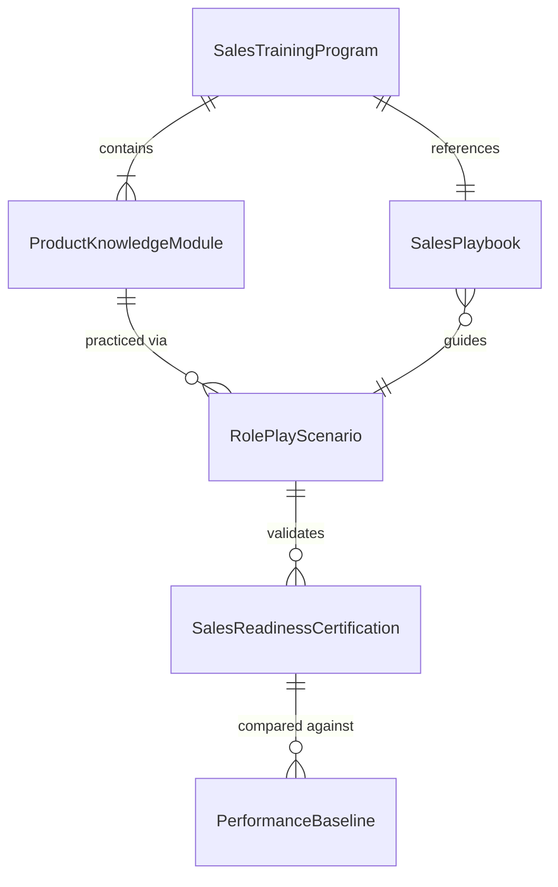
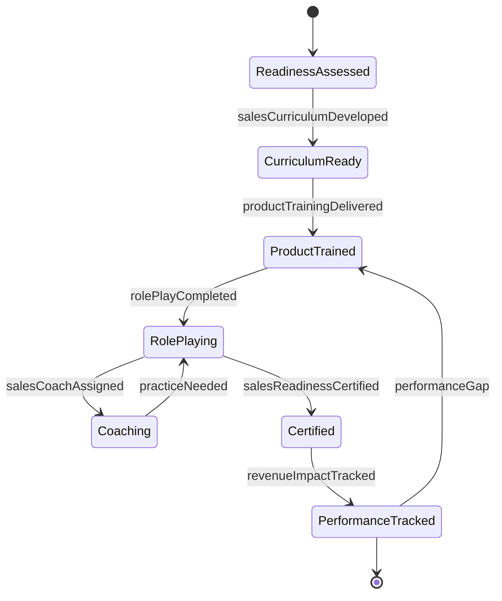
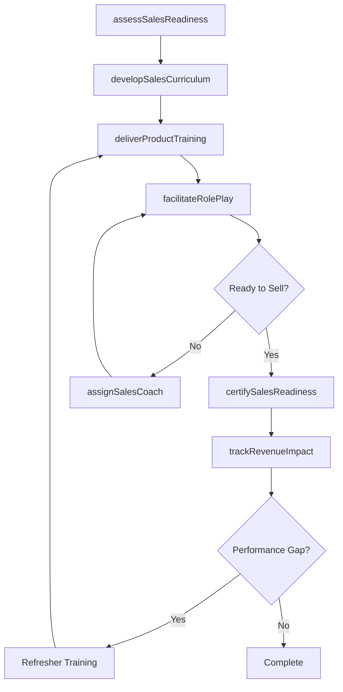
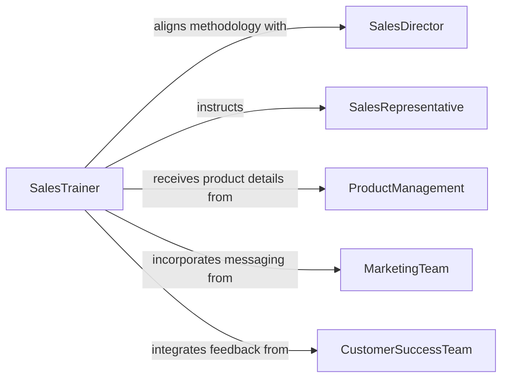

# Train Sales Personnel

> Business-as-Code definition for training sales personnel. Models the process of onboarding sales representatives, delivering product knowledge and selling skills instruction, and measuring sales readiness and performance improvement.

## Overview

Training sales personnel involves developing programs that equip sales teams with product knowledge, selling methodologies, objection handling techniques, and CRM proficiency. This definition exposes actions for building sales enablement curricula, conducting role-play exercises, certifying sales readiness, and correlating training completion with revenue outcomes. It supports both new hire onboarding and ongoing skill development for experienced representatives.

## Actors

| Actor | Description |
|-------|-------------|
| SalesDirector | Sets revenue targets and defines the selling methodology |
| SalesRepresentative | The individual receiving training on products and sales techniques |
| ProductManagement | Provides product specifications, positioning, and competitive intelligence |
| MarketingTeam | Supplies messaging frameworks, collateral, and campaign information |
| CustomerSuccessTeam | Shares customer feedback and common post-sale challenges |

## Roles

| Role | Description |
|------|-------------|
| SalesTrainer | Designs and delivers sales training programs |
| SalesEnablementManager | Aligns training content with go-to-market strategy |
| SalesCoach | Provides one-on-one mentoring and deal coaching |
| OnboardingSpecialist | Manages the structured ramp-up program for new sales hires |

## Entities

| Entity | Description |
|--------|-------------|
| SalesTrainingProgram | A structured curriculum for sales skill and product knowledge development |
| ProductKnowledgeModule | An instructional unit covering a specific product or service offering |
| SalesPlaybook | A reference guide containing selling methodologies and best practices |
| RolePlayScenario | A simulated sales interaction used for practice and evaluation |
| SalesReadinessCertification | A formal assessment confirming a representative is prepared to sell |
| PerformanceBaseline | A pre-training measurement of sales metrics for comparison |

## Actions

| Action | Description |
|--------|-------------|
| assessSalesReadiness | Evaluate a representative's current product knowledge and selling skills |
| developSalesCurriculum | Create training content aligned with the selling methodology |
| deliverProductTraining | Conduct sessions on product features, benefits, and positioning |
| facilitateRolePlay | Run simulated sales scenarios for practice and feedback |
| certifySalesReadiness | Formally qualify a representative to engage prospects |
| assignSalesCoach | Pair a representative with a mentor for ongoing development |
| trackRevenueImpact | Correlate training completion with sales performance metrics |

## Events

| Event | Description |
|-------|-------------|
| salesReadinessAssessed | A representative's selling capabilities have been evaluated |
| salesCurriculumDeveloped | A new sales training program has been published |
| productTrainingDelivered | A product knowledge session has been completed |
| rolePlayCompleted | A simulated sales scenario exercise has been finished |
| salesReadinessCertified | A representative has been formally cleared to sell |
| salesCoachAssigned | A representative has been paired with a sales mentor |
| revenueImpactTracked | Training-to-performance correlation metrics have been compiled |

## Searches

| Search | Description |
|--------|-------------|
| findUncertifiedReps | Identify sales representatives who have not achieved readiness certification |
| getTrainingByProduct | List training modules associated with a specific product line |
| getSalesPerformancePost | Retrieve performance metrics for representatives after training completion |
| getRampProgress | Track onboarding milestone completion for new sales hires |
| getCoachingEngagements | List active sales coaching relationships and session history |

## Entity Relationships



## State Diagram



## Workflow



## Actor Relationships



## Usage

### Calling Actions

```typescript
import { trainSalesPersonnel } from '@headlessly/train-sales-personnel'

const sales = trainSalesPersonnel()

// Assess sales readiness for a new hire
const assessment = await sales.assessSalesReadiness({
  representativeId: 'REP-1042',
  areas: ['product-knowledge', 'objection-handling', 'discovery-skills', 'crm-proficiency']
})

// Deliver product training
await sales.deliverProductTraining({
  programId: 'PROG-PROD-2026Q2',
  products: ['Enterprise Platform', 'Analytics Suite'],
  participants: ['REP-1042', 'REP-1043', 'REP-1044'],
  format: 'instructor-led'
})

// Certify sales readiness
await sales.certifySalesReadiness({
  representativeId: 'REP-1042',
  certificationDate: '2026-04-01',
  products: ['Enterprise Platform'],
  territory: 'West Region'
})
```

### Event-Driven Automation

```typescript
// Assign coaching when role-play reveals gaps
sales.rolePlayCompleted(async ({ representativeId, scenarioId, score, threshold }) => {
  if (score < threshold) {
    await sales.assignSalesCoach({
      representativeId,
      focusAreas: ['objection-handling', 'closing-techniques'],
      sessions: 6
    })
  }
})

// Track revenue impact quarterly
sales.salesReadinessCertified(async ({ representativeId, certificationDate }) => {
  await scheduleTask({
    date: addDays(certificationDate, 90),
    action: async () => {
      await sales.trackRevenueImpact({
        representativeId,
        baselinePeriod: { start: subtractDays(certificationDate, 90), end: certificationDate },
        comparisonPeriod: { start: certificationDate, end: addDays(certificationDate, 90) }
      })
    }
  })
})
```
