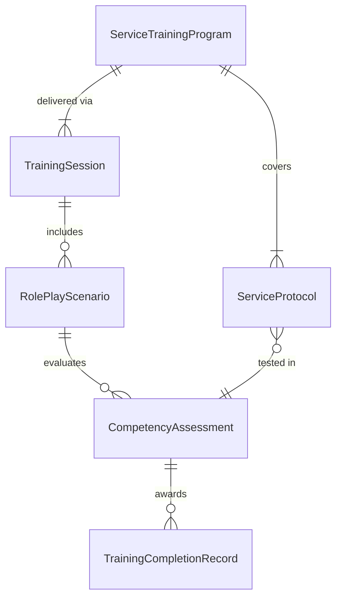
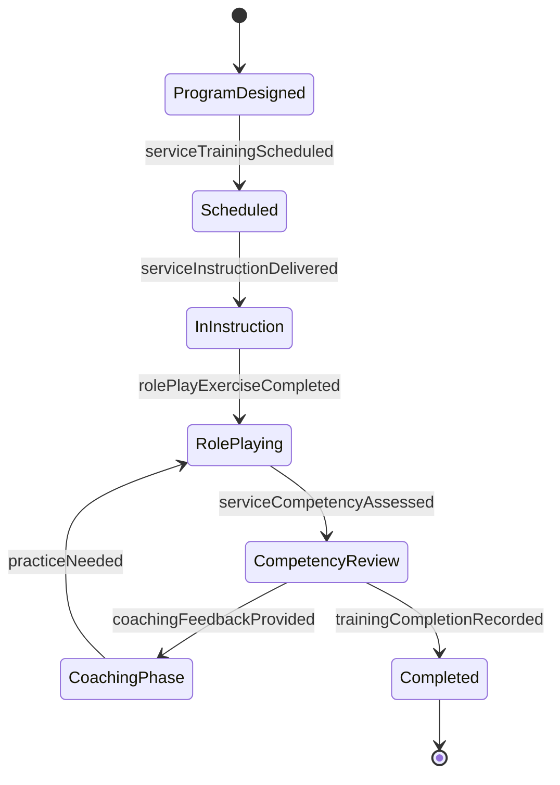
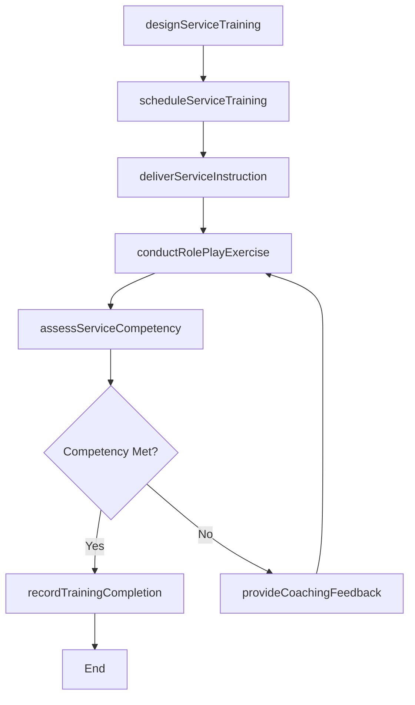
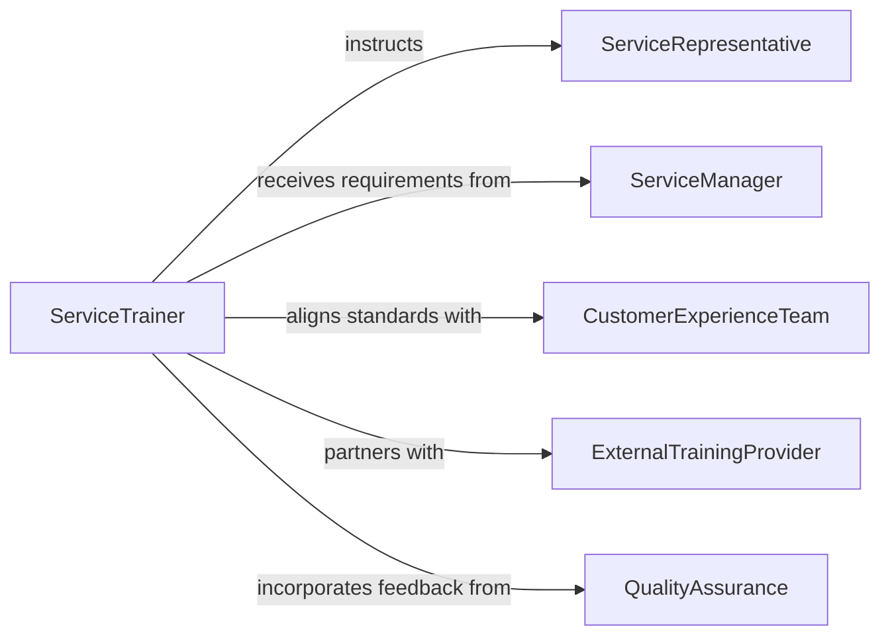

# Train Service Staff

> Business-as-Code definition for training service staff. Models the process of developing customer service skills training, delivering instruction on service protocols, and evaluating staff readiness to deliver quality customer interactions.

## Overview

Training service staff involves instructing customer-facing personnel on communication techniques, service protocols, product knowledge, complaint handling, and quality standards. This definition exposes actions for designing service training programs, scheduling onboarding and refresher sessions, conducting role-play exercises and skill demonstrations, assessing service competency, and tracking training completion across the service workforce.

## Actors

| Actor | Description |
|-------|-------------|
| ServiceRepresentative | Staff member receiving training on customer service procedures |
| ServiceManager | Oversees service operations and identifies staff training requirements |
| CustomerExperienceTeam | Develops service standards and quality benchmarks |
| ExternalTrainingProvider | Third-party organization delivering specialized service skills programs |
| QualityAssurance | Monitors service delivery quality and feeds back training needs |

## Roles

| Role | Description |
|------|-------------|
| ServiceTrainer | Designs and delivers customer service skills training |
| OnboardingCoordinator | Manages the structured onboarding training process for new service hires |
| SkillsCoach | Provides one-on-one coaching and feedback to service staff |
| TrainingAdministrator | Tracks enrollment, completion records, and certification status |

## Entities

| Entity | Description |
|--------|-------------|
| ServiceTrainingProgram | A structured curriculum covering customer service skills and protocols |
| ServiceProtocol | A documented standard for handling specific types of customer interactions |
| TrainingSession | A scheduled event for delivering service skills instruction |
| RolePlayScenario | A simulated customer interaction used for practice and evaluation |
| CompetencyAssessment | An evaluation of staff readiness to handle customer interactions |
| TrainingCompletionRecord | Documentation that a staff member has finished a training program |

## Actions

| Action | Description |
|--------|-------------|
| designServiceTraining | Create a training program covering customer service skills and protocols |
| scheduleServiceTraining | Plan training sessions with participants, dates, and delivery format |
| deliverServiceInstruction | Conduct training on service standards, communication, and product knowledge |
| conductRolePlayExercise | Facilitate simulated customer interactions for practice and skill building |
| assessServiceCompetency | Evaluate staff ability to handle customer interactions effectively |
| provideCoachingFeedback | Deliver individualized feedback based on observation and assessment |
| recordTrainingCompletion | Document that a staff member has successfully completed service training |

## Events

| Event | Description |
|-------|-------------|
| serviceTrainingDesigned | A customer service training program has been created |
| serviceTrainingScheduled | A service training session has been planned and confirmed |
| serviceInstructionDelivered | Customer service training has been completed for a group |
| rolePlayExerciseCompleted | A simulated customer interaction practice session has been finished |
| serviceCompetencyAssessed | Staff readiness for customer interactions has been evaluated |
| coachingFeedbackProvided | Individualized performance feedback has been delivered to a staff member |
| trainingCompletionRecorded | A staff member's training completion has been documented |

## Searches

| Search | Description |
|--------|-------------|
| findServicePrograms | List service training programs by topic, status, or target role |
| getCompletionRecords | Retrieve training completion records by staff member, program, or date |
| getCompetencyResults | Look up service competency assessment scores by staff or session |
| findTrainingGaps | Identify service staff missing required training or certifications |

## Entity Relationships



## State Diagram



## Workflow



## Actor Relationships



## Usage

### Calling Actions

```typescript
import { trainServiceStaff } from '@headlessly/train-service-staff'

const serviceTraining = trainServiceStaff()

// Design a service training program
const program = await serviceTraining.designServiceTraining({
  name: 'Customer Service Excellence Program',
  modules: ['active-listening', 'conflict-de-escalation', 'product-knowledge', 'upselling-techniques'],
  targetRole: 'front-desk-representative',
  duration: { days: 3 }
})

// Schedule and deliver training
const session = await serviceTraining.scheduleServiceTraining({
  programId: program.id,
  participantIds: ['rep-301', 'rep-302', 'rep-303'],
  scheduledDate: '2026-04-07',
  format: 'in-person-workshop'
})

// Conduct role-play and assess competency
await serviceTraining.conductRolePlayExercise({
  sessionId: session.id,
  scenarios: ['difficult-customer-complaint', 'product-return-request', 'loyalty-program-inquiry']
})

const assessment = await serviceTraining.assessServiceCompetency({
  sessionId: session.id,
  participantId: 'rep-301',
  criteria: ['communication-clarity', 'empathy', 'problem-resolution', 'protocol-adherence']
})
```

### Event-Driven Automation

```typescript
// Auto-record completion when competency is confirmed
serviceTraining.serviceCompetencyAssessed(async ({ participantId, passed, programId }) => {
  if (passed) {
    await serviceTraining.recordTrainingCompletion({
      staffId: participantId,
      programId,
      completionDate: new Date().toISOString()
    })
  }
})

// Schedule coaching for staff who need improvement
serviceTraining.serviceCompetencyAssessed(async ({ participantId, passed, weakAreas }) => {
  if (!passed) {
    await serviceTraining.provideCoachingFeedback({
      staffId: participantId,
      focusAreas: weakAreas,
      followUpDate: nextWeek()
    })
  }
})
```
