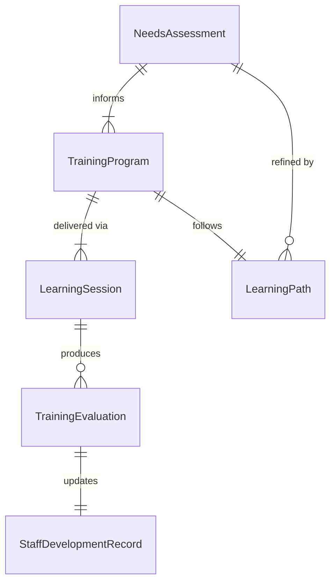
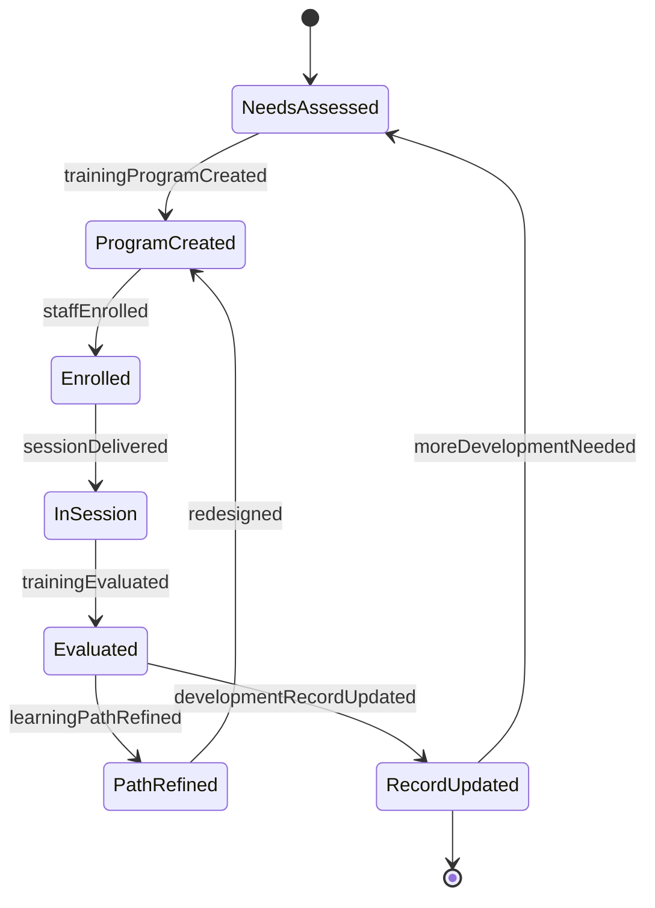
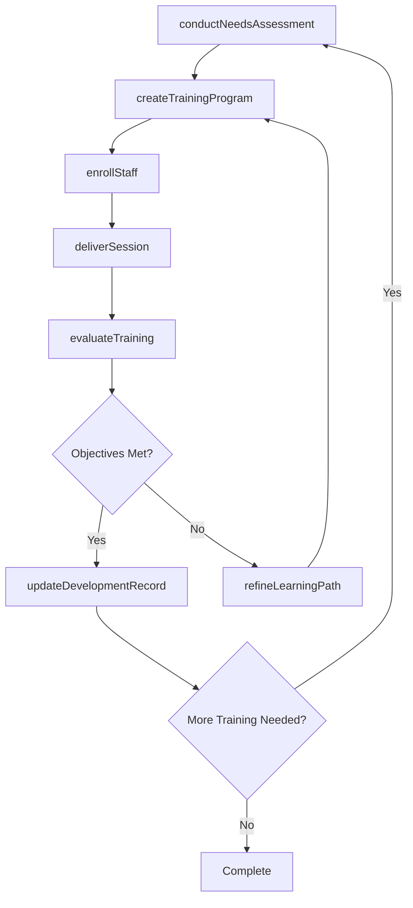
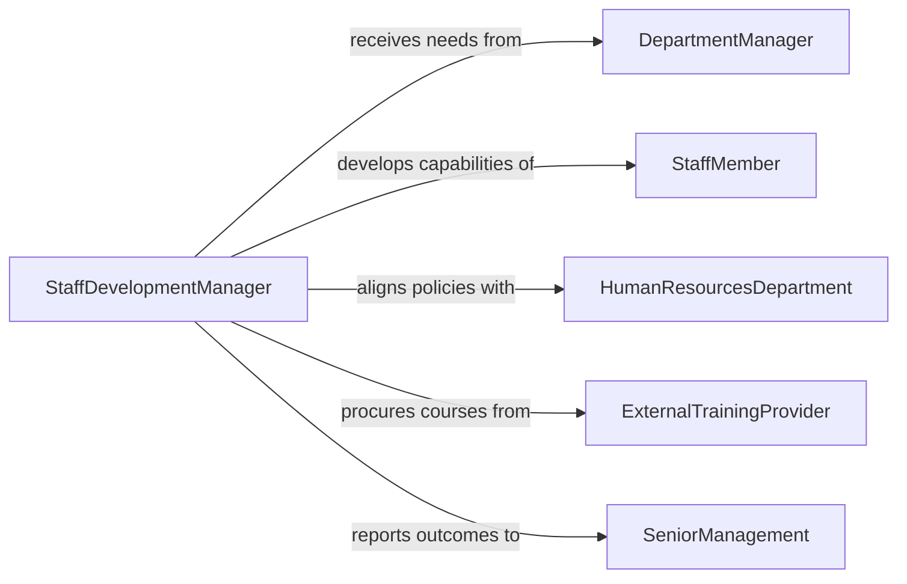

# Train Staff Members

> Business-as-Code definition for training staff members. Models the general-purpose process of onboarding, upskilling, and cross-training organizational staff through structured learning programs and performance-linked evaluation.

## Overview

Training staff members involves identifying development needs, creating learning programs, delivering instruction across multiple modalities, and evaluating the impact of training on job performance. This definition exposes actions for needs analysis, program design, session delivery, and outcome tracking. It serves as the broadly applicable staff development pattern across all organizational functions and levels.

## Actors

| Actor | Description |
|-------|-------------|
| DepartmentManager | Identifies staff development needs and approves training participation |
| StaffMember | The individual receiving training and development |
| HumanResourcesDepartment | Establishes training policies, budgets, and organizational standards |
| ExternalTrainingProvider | Delivers specialized courses and certification programs |
| SeniorManagement | Sets strategic development priorities for the organization |

## Roles

| Role | Description |
|------|-------------|
| StaffDevelopmentManager | Oversees the portfolio of staff training programs |
| Instructor | Designs and delivers instructional sessions |
| TrainingAdministrator | Coordinates logistics, enrollment, and record-keeping |
| LearningAnalyst | Measures training effectiveness and recommends improvements |

## Entities

| Entity | Description |
|--------|-------------|
| TrainingProgram | A structured learning initiative with defined scope and objectives |
| LearningSession | A scheduled instance of training delivery |
| StaffDevelopmentRecord | An individual's history of completed training and certifications |
| NeedsAssessment | An analysis of skill gaps and development priorities for staff |
| TrainingEvaluation | A post-training measurement of knowledge gain and satisfaction |
| LearningPath | A curated sequence of training activities for a role or career track |

## Actions

| Action | Description |
|--------|-------------|
| conductNeedsAssessment | Analyze skill gaps and development priorities for staff |
| createTrainingProgram | Design a learning program with objectives, content, and schedule |
| enrollStaff | Register staff members for scheduled training sessions |
| deliverSession | Conduct the training in the designated format |
| evaluateTraining | Administer post-training assessments and satisfaction surveys |
| updateDevelopmentRecord | Record training completion in the staff member's profile |
| refineLearningPath | Adjust the learning path based on evaluation results and feedback |

## Events

| Event | Description |
|-------|-------------|
| needsAssessmentCompleted | A staff development gap analysis has been finalized |
| trainingProgramCreated | A new training program has been designed and approved |
| staffEnrolled | Staff members have been registered for a training session |
| sessionDelivered | A training session has been conducted |
| trainingEvaluated | Post-training assessment and survey results have been compiled |
| developmentRecordUpdated | A staff member's training record has been updated |
| learningPathRefined | A learning path has been adjusted based on feedback |

## Searches

| Search | Description |
|--------|-------------|
| findProgramsByRole | List training programs relevant to a specific staff role |
| getStaffDevelopmentRecord | Retrieve the complete training history for a staff member |
| getCompletionRates | Calculate training completion statistics by program or department |
| findUpcomingSessions | List scheduled training sessions with available enrollment |
| getEvaluationResults | Retrieve assessment scores and feedback for a training program |

## Entity Relationships



## State Diagram



## Workflow



## Actor Relationships



## Usage

### Calling Actions

```typescript
import { trainStaffMembers } from '@headlessly/train-staff-members'

const training = trainStaffMembers()

// Conduct a needs assessment
const needs = await training.conductNeedsAssessment({
  department: 'Operations',
  roles: ['Coordinator', 'Analyst', 'Specialist'],
  period: 'FY2026'
})

// Create a training program
const program = await training.createTrainingProgram({
  name: 'Operations Excellence Fundamentals',
  objectives: ['Process documentation standards', 'Data analysis techniques', 'Cross-functional communication'],
  format: 'blended',
  sessions: 6,
  duration: { weeks: 3 }
})

// Enroll staff
await training.enrollStaff({
  programId: program.id,
  staffIds: needs.priorityStaff,
  startDate: '2026-04-07'
})
```

### Event-Driven Automation

```typescript
// Update records automatically on session completion
training.sessionDelivered(async ({ sessionId, attendees }) => {
  for (const staffId of attendees) {
    await training.updateDevelopmentRecord({
      staffId,
      sessionId,
      completedDate: new Date().toISOString()
    })
  }
})

// Notify managers of low evaluation scores
training.trainingEvaluated(async ({ programId, averageScore, threshold }) => {
  if (averageScore < threshold) {
    await notify({
      to: 'training-leadership',
      message: `Program ${programId} scored ${averageScore}/${threshold}. Consider curriculum revision.`
    })
  }
})
```
