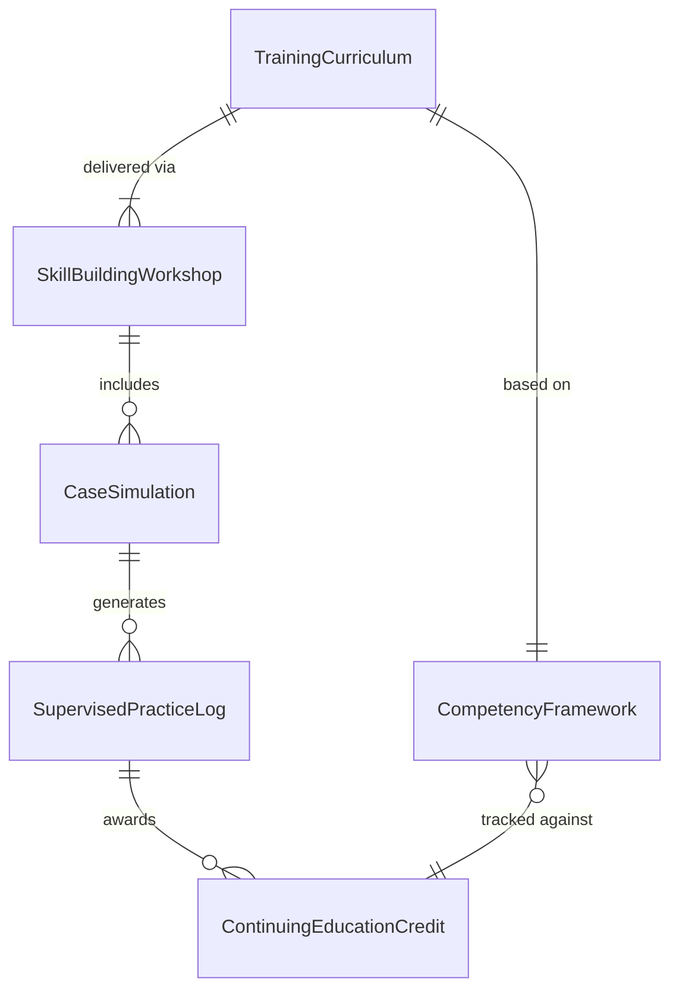
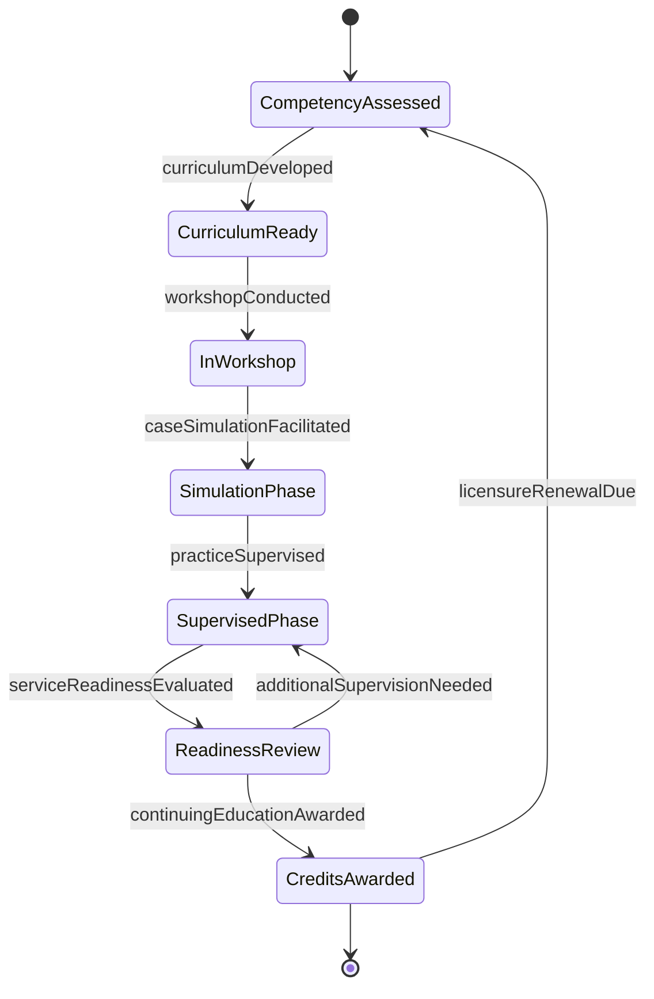
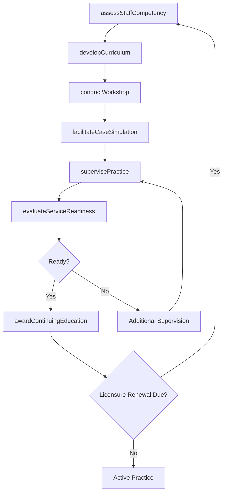
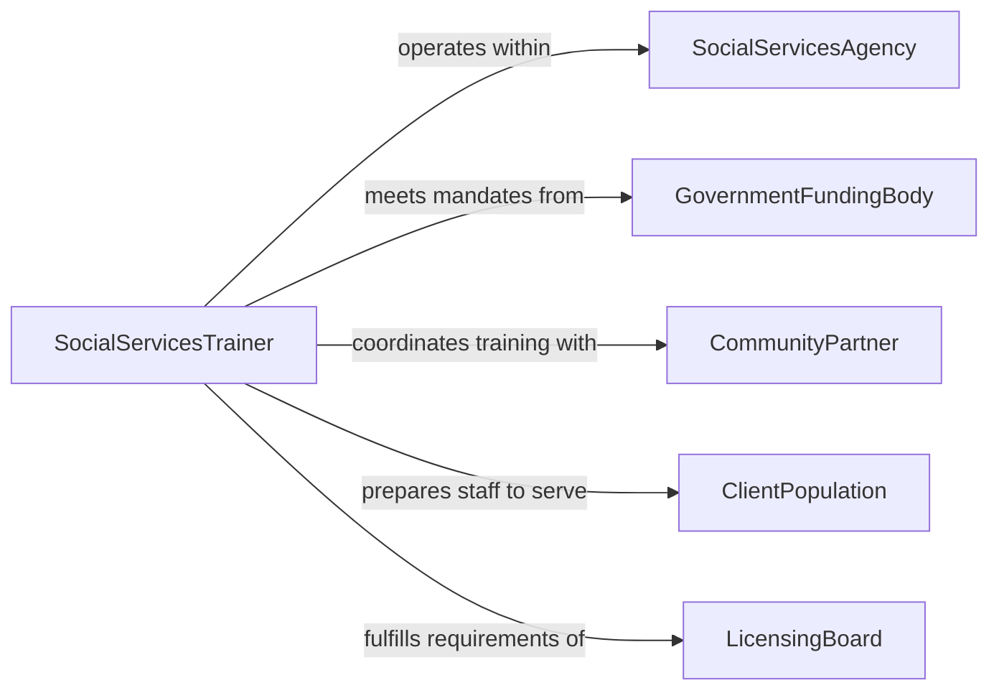

# Train Staff Members Social Services

> Business-as-Code definition for training staff members in social services skills. Models the process of developing competency in case management, client assessment, crisis intervention, and community resource coordination for social services professionals.

## Overview

Training staff members in social services skills involves building proficiency in client intake, needs assessment, case planning, crisis intervention, cultural competency, and interagency coordination. This definition exposes actions for designing social services curricula, delivering skill-building workshops, conducting supervised practice sessions, and evaluating staff readiness to serve vulnerable populations. It supports both initial onboarding and ongoing professional development for social services practitioners.

## Actors

| Actor | Description |
|-------|-------------|
| SocialServicesAgency | The organization employing staff and defining service delivery standards |
| GovernmentFundingBody | Provides grants and mandates training requirements for funded programs |
| CommunityPartner | Collaborating organizations that provide referral resources and joint training |
| ClientPopulation | The individuals and families served by trained social services staff |
| LicensingBoard | Sets professional credentialing and continuing education requirements |

## Roles

| Role | Description |
|------|-------------|
| SocialServicesTrainer | Designs and delivers skill-building programs for social services staff |
| ClinicalSupervisor | Provides supervised practice oversight and mentoring |
| ProgramDirector | Defines service delivery standards and training priorities |
| ContinuingEducationCoordinator | Manages professional development credits and licensing requirements |

## Entities

| Entity | Description |
|--------|-------------|
| TrainingCurriculum | A structured program covering social services competency areas |
| SkillBuildingWorkshop | An interactive session focused on a specific social services skill |
| SupervisedPracticeLog | A record of supervised client interactions for skill development |
| CompetencyFramework | The defined set of skills and knowledge areas for social services roles |
| ContinuingEducationCredit | A unit of professional development credit toward licensure |
| CaseSimulation | A practice scenario replicating real-world social services situations |

## Actions

| Action | Description |
|--------|-------------|
| assessStaffCompetency | Evaluate current social services skills against the competency framework |
| developCurriculum | Create training content for targeted social services skill areas |
| conductWorkshop | Deliver an interactive skill-building session |
| facilitateCaseSimulation | Run a practice scenario for applied learning and assessment |
| supervisePractice | Oversee and provide feedback on staff client interactions |
| awardContinuingEducation | Grant professional development credits upon training completion |
| evaluateServiceReadiness | Determine if staff are prepared to independently serve clients |

## Events

| Event | Description |
|-------|-------------|
| staffCompetencyAssessed | A staff member's social services skills have been evaluated |
| curriculumDeveloped | A new social services training curriculum has been published |
| workshopConducted | An interactive skill-building workshop has been completed |
| caseSimulationFacilitated | A practice scenario session has been delivered and debriefed |
| practiceSupervised | A supervised client interaction has been reviewed and documented |
| continuingEducationAwarded | Professional development credits have been granted |
| serviceReadinessEvaluated | A staff member has been assessed for independent service delivery |

## Searches

| Search | Description |
|--------|-------------|
| findStaffByCompetency | List staff members filtered by skill area and proficiency level |
| getContinuingEducationStatus | Retrieve credit hours accumulated toward licensure requirements |
| getSupervisionLog | List supervised practice sessions for a specific staff member |
| findAvailableWorkshops | List upcoming skill-building workshops by topic area |
| getStaffReadiness | Retrieve service readiness evaluations by department or individual |

## Entity Relationships



## State Diagram



## Workflow



## Actor Relationships



## Usage

### Calling Actions

```typescript
import { trainStaffMembersSocialServices } from '@headlessly/train-staff-members-social-services'

const socialTraining = trainStaffMembersSocialServices()

// Assess staff competency
const assessment = await socialTraining.assessStaffCompetency({
  staffId: 'SSW-2201',
  competencyFramework: 'social-services-core-v2',
  areas: ['case-management', 'crisis-intervention', 'cultural-competency', 'trauma-informed-care']
})

// Facilitate a case simulation
const simulation = await socialTraining.facilitateCaseSimulation({
  scenario: 'Family-Crisis-Intake',
  participants: ['SSW-2201', 'SSW-2202'],
  supervisorId: 'SUP-105',
  duration: { minutes: 90 }
})

// Award continuing education credits
await socialTraining.awardContinuingEducation({
  staffId: 'SSW-2201',
  workshopId: 'WS-TIC-2026',
  credits: 6,
  category: 'Trauma-Informed Care'
})
```

### Event-Driven Automation

```typescript
// Schedule additional supervision when simulation reveals gaps
socialTraining.caseSimulationFacilitated(async ({ participants, scores, threshold }) => {
  for (const participant of participants) {
    if (participant.score < threshold) {
      await socialTraining.supervisePractice({
        staffId: participant.id,
        focusAreas: participant.gaps,
        sessions: 4
      })
    }
  }
})

// Notify staff of licensure renewal requirements
socialTraining.continuingEducationAwarded(async ({ staffId, totalCredits, requiredCredits, renewalDate }) => {
  const remaining = requiredCredits - totalCredits
  if (remaining > 0) {
    await notify({
      to: staffId,
      message: `You need ${remaining} more CE credits before licensure renewal on ${renewalDate}`
    })
  }
})
```
