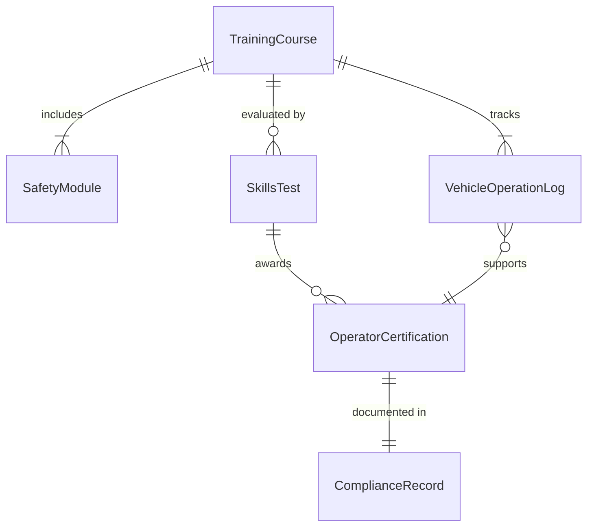
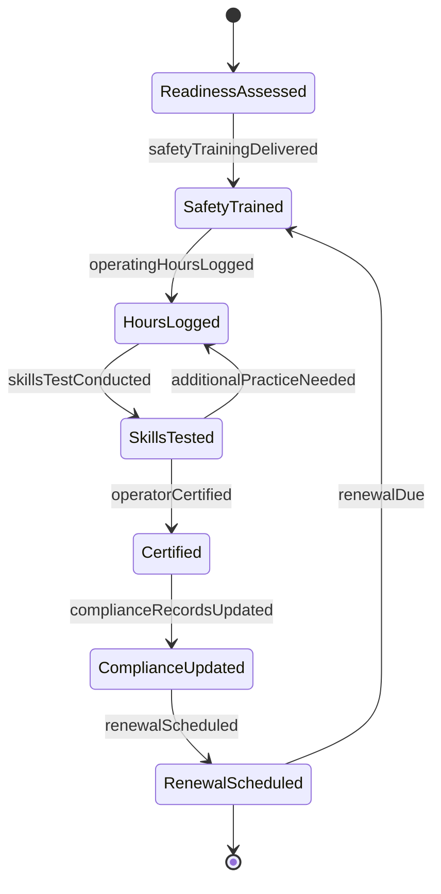
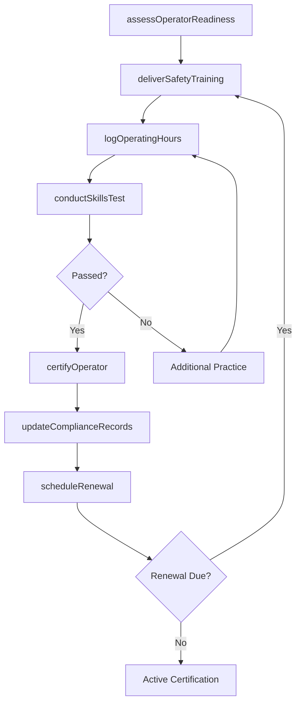
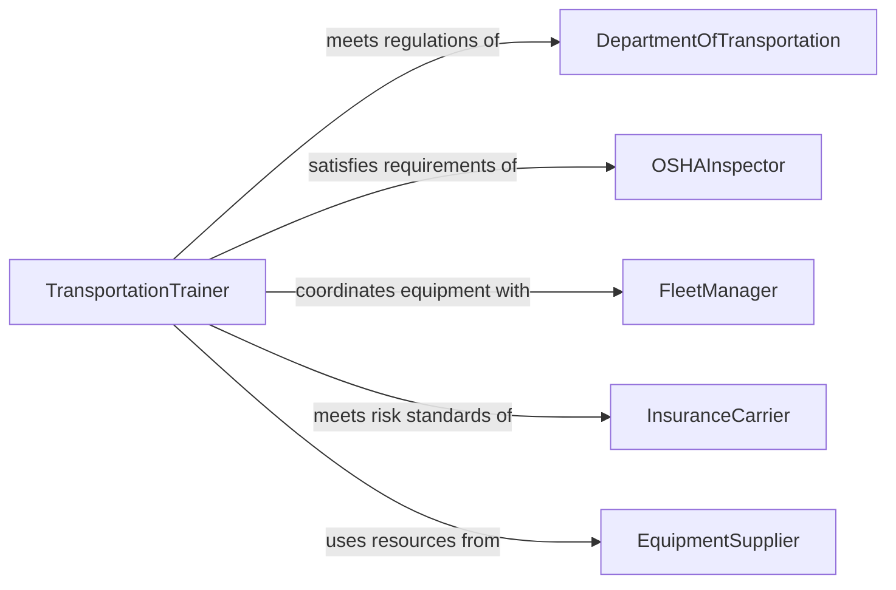

# Train Transportation Material Moving Personnel

> Business-as-Code definition for training transportation or material moving personnel. Models the process of qualifying drivers, equipment operators, and material handlers through safety instruction, skills certification, and regulatory compliance training.

## Overview

Training transportation or material moving personnel involves delivering instruction on vehicle operation, material handling equipment, safety protocols, regulatory compliance, and route or warehouse procedures. This definition exposes actions for assessing operator readiness, conducting classroom and practical training, administering skills tests, issuing certifications, and maintaining compliance with Department of Transportation and OSHA requirements.

## Actors

| Actor | Description |
|-------|-------------|
| DepartmentOfTransportation | Establishes commercial driving regulations and licensing requirements |
| OSHAInspector | Enforces workplace safety standards for material handling operations |
| FleetManager | Oversees vehicles and equipment used by transportation personnel |
| InsuranceCarrier | Sets risk mitigation requirements that influence training standards |
| EquipmentSupplier | Provides operator manuals and training resources for material handling equipment |

## Roles

| Role | Description |
|------|-------------|
| TransportationTrainer | Delivers driving, equipment operation, and safety instruction |
| SafetyCoordinator | Ensures training programs meet regulatory safety requirements |
| CertificationAdministrator | Manages operator licenses, certifications, and renewal schedules |
| OperationsTrainingLead | Aligns training programs with operational procedures and logistics workflows |

## Entities

| Entity | Description |
|--------|-------------|
| OperatorCertification | A formal credential confirming an operator meets qualification standards |
| TrainingCourse | A structured program covering a specific transportation or material handling topic |
| SkillsTest | A practical evaluation of driving or equipment operation proficiency |
| SafetyModule | An instructional unit covering hazard awareness and prevention |
| VehicleOperationLog | A record of supervised and independent vehicle or equipment operation |
| ComplianceRecord | Documentation demonstrating adherence to regulatory training mandates |

## Actions

| Action | Description |
|--------|-------------|
| assessOperatorReadiness | Evaluate a candidate's baseline knowledge and physical qualifications |
| deliverSafetyTraining | Conduct instruction on hazard awareness, defensive driving, and emergency procedures |
| conductSkillsTest | Administer a practical evaluation of driving or equipment operation |
| certifyOperator | Issue formal certification upon successful completion of training and testing |
| scheduleRenewal | Set up recertification timelines for expiring operator credentials |
| logOperatingHours | Record supervised and independent operation time for compliance tracking |
| updateComplianceRecords | Document completion of regulatory training requirements |

## Events

| Event | Description |
|-------|-------------|
| operatorReadinessAssessed | A candidate's baseline qualifications have been evaluated |
| safetyTrainingDelivered | A safety instruction session has been completed |
| skillsTestConducted | A practical operation evaluation has been administered |
| operatorCertified | An operator has received formal certification credentials |
| renewalScheduled | A recertification date has been established for an operator |
| operatingHoursLogged | Supervised or independent operation time has been recorded |
| complianceRecordsUpdated | Regulatory training documentation has been updated |

## Searches

| Search | Description |
|--------|-------------|
| findCertifiedOperators | List personnel certified for a specific vehicle or equipment type |
| getExpiringCertifications | Identify operators whose certifications expire within a given period |
| getOperatingHours | Retrieve logged operation hours for an individual or equipment type |
| findTrainingByEquipment | List available courses for a specific vehicle or material handling equipment |
| getComplianceStatus | Check regulatory training completion status for a department or individual |

## Entity Relationships



## State Diagram



## Workflow



## Actor Relationships



## Usage

### Calling Actions

```typescript
import { trainTransportationMaterialMovingPersonnel } from '@headlessly/train-transportation-material-moving-personnel'

const transport = trainTransportationMaterialMovingPersonnel()

// Assess operator readiness
const readiness = await transport.assessOperatorReadiness({
  candidateId: 'OPR-3301',
  equipmentType: 'Class-A-CDL',
  physicalExam: { date: '2026-02-01', status: 'passed' },
  writtenTest: { score: 88, passingScore: 80 }
})

// Deliver safety training
await transport.deliverSafetyTraining({
  courseId: 'CRS-DEF-DRIVING-2026',
  participants: ['OPR-3301', 'OPR-3302'],
  topics: ['Defensive Driving', 'Pre-Trip Inspection', 'Hazmat Awareness'],
  format: 'classroom-plus-practical',
  hours: 16
})

// Certify the operator
await transport.certifyOperator({
  operatorId: 'OPR-3301',
  certification: 'Forklift-Operator',
  certifiedDate: '2026-03-01',
  validUntil: '2029-03-01',
  issuedBy: 'TRN-040'
})
```

### Event-Driven Automation

```typescript
// Alert on expiring certifications
transport.renewalScheduled(async ({ operatorId, certification, renewalDate }) => {
  await scheduleReminder({
    date: daysBeforeDate(renewalDate, 60),
    to: operatorId,
    message: `Your ${certification} certification expires on ${renewalDate}. Please schedule renewal training.`
  })
})

// Auto-update compliance records on certification
transport.operatorCertified(async ({ operatorId, certification, certifiedDate }) => {
  await transport.updateComplianceRecords({
    operatorId,
    regulation: certification.includes('CDL') ? 'DOT-FMCSA' : 'OSHA-1910.178',
    completedDate: certifiedDate
  })
})
```
