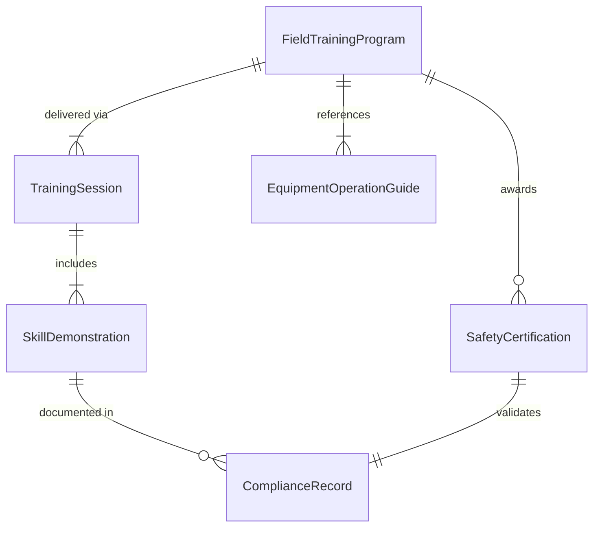
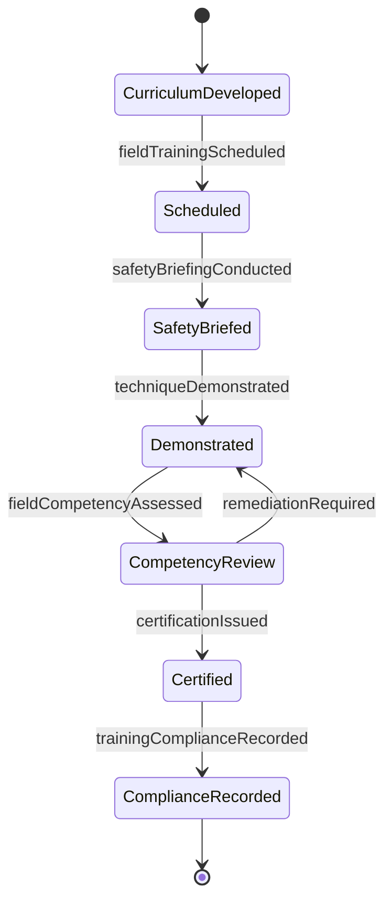
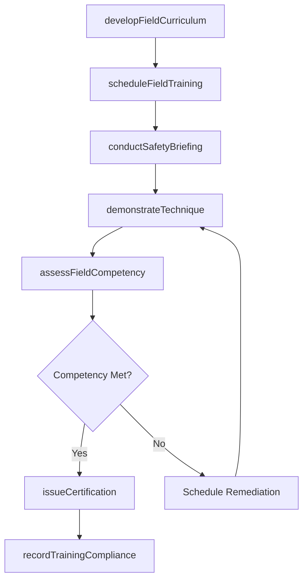
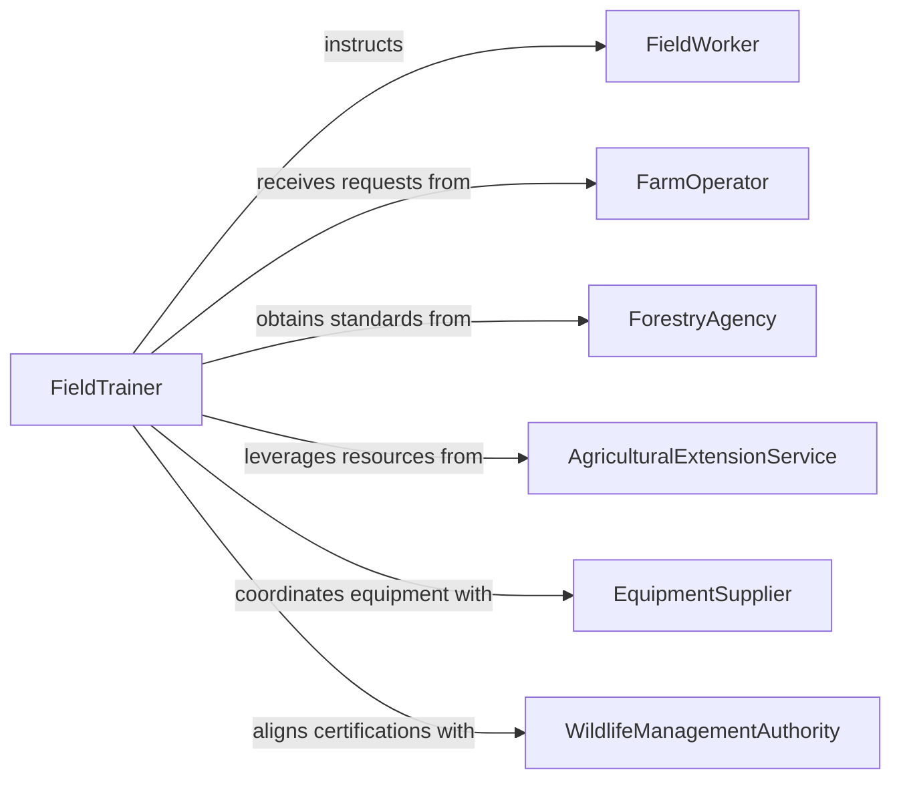

# Train Workers Farming Forestry Hunting

> Business-as-Code definition for training workers in farming, forestry, or hunting techniques. Models the process of designing field-based instruction programs, delivering hands-on training in agricultural and natural resource operations, and certifying worker readiness.

## Overview

Training workers in farming, forestry, or hunting techniques involves instructing personnel on safe and effective methods for crop cultivation, livestock management, timber harvesting, wildlife management, and related outdoor operations. This definition exposes actions for developing field-specific curricula, conducting on-site training demonstrations, assessing practical competency, and maintaining compliance with environmental and safety regulations governing agricultural and natural resource work.

## Actors

| Actor | Description |
|-------|-------------|
| FieldWorker | Individual receiving training on agricultural, forestry, or hunting methods |
| FarmOperator | Owner or manager of agricultural operations requesting worker training |
| ForestryAgency | Regulatory body overseeing forestry practices and worker certifications |
| AgriculturalExtensionService | Government or university program providing technical training resources |
| EquipmentSupplier | Provider of machinery and tools used in training demonstrations |
| WildlifeManagementAuthority | Agency governing hunting regulations and safety certification |

## Roles

| Role | Description |
|------|-------------|
| FieldTrainer | Delivers hands-on instruction in farming, forestry, or hunting practices |
| SafetyInstructor | Teaches proper safety protocols for outdoor and equipment-based operations |
| TrainingCoordinator | Manages scheduling, logistics, and record-keeping for field training programs |
| ComplianceOfficer | Ensures training content meets regulatory and environmental standards |

## Entities

| Entity | Description |
|--------|-------------|
| FieldTrainingProgram | A structured curriculum covering techniques for a specific agricultural or natural resource domain |
| TrainingSession | A scheduled on-site or classroom event for delivering instruction |
| SafetyCertification | A credential confirming a worker has met safety training requirements |
| SkillDemonstration | A practical exercise where trainees perform techniques under observation |
| ComplianceRecord | Documentation of regulatory training requirements fulfilled |
| EquipmentOperationGuide | Reference material for safe and effective use of field equipment |

## Actions

| Action | Description |
|--------|-------------|
| developFieldCurriculum | Create training content for farming, forestry, or hunting techniques |
| scheduleFieldTraining | Plan on-site training sessions with locations, dates, and participants |
| conductSafetyBriefing | Deliver pre-training safety instruction covering hazards and protocols |
| demonstrateTechnique | Perform hands-on demonstration of field methods for trainees |
| assessFieldCompetency | Evaluate trainee proficiency through practical skill exercises |
| issueCertification | Grant safety or technique certification upon successful completion |
| recordTrainingCompliance | Document completed training against regulatory requirements |

## Events

| Event | Description |
|-------|-------------|
| fieldCurriculumDeveloped | Training content for a field discipline has been created or updated |
| fieldTrainingScheduled | An on-site training session has been planned and confirmed |
| safetyBriefingConducted | Pre-training safety instruction has been delivered |
| techniqueDemonstrated | A hands-on field technique demonstration has been completed |
| fieldCompetencyAssessed | Trainee practical skills have been evaluated and scored |
| certificationIssued | A worker has received a safety or technique certification |
| trainingComplianceRecorded | Regulatory training requirements have been documented as fulfilled |

## Searches

| Search | Description |
|--------|-------------|
| findFieldPrograms | List training programs by discipline, region, or certification type |
| getTrainingSessions | Retrieve scheduled or completed sessions by date, location, or trainer |
| getCertifications | Look up worker certifications by type, status, or expiration date |
| findComplianceGaps | Identify workers or sites missing required regulatory training |

## Entity Relationships



## State Diagram



## Workflow



## Actor Relationships



## Usage

### Calling Actions

```typescript
import { trainWorkersFarmingForestryHunting } from '@headlessly/train-workers-farming-forestry-hunting'

const fieldTraining = trainWorkersFarmingForestryHunting()

// Develop a forestry training curriculum
const curriculum = await fieldTraining.developFieldCurriculum({
  discipline: 'timber-harvesting',
  techniques: ['chainsaw-operation', 'felling-direction-control', 'log-skidding'],
  safetyModules: ['ppe-requirements', 'hazard-tree-identification']
})

// Schedule on-site training
const session = await fieldTraining.scheduleFieldTraining({
  programId: curriculum.id,
  location: 'North Ridge Timber Unit',
  scheduledDate: '2026-04-10',
  participantIds: ['wkr-201', 'wkr-202', 'wkr-203']
})

// Assess competency after demonstration
const results = await fieldTraining.assessFieldCompetency({
  sessionId: session.id,
  evaluationCriteria: ['safety-compliance', 'technique-accuracy', 'efficiency']
})
```

### Event-Driven Automation

```typescript
// Auto-issue certifications when competency is met
fieldTraining.fieldCompetencyAssessed(async ({ participantId, passed, sessionId }) => {
  if (passed) {
    await fieldTraining.issueCertification({
      workerId: participantId,
      sessionId,
      type: 'forestry-safety',
      validUntil: '2027-04-10'
    })
  }
})

// Alert compliance officer when training gaps are found
fieldTraining.trainingComplianceRecorded(async ({ siteId, gapsFound }) => {
  if (gapsFound > 0) {
    await notify({
      to: 'compliance-team',
      message: `Site ${siteId} has ${gapsFound} outstanding training requirements`
    })
  }
})
```
