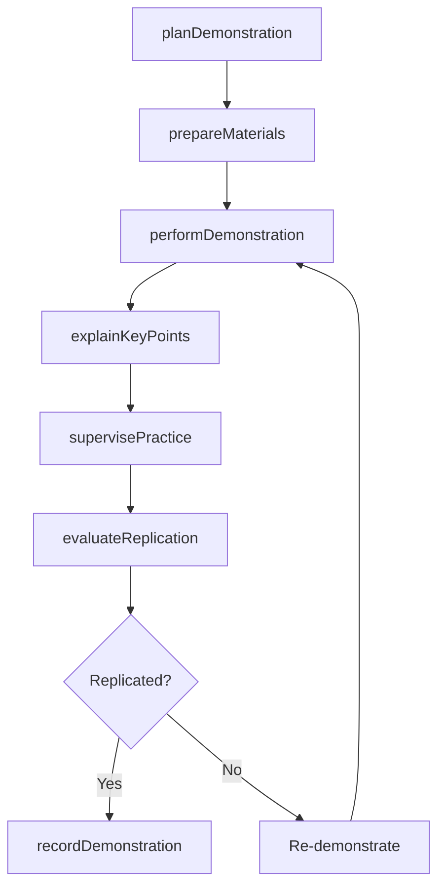
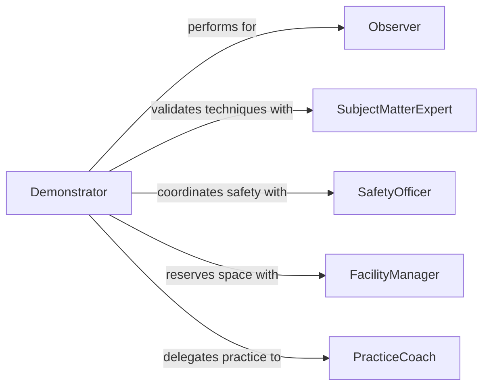

# Demonstrate Activity Techniques Equipment Use

> Business-as-Code definition for demonstrating activity techniques and equipment use. Models the hands-on demonstration process where an instructor performs techniques or operates equipment while observers learn proper methods, safety practices, and best practices.

## Overview

Demonstrating activity techniques or equipment use involves preparing demonstration materials, performing step-by-step technique execution in front of learners, explaining key decision points, allowing supervised practice, and confirming that observers can replicate the demonstrated technique. This definition exposes actions for demonstration planning and delivery, events for tracking learner engagement, and searches for retrieving demonstration records and technique libraries.

## Actors

| Actor | Description |
|-------|-------------|
| Observer | Watches the demonstration and practices the technique |
| SafetyOfficer | Ensures demonstrations comply with safety requirements |
| EquipmentSupplier | Provides equipment and materials needed for demonstrations |
| SubjectMatterExpert | Validates that demonstrated techniques follow best practices |
| FacilityManager | Provides space and environmental conditions for demonstrations |
| QualityAssurance | Verifies demonstration content meets organizational standards |

## Roles

| Role | Description |
|------|-------------|
| Demonstrator | Performs the technique or equipment operation for observers |
| TrainingFacilitator | Manages the demonstration session logistics and flow |
| TechniqueDocumentor | Records demonstrations and creates reference materials |
| PracticeCoach | Supervises observers during hands-on practice after the demonstration |

## Entities

| Entity | Description |
|--------|-------------|
| DemonstrationPlan | A structured outline of what will be demonstrated and how |
| TechniqueProfile | A documented standard method for performing an activity |
| DemonstrationSession | A scheduled live demonstration event |
| PracticeExercise | A guided hands-on activity for observers after the demonstration |
| ObservationChecklist | Criteria observers should note during the demonstration |
| RecordedDemo | A video or photo documentation of the demonstration |

## Actions

| Action | Description |
|--------|-------------|
| planDemonstration | Outline the technique, equipment, and safety requirements |
| prepareMaterials | Set up equipment, tools, and workspace for the demonstration |
| performDemonstration | Execute the technique or equipment operation for observers |
| explainKeyPoints | Narrate critical steps, safety considerations, and decision points |
| supervisePractice | Guide observers through hands-on replication of the technique |
| evaluateReplication | Assess whether observers can correctly replicate the technique |
| recordDemonstration | Capture the demonstration for future reference |

## Events

| Event | Description |
|-------|-------------|
| demonstrationPlanned | A demonstration session has been outlined and scheduled |
| materialsPrepared | Equipment and workspace have been set up for the demonstration |
| demonstrationPerformed | A live technique demonstration has been completed |
| keyPointsExplained | Critical steps and safety notes have been communicated |
| practiceSupervised | Observers have completed supervised hands-on practice |
| replicationSuccessful | An observer has correctly replicated the demonstrated technique |
| replicationUnsuccessful | An observer was unable to replicate the technique |

## Searches

| Search | Description |
|--------|-------------|
| findDemonstrations | List demonstrations by technique, date, or demonstrator |
| getTechniqueProfiles | Retrieve technique documentation by activity or equipment |
| getPracticeResults | Query observer practice outcomes by session or individual |
| getRecordedDemos | Find recorded demonstrations by technique or keyword |

## Workflow



## Actor Relationships



## Usage

### Calling Actions

```typescript
import { demonstrateActivityTechniquesEquipmentUse } from '@headlessly/demonstrate-activity-techniques-equipment-use'

const demo = demonstrateActivityTechniquesEquipmentUse()

// Plan a welding technique demonstration
const plan = await demo.planDemonstration({
  technique: 'TIG Welding - Aluminum Butt Joint',
  equipment: ['TIG Welder', 'Argon Gas Supply', 'Filler Rod 4043', 'Welding Helmet', 'Gloves'],
  safetyRequirements: ['fire-extinguisher', 'ventilation', 'ppe-check'],
  observers: ['APP-001', 'APP-002', 'APP-003'],
  duration: 60
})

// Perform the demonstration
await demo.performDemonstration({
  planId: plan.id,
  demonstratorId: 'INST-0015',
  steps: ['workpiece-prep', 'machine-setup', 'torch-angle', 'arc-initiation', 'filler-feeding', 'bead-completion'],
  recordVideo: true
})

// Evaluate observer replication
const result = await demo.evaluateReplication({
  observerId: 'APP-001',
  technique: 'TIG Welding - Aluminum Butt Joint',
  criteria: ['arc-stability', 'bead-consistency', 'penetration-depth', 'safety-compliance'],
  assessorId: 'INST-0015'
})
```

### Event-Driven Automation

```typescript
// Share recorded demonstration with observers who missed the session
demo.demonstrationPerformed(async ({ planId, recordedDemoId }) => {
  const plan = await demo.findDemonstrations({ id: planId })
  const absentees = plan.observers.filter(o => !o.attended)
  if (absentees.length > 0) {
    for (const observer of absentees) {
      await notify({
        to: observer.id,
        message: `A recorded demonstration of ${plan.technique} is available for your review`,
        link: recordedDemoId
      })
    }
  }
})

// Schedule additional practice for unsuccessful replications
demo.replicationUnsuccessful(async ({ observerId, technique, deficiencies }) => {
  await notify({
    to: 'practice-coach',
    message: `Observer ${observerId} needs additional practice on ${technique}: ${deficiencies.join(', ')}`
  })
})
```
