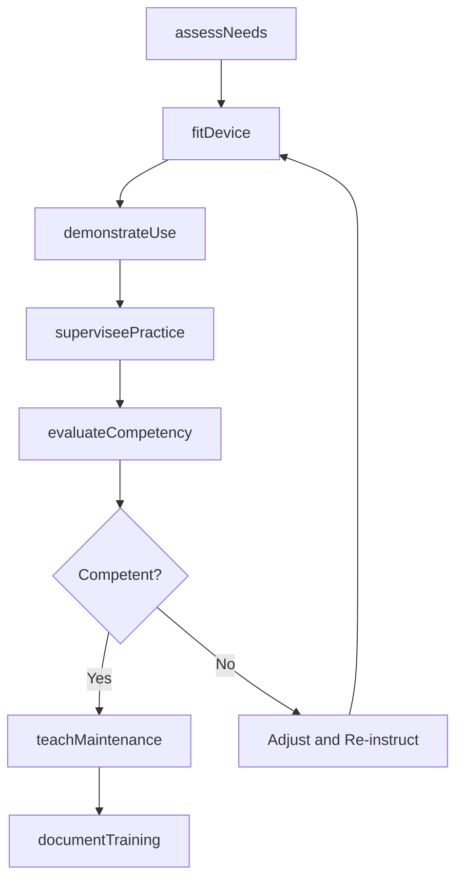
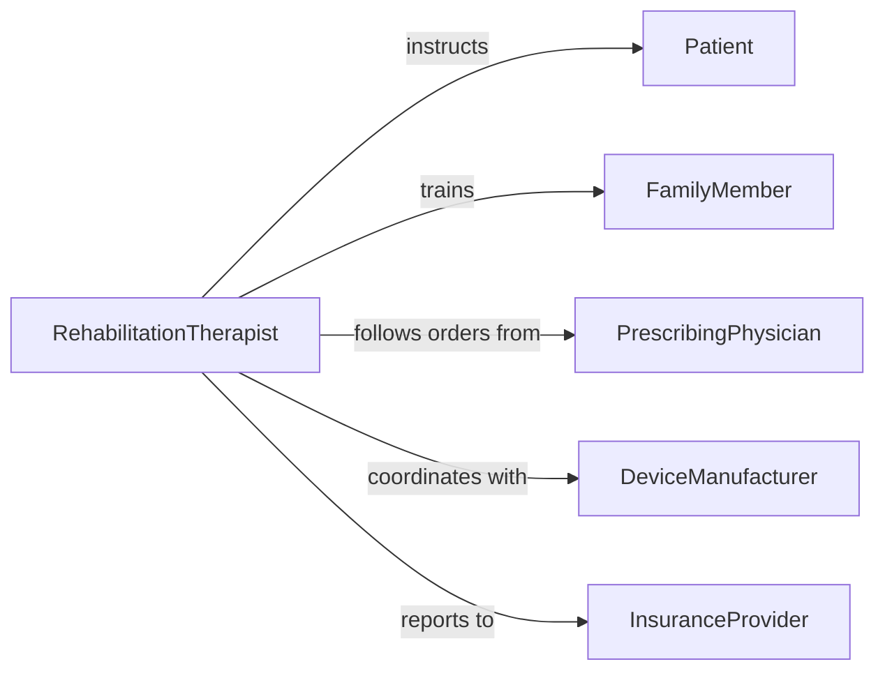

# Instruct Patients Use Assistive Equipment

> Business-as-Code definition for instructing patients in the use of assistive equipment. Models the training process for mobility aids, prosthetics, orthotics, hearing devices, and other assistive technologies from fitting through independent use.

## Overview

Instructing patients in the use of assistive equipment involves assessing functional needs, fitting and adjusting devices, demonstrating proper use and maintenance, supervising patient practice, and verifying safe independent operation. This definition exposes actions for device instruction and patient competency evaluation, events for tracking training progress, and searches for retrieving patient and equipment records.

## Actors

| Actor | Description |
|-------|-------------|
| Patient | Learns to operate and maintain assigned assistive equipment |
| FamilyMember | Assists the patient with equipment use at home |
| PrescribingPhysician | Orders the assistive device and sets functional goals |
| DeviceManufacturer | Provides equipment, manuals, and technical support |
| InsuranceProvider | Authorizes coverage for assistive devices and training |
| DurableMedicalEquipmentSupplier | Delivers and services assistive equipment |

## Roles

| Role | Description |
|------|-------------|
| RehabilitationTherapist | Instructs patients on assistive device use and techniques |
| Prosthetist | Fits and adjusts prosthetic devices and trains patients |
| Orthotist | Fits orthotic devices and teaches proper wearing schedules |
| AssistiveTechnologySpecialist | Configures and trains patients on complex assistive technologies |

## Entities

| Entity | Description |
|--------|-------------|
| AssistiveDevice | A piece of equipment prescribed to aid patient function |
| FittingRecord | Documentation of device adjustments and measurements |
| InstructionSession | A scheduled training encounter for device use |
| CompetencyChecklist | Skills the patient must demonstrate with the device |
| MaintenanceGuide | Instructions for cleaning, charging, and caring for the device |
| UsageLog | A record of the patient's device usage patterns and issues |

## Actions

| Action | Description |
|--------|-------------|
| assessNeeds | Evaluate the patient's functional limitations and device requirements |
| fitDevice | Adjust the assistive device for proper fit and comfort |
| demonstrateUse | Show the patient correct device operation and techniques |
| superviseePractice | Observe the patient using the device and provide feedback |
| evaluateCompetency | Verify the patient can safely use the device independently |
| teachMaintenance | Instruct the patient on device care, cleaning, and troubleshooting |
| documentTraining | Record all instruction sessions and competency outcomes |

## Events

| Event | Description |
|-------|-------------|
| needsAssessed | Patient functional needs have been evaluated |
| deviceFitted | An assistive device has been adjusted for the patient |
| usedemonstrated | Device operation has been demonstrated to the patient |
| practiceSupervised | A supervised device practice session has been completed |
| competencyAchieved | The patient can safely use the device independently |
| competencyNotAchieved | The patient requires additional device training |
| maintenanceTaught | Device care instructions have been provided |

## Searches

| Search | Description |
|--------|-------------|
| findDevices | List assistive devices by patient, type, or prescription |
| getTrainingSessions | Retrieve instruction sessions by patient, device, or date |
| getCompetencyStatus | Query competency records by patient or device type |
| getUsageLogs | Find device usage data by patient or time period |

## Workflow



## Actor Relationships



## Usage

### Calling Actions

```typescript
import { instructPatientsUseAssistiveEquipment } from '@headlessly/instruct-patients-use-assistive-equipment'

const instruction = instructPatientsUseAssistiveEquipment()

// Assess patient needs for a mobility aid
const needs = await instruction.assessNeeds({
  patientId: 'PT-2024-0734',
  condition: 'Below-Knee Amputation',
  functionalGoals: ['household-ambulation', 'community-ambulation', 'stair-navigation']
})

// Fit the prosthetic device
await instruction.fitDevice({
  patientId: 'PT-2024-0734',
  deviceType: 'Below-Knee Prosthesis',
  manufacturer: 'Ottobock',
  model: 'Genium X4',
  adjustments: ['socket-alignment', 'knee-resistance', 'ankle-range']
})

// Evaluate competency
const result = await instruction.evaluateCompetency({
  patientId: 'PT-2024-0734',
  deviceType: 'Below-Knee Prosthesis',
  skills: ['donning-doffing', 'level-walking', 'incline-walking', 'stair-climbing', 'fall-recovery'],
  assessorId: 'PT-CERT-0019'
})
```

### Event-Driven Automation

```typescript
// Notify physician when patient achieves competency
instruction.competencyAchieved(async ({ patientId, deviceType }) => {
  await notify({
    to: 'prescribing-physician',
    message: `Patient ${patientId} has demonstrated competency with ${deviceType} - cleared for independent use`
  })
})

// Schedule follow-up when competency is not achieved
instruction.competencyNotAchieved(async ({ patientId, deviceType, deficiencies }) => {
  await instruction.documentTraining({
    patientId,
    note: `Additional training required for ${deviceType}: ${deficiencies.join(', ')}`,
    followUpDate: 'next-available'
  })
})
```
