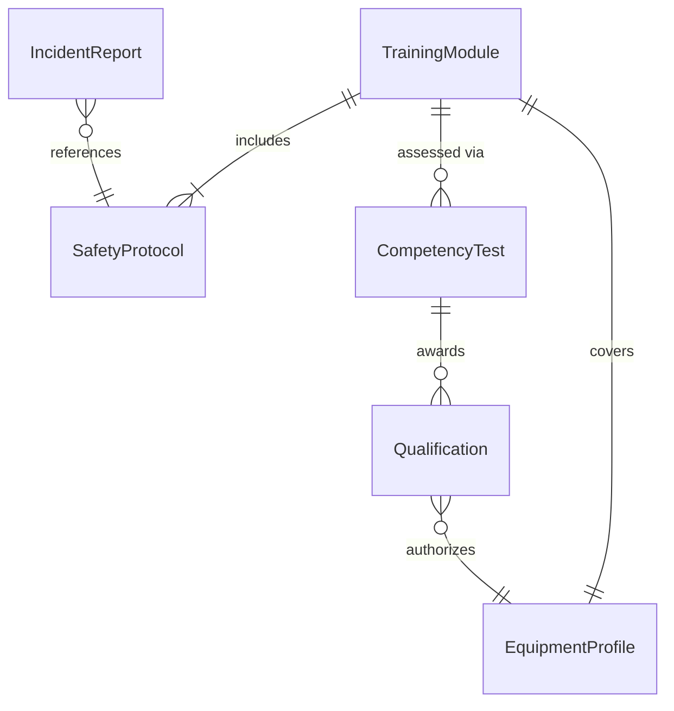
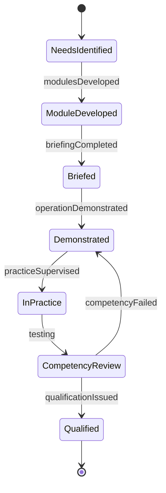
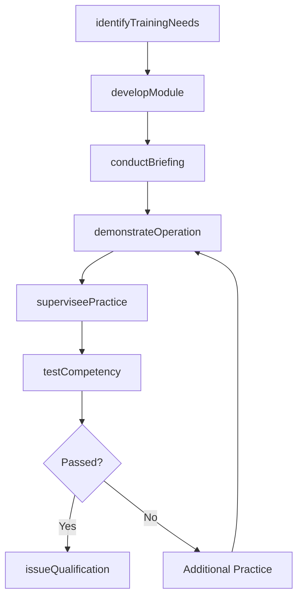
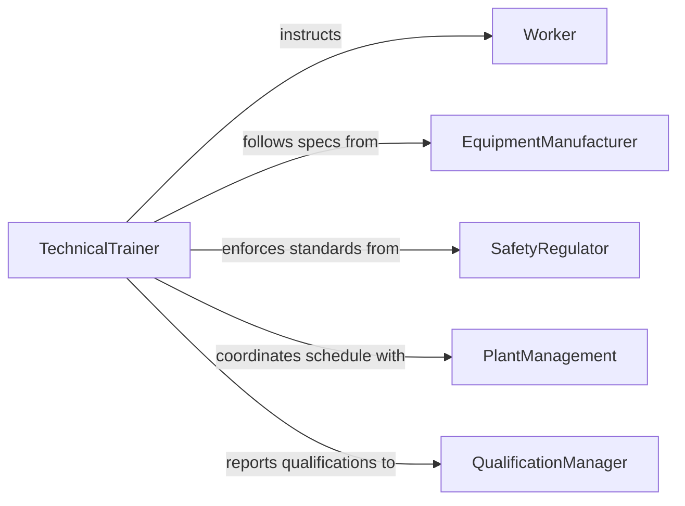

# Instruct Workers Use Equipment Perform

> Business-as-Code definition for instructing workers on equipment operation and technical procedures. Models the workplace training lifecycle from needs identification through hands-on instruction, safety certification, and ongoing proficiency verification.

## Overview

Instructing workers to use equipment or perform technical procedures involves identifying training needs, developing equipment-specific instruction, conducting hands-on demonstrations, supervising worker practice, and certifying operational competency. This definition exposes actions for training delivery and proficiency tracking, events for monitoring certification status, and searches for retrieving worker qualification records.

## Actors

| Actor | Description |
|-------|-------------|
| Worker | Receives instruction on equipment operation and procedures |
| EquipmentManufacturer | Provides technical manuals, specifications, and training aids |
| SafetyRegulator | Sets equipment operation safety standards and requirements |
| PlantManagement | Authorizes training programs and allocates production time |
| UnionRepresentative | Ensures training meets labor agreement provisions |
| MaintenanceTeam | Provides equipment condition data and maintenance procedures |

## Roles

| Role | Description |
|------|-------------|
| TechnicalTrainer | Develops and delivers equipment operation instruction |
| SafetyOfficer | Ensures training covers all safety protocols and hazard controls |
| ShiftSupervisor | Identifies training needs and validates worker readiness |
| QualificationManager | Maintains worker certification records and renewal schedules |

## Entities

| Entity | Description |
|--------|-------------|
| TrainingModule | A unit of instruction for a specific equipment or procedure |
| EquipmentProfile | Technical specifications and operating parameters for a machine |
| SafetyProtocol | Hazard controls and personal protective equipment requirements |
| CompetencyTest | A practical or written evaluation of equipment operation skills |
| Qualification | A formal record of a worker's authorization to operate equipment |
| IncidentReport | Documentation of training-related safety events |

## Actions

| Action | Description |
|--------|-------------|
| identifyTrainingNeeds | Determine which workers require equipment instruction |
| developModule | Create an equipment-specific training module |
| conductBriefing | Deliver classroom instruction on equipment theory and safety |
| demonstrateOperation | Show proper equipment operation techniques hands-on |
| superviseePractice | Observe a worker operating equipment under guidance |
| testCompetency | Evaluate worker proficiency through practical assessment |
| issueQualification | Certify a worker to independently operate equipment |

## Events

| Event | Description |
|-------|-------------|
| trainingNeedsIdentified | Equipment training gaps have been determined |
| modulesDeveloped | A training module has been created or updated |
| briefingCompleted | A classroom instruction session has been delivered |
| operationDemonstrated | Equipment operation has been demonstrated to workers |
| practiceSupervised | A worker has completed supervised equipment practice |
| competencyPassed | A worker has met equipment operation competency standards |
| competencyFailed | A worker did not pass equipment competency assessment |
| qualificationIssued | A worker has been certified to operate equipment |

## Searches

| Search | Description |
|--------|-------------|
| findTrainingModules | List modules by equipment type, procedure, or skill level |
| getWorkerQualifications | Retrieve qualifications by worker, equipment, or expiration |
| getCompetencyResults | Query test results by worker, equipment, or date |
| getTrainingSchedule | Find upcoming training sessions by equipment or department |

## Entity Relationships



## State Diagram



## Workflow



## Actor Relationships



## Usage

### Calling Actions

```typescript
import { instructWorkersUseEquipmentPerform } from '@headlessly/instruct-workers-use-equipment-perform'

const training = instructWorkersUseEquipmentPerform()

// Identify training needs for new CNC machine
const needs = await training.identifyTrainingNeeds({
  equipment: 'Haas VF-2SS CNC Mill',
  department: 'Machine Shop',
  workers: ['WKR-0045', 'WKR-0067', 'WKR-0089'],
  reason: 'new-equipment-installation'
})

// Develop a training module
const module = await training.developModule({
  equipment: 'Haas VF-2SS CNC Mill',
  topics: ['machine-startup-shutdown', 'tool-loading', 'program-selection', 'emergency-stop', 'lockout-tagout'],
  estimatedHours: 16,
  prerequisite: 'basic-machining-safety'
})

// Test worker competency
const result = await training.testCompetency({
  workerId: 'WKR-0045',
  moduleId: module.id,
  assessorId: 'SUPV-0012',
  practicalTasks: ['startup-sequence', 'tool-change', 'part-run', 'shutdown-sequence'],
  safetyChecks: ['ppe-compliance', 'emergency-stop-location', 'lockout-procedure']
})
```

### Event-Driven Automation

```typescript
// Notify supervisor when worker is qualified
training.qualificationIssued(async ({ workerId, equipment, qualification }) => {
  await notify({
    to: 'shift-supervisor',
    message: `Worker ${workerId} is now qualified to operate ${equipment} - qualification valid until ${qualification.expiresAt}`
  })
})

// Flag workers who fail competency for remediation
training.competencyFailed(async ({ workerId, equipment, deficiencies }) => {
  await notify({
    to: 'technical-trainer',
    message: `Worker ${workerId} requires remediation on ${equipment}: ${deficiencies.join(', ')}`
  })
})
```
