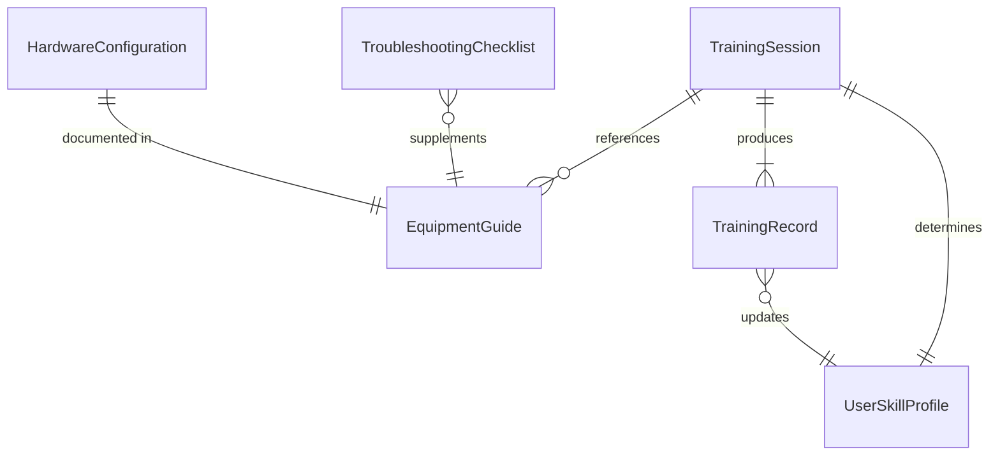
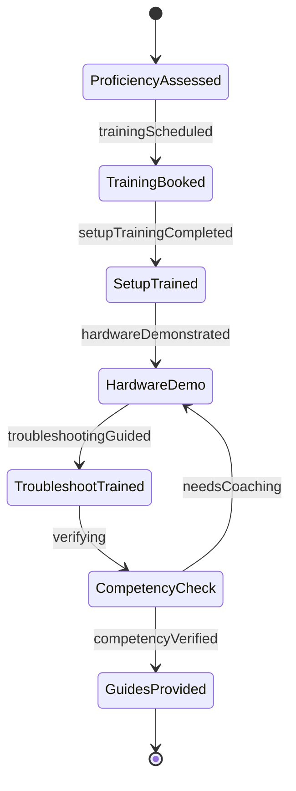
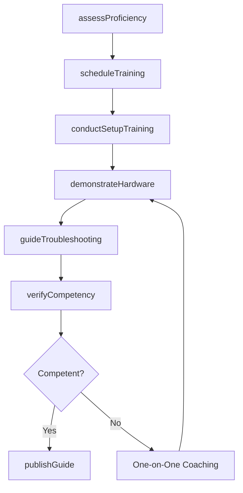
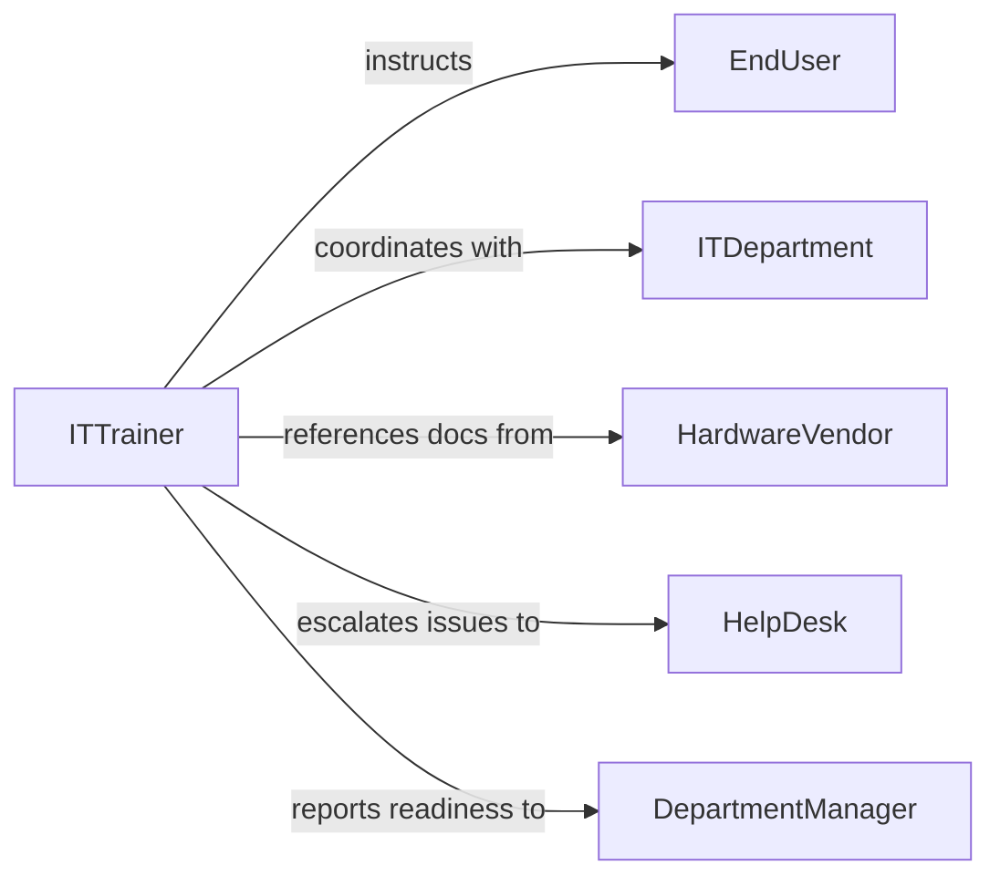

# Teach Others Use Computer Equipment

> Business-as-Code definition for teaching others to use computer equipment and hardware. Models the training process for workstations, peripherals, network devices, and specialized computing hardware from setup through proficient daily use.

## Overview

Teaching others to use computer equipment or hardware involves assessing user familiarity, providing instruction on hardware setup and configuration, demonstrating proper operation and troubleshooting, and verifying that users can independently perform required tasks. This definition exposes actions for training delivery and skill evaluation, events for tracking user readiness, and searches for retrieving training records and equipment inventories.

## Actors

| Actor | Description |
|-------|-------------|
| EndUser | Receives instruction on computer hardware operation |
| ITDepartment | Provisions equipment and manages configurations |
| HardwareVendor | Supplies computer equipment and technical documentation |
| HelpDesk | Provides ongoing support for hardware-related issues |
| DepartmentManager | Identifies training needs and approves training time |
| Procurement | Manages equipment acquisition and lifecycle |

## Roles

| Role | Description |
|------|-------------|
| ITTrainer | Delivers instruction on computer hardware operation |
| DesktopSupportTechnician | Assists with equipment setup and resolves technical issues |
| TrainingCoordinator | Schedules training sessions and manages enrollment |
| KnowledgeBaseAuthor | Creates self-service hardware guides and troubleshooting articles |

## Entities

| Entity | Description |
|--------|-------------|
| TrainingSession | A scheduled instruction session on computer equipment |
| EquipmentGuide | Documentation for a specific hardware device or setup |
| UserSkillProfile | A user's assessed computer hardware proficiency level |
| HardwareConfiguration | The standard setup specification for a role or department |
| TroubleshootingChecklist | Steps for resolving common hardware issues |
| TrainingRecord | Documentation of completed hardware training |

## Actions

| Action | Description |
|--------|-------------|
| assessProficiency | Evaluate a user's current computer hardware familiarity |
| scheduleTraining | Plan and book a hardware training session |
| conductSetupTraining | Teach users how to set up and configure their workstation |
| demonstrateHardware | Show proper use of peripherals, docking stations, and devices |
| guideTroubleshooting | Walk users through common hardware issue resolution |
| verifyCompetency | Confirm users can independently operate their equipment |
| publishGuide | Create and distribute hardware reference documentation |

## Events

| Event | Description |
|-------|-------------|
| proficiencyAssessed | A user's hardware skill level has been evaluated |
| trainingScheduled | A hardware training session has been booked |
| setupTrainingCompleted | A user has finished workstation setup training |
| hardwareDemonstrated | Hardware operation has been demonstrated to users |
| troubleshootingGuided | A user has completed troubleshooting training |
| competencyVerified | A user can independently operate their computer equipment |
| guidePublished | A hardware reference guide has been distributed |

## Searches

| Search | Description |
|--------|-------------|
| findTrainingSessions | List sessions by date, equipment type, or instructor |
| getUserProfiles | Retrieve user skill profiles by department or proficiency level |
| getTrainingRecords | Query completed training by user, equipment, or date |
| getEquipmentGuides | Find guides by hardware type, model, or topic |

## Entity Relationships



## State Diagram



## Workflow



## Actor Relationships



## Usage

### Calling Actions

```typescript
import { teachOthersUseComputerEquipment } from '@headlessly/teach-others-use-computer-equipment'

const hwTraining = teachOthersUseComputerEquipment()

// Assess a new employee's hardware proficiency
const profile = await hwTraining.assessProficiency({
  userId: 'EMP-2024-0456',
  areas: ['workstation-setup', 'monitor-configuration', 'printer-setup', 'vpn-hardware-token', 'docking-station']
})

// Conduct workstation setup training
await hwTraining.conductSetupTraining({
  userId: 'EMP-2024-0456',
  equipment: ['Dell Latitude 5540', 'Dell U2723QE Monitor', 'WD19TBS Thunderbolt Dock'],
  topics: ['docking-connection', 'dual-monitor-setup', 'peripheral-pairing', 'power-management']
})

// Verify competency
const result = await hwTraining.verifyCompetency({
  userId: 'EMP-2024-0456',
  tasks: ['dock-laptop', 'configure-displays', 'connect-printer', 'use-hardware-vpn-token'],
  assessorId: 'IT-TRAIN-008'
})
```

### Event-Driven Automation

```typescript
// Notify help desk that user is self-sufficient
hwTraining.competencyVerified(async ({ userId, equipment }) => {
  await notify({
    to: 'help-desk',
    message: `User ${userId} has completed hardware training and is self-sufficient on ${equipment.join(', ')}`
  })
})

// Auto-schedule follow-up for users needing more practice
hwTraining.proficiencyAssessed(async ({ userId, gaps }) => {
  if (gaps.length > 0) {
    await hwTraining.scheduleTraining({
      userId,
      focusAreas: gaps,
      format: 'one-on-one',
      priority: 'standard'
    })
  }
})
```
