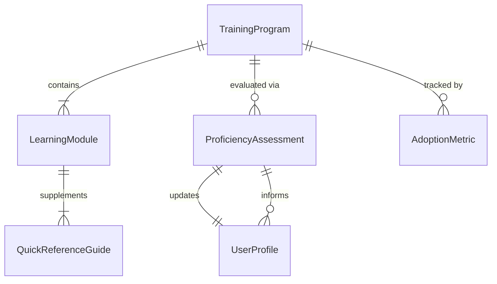
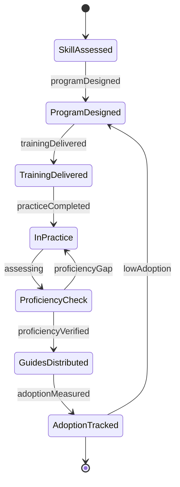
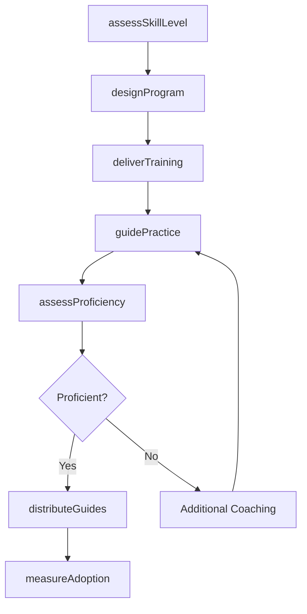
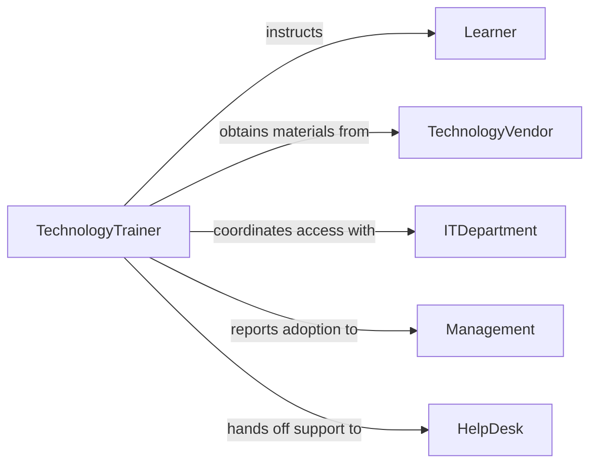

# Teach Others Use Technology Equipment

> Business-as-Code definition for teaching others to use technology and equipment. Models the end-to-end training process for technology adoption, covering needs assessment, instructional design, hands-on practice, and user proficiency verification.

## Overview

Teaching others to use technology or equipment involves evaluating user skill levels, developing technology-specific training content, delivering instruction through demonstrations and guided practice, and measuring adoption success. This definition exposes actions for training program management and learner assessment, events for tracking technology adoption milestones, and searches for retrieving training and proficiency data.

## Actors

| Actor | Description |
|-------|-------------|
| Learner | Receives instruction on technology or equipment use |
| TechnologyVendor | Provides product documentation, updates, and support |
| ITDepartment | Manages technology deployment and access provisioning |
| Management | Sponsors training initiatives and sets adoption timelines |
| HelpDesk | Provides post-training support and issue resolution |
| ContentProvider | Supplies e-learning modules and training media |

## Roles

| Role | Description |
|------|-------------|
| TechnologyTrainer | Designs and delivers technology instruction programs |
| InstructionalDesigner | Creates training materials and learning pathways |
| AdoptionSpecialist | Measures and drives technology adoption rates |
| SupportCoach | Provides one-on-one assistance during the transition period |

## Entities

| Entity | Description |
|--------|-------------|
| TrainingProgram | A structured plan for technology or equipment instruction |
| LearningModule | A self-contained unit of technology training content |
| ProficiencyAssessment | An evaluation of a learner's technology skills |
| UserProfile | A learner's skill level, role, and training history |
| QuickReferenceGuide | A concise job aid for common technology tasks |
| AdoptionMetric | A measurement of technology usage and user proficiency |

## Actions

| Action | Description |
|--------|-------------|
| assessSkillLevel | Evaluate a learner's current technology proficiency |
| designProgram | Create a technology training program with learning objectives |
| deliverTraining | Conduct a technology training session with demonstrations |
| guidePractice | Walk learners through hands-on exercises with the technology |
| assessProficiency | Test learner ability to independently use the technology |
| distributeGuides | Provide quick reference guides and job aids |
| measureAdoption | Track technology usage rates and support ticket trends |

## Events

| Event | Description |
|-------|-------------|
| skillLevelAssessed | A learner's technology proficiency has been evaluated |
| programDesigned | A technology training program has been created |
| trainingDelivered | A technology training session has been conducted |
| practiceCompleted | A learner has completed guided practice exercises |
| proficiencyVerified | A learner has demonstrated independent technology use |
| proficiencyGap | A learner has not met minimum proficiency standards |
| adoptionMeasured | Technology adoption metrics have been collected |

## Searches

| Search | Description |
|--------|-------------|
| findPrograms | List training programs by technology, audience, or status |
| getLearnerProfiles | Retrieve learner profiles by department, role, or skill level |
| getProficiencyResults | Query assessment results by learner or technology |
| getAdoptionMetrics | Find adoption data by technology, department, or time period |

## Entity Relationships



## State Diagram



## Workflow



## Actor Relationships



## Usage

### Calling Actions

```typescript
import { teachOthersUseTechnologyEquipment } from '@headlessly/teach-others-use-technology-equipment'

const techTraining = teachOthersUseTechnologyEquipment()

// Assess skill levels for a department
const assessments = await techTraining.assessSkillLevel({
  technology: 'Salesforce CRM',
  department: 'Sales',
  learners: ['USR-0101', 'USR-0102', 'USR-0103'],
  areas: ['navigation', 'data-entry', 'reporting', 'dashboard-creation']
})

// Design a training program
const program = await techTraining.designProgram({
  technology: 'Salesforce CRM',
  modules: ['platform-overview', 'contact-management', 'opportunity-tracking', 'report-builder', 'mobile-app'],
  deliveryMethod: 'blended',
  duration: '3-days'
})

// Measure technology adoption after training
const metrics = await techTraining.measureAdoption({
  technology: 'Salesforce CRM',
  department: 'Sales',
  metrics: ['daily-active-users', 'feature-utilization', 'support-tickets'],
  period: 'post-30-days'
})
```

### Event-Driven Automation

```typescript
// Schedule follow-up coaching for proficiency gaps
techTraining.proficiencyGap(async ({ learnerId, technology, gaps }) => {
  await notify({
    to: 'support-coach',
    message: `Learner ${learnerId} needs additional coaching on ${technology}: ${gaps.join(', ')}`
  })
})

// Report adoption milestones to management
techTraining.adoptionMeasured(async ({ technology, department, adoptionRate }) => {
  if (adoptionRate >= 0.9) {
    await notify({
      to: 'management',
      message: `${department} has achieved ${Math.round(adoptionRate * 100)}% adoption of ${technology}`
    })
  }
})
```
