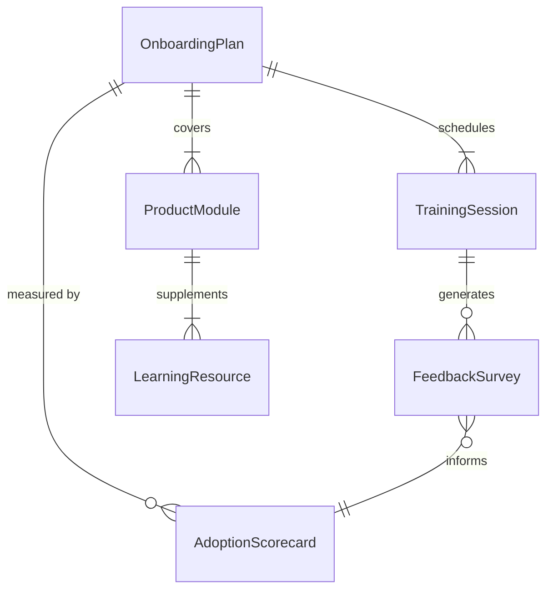
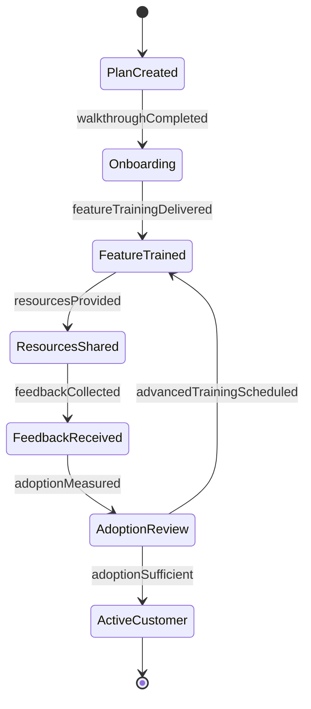
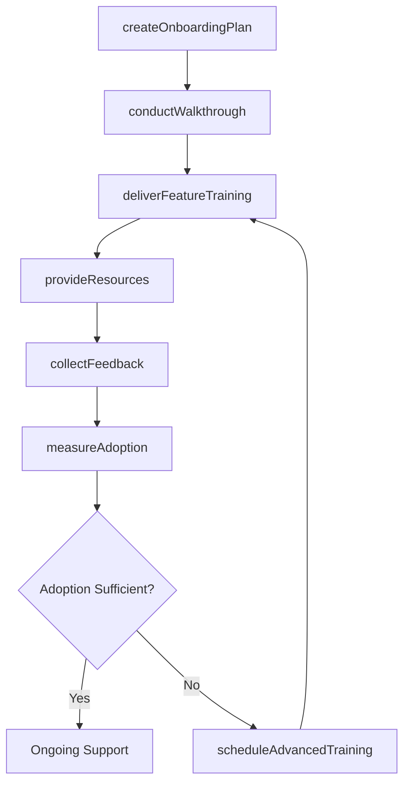
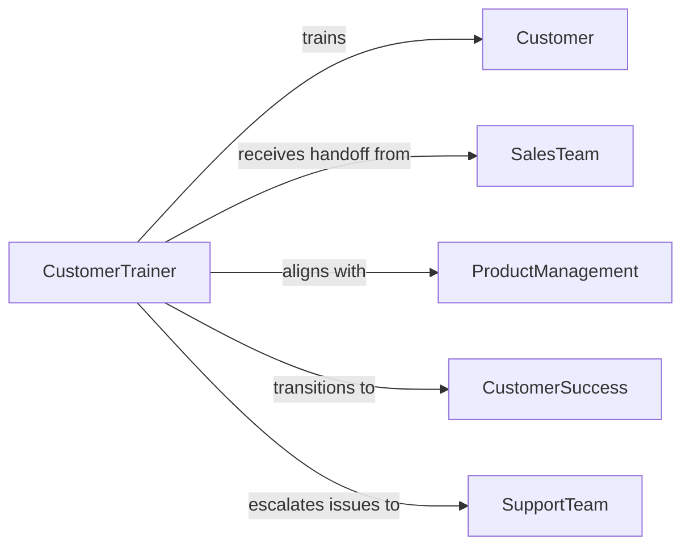

# Train Customers Use Products

> Business-as-Code definition for training customers in product usage. Models the customer onboarding and education lifecycle from initial product setup through advanced feature training, ensuring successful adoption and reducing support dependency.

## Overview

Training customers in the use of products involves onboarding new customers, delivering product walkthroughs, providing hands-on practice sessions, creating self-service learning resources, and measuring product adoption. This definition exposes actions for customer training delivery and engagement tracking, events for monitoring onboarding milestones, and searches for retrieving training and adoption data.

## Actors

| Actor | Description |
|-------|-------------|
| Customer | Receives instruction on product features and operation |
| SalesTeam | Hands off customer context and purchase details post-sale |
| ProductManagement | Defines product capabilities and feature roadmaps |
| CustomerSuccess | Owns long-term customer relationship and adoption goals |
| SupportTeam | Handles product issues that arise during or after training |
| PartnerReseller | Delivers training on behalf of the product company |

## Roles

| Role | Description |
|------|-------------|
| CustomerTrainer | Designs and delivers product training to customers |
| OnboardingSpecialist | Guides new customers through initial product setup |
| ContentDeveloper | Creates training materials, videos, and knowledge base articles |
| AdoptionAnalyst | Tracks product usage metrics and training effectiveness |

## Entities

| Entity | Description |
|--------|-------------|
| OnboardingPlan | A structured plan for customer product introduction |
| TrainingSession | A scheduled product instruction session with a customer |
| ProductModule | A training unit focused on a specific product feature |
| LearningResource | Videos, guides, and tutorials for self-paced learning |
| AdoptionScorecard | A measurement of customer product usage and feature adoption |
| FeedbackSurvey | Post-training customer satisfaction and comprehension data |

## Actions

| Action | Description |
|--------|-------------|
| createOnboardingPlan | Design a customer-specific product onboarding roadmap |
| conductWalkthrough | Guide the customer through initial product setup and navigation |
| deliverFeatureTraining | Teach specific product features with hands-on exercises |
| provideResources | Share self-service learning materials with the customer |
| collectFeedback | Gather post-training feedback on comprehension and satisfaction |
| measureAdoption | Track customer product usage and feature utilization |
| scheduleAdvancedTraining | Book follow-up sessions on advanced product capabilities |

## Events

| Event | Description |
|-------|-------------|
| onboardingPlanCreated | A customer onboarding plan has been established |
| walkthroughCompleted | A customer has completed the initial product walkthrough |
| featureTrainingDelivered | A feature-specific training session has been conducted |
| resourcesProvided | Self-service learning materials have been shared |
| feedbackCollected | Post-training customer feedback has been received |
| adoptionMeasured | Customer product adoption metrics have been calculated |
| advancedTrainingScheduled | A follow-up training session has been booked |

## Searches

| Search | Description |
|--------|-------------|
| findOnboardingPlans | List onboarding plans by customer, product, or status |
| getTrainingSessions | Retrieve sessions by customer, trainer, or date |
| getAdoptionScores | Query adoption metrics by customer, feature, or time period |
| getFeedbackResults | Find feedback data by session, customer, or rating |

## Entity Relationships



## State Diagram



## Workflow



## Actor Relationships



## Usage

### Calling Actions

```typescript
import { trainCustomersUseProducts } from '@headlessly/train-customers-use-products'

const productTraining = trainCustomersUseProducts()

// Create an onboarding plan for a new enterprise customer
const plan = await productTraining.createOnboardingPlan({
  customerId: 'CUST-2024-0089',
  product: 'Enterprise Analytics Platform',
  users: 25,
  modules: ['dashboard-setup', 'data-connectors', 'report-builder', 'user-management', 'api-integration'],
  targetCompletionDate: '2026-04-15'
})

// Deliver feature-specific training
await productTraining.deliverFeatureTraining({
  customerId: 'CUST-2024-0089',
  module: 'report-builder',
  attendees: ['user-01', 'user-02', 'user-03'],
  format: 'live-virtual',
  duration: 90
})

// Measure product adoption
const adoption = await productTraining.measureAdoption({
  customerId: 'CUST-2024-0089',
  metrics: ['daily-active-users', 'reports-created', 'dashboards-viewed', 'api-calls'],
  period: 'post-30-days'
})
```

### Event-Driven Automation

```typescript
// Alert customer success when adoption is low
productTraining.adoptionMeasured(async ({ customerId, adoptionScore, threshold }) => {
  if (adoptionScore < threshold) {
    await notify({
      to: 'customer-success',
      message: `Customer ${customerId} adoption score is ${adoptionScore}% (below ${threshold}% target) - intervention recommended`
    })
  }
})

// Auto-send resources after feature training
productTraining.featureTrainingDelivered(async ({ customerId, module }) => {
  await productTraining.provideResources({
    customerId,
    resources: [`${module}-quick-start-guide`, `${module}-video-walkthrough`, `${module}-faq`]
  })
})
```
