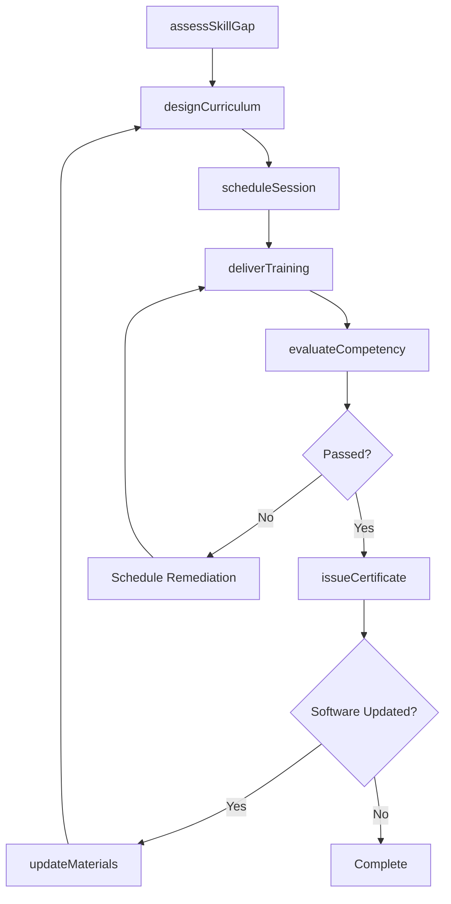
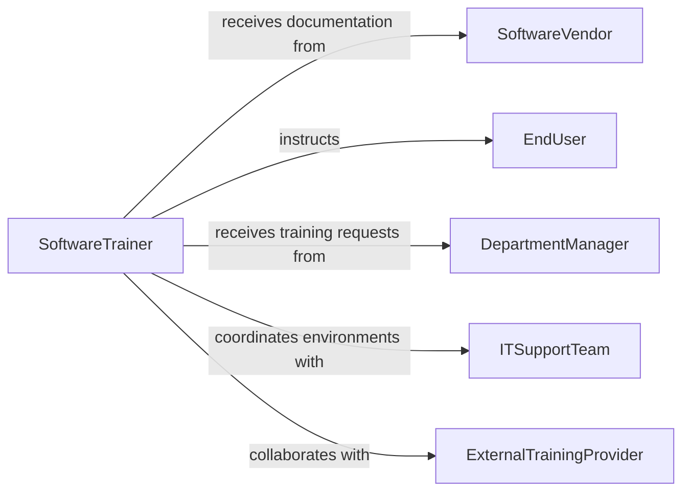

# Train Others Computer Interface Software

> Business-as-Code definition for training others in computer interface or software use. Models the process of assessing skill gaps, designing instructional sessions, delivering hands-on software training, and evaluating learner proficiency.

## Overview

Training others in computer interface or software use involves identifying user skill levels, developing instructional materials tailored to specific applications, conducting training sessions, and measuring post-training competency. This definition exposes actions for curriculum development and session delivery, events for tracking learner progress, and searches for managing training schedules and completion records.

## Actors

| Actor | Description |
|-------|-------------|
| SoftwareVendor | Provides application documentation, release notes, and certification programs |
| EndUser | The individual receiving training on computer interfaces or software |
| DepartmentManager | Identifies training needs and nominates staff for sessions |
| ITSupportTeam | Provisions software environments and resolves technical issues during training |
| ExternalTrainingProvider | Delivers specialized or vendor-certified instruction |

## Roles

| Role | Description |
|------|-------------|
| SoftwareTrainer | Designs and delivers computer interface and software training |
| InstructionalDesigner | Creates training materials, guides, and e-learning modules |
| TrainingCoordinator | Schedules sessions, manages enrollment, and tracks attendance |
| TechnicalMentor | Provides ongoing post-training support and coaching |

## Entities

| Entity | Description |
|--------|-------------|
| TrainingCurriculum | The structured set of topics and objectives for a software training program |
| TrainingSession | A scheduled instance of instructor-led or virtual training delivery |
| LearnerProfile | The skill assessment and progress record for a training participant |
| TrainingMaterial | Guides, tutorials, exercises, and reference documents |
| CompetencyAssessment | An evaluation measuring learner proficiency after training |
| CompletionCertificate | A record confirming successful completion of training requirements |

## Actions

| Action | Description |
|--------|-------------|
| assessSkillGap | Evaluate current user proficiency against required competencies |
| designCurriculum | Create a structured training plan for the target software |
| scheduleSession | Set up a training session with date, location, and participants |
| deliverTraining | Conduct the hands-on software training session |
| evaluateCompetency | Administer post-training assessments to measure proficiency |
| issueCertificate | Generate a completion certificate for participants who pass |
| updateMaterials | Revise training content to reflect software changes or feedback |

## Events

| Event | Description |
|-------|-------------|
| skillGapAssessed | A user skill evaluation has been completed |
| curriculumDesigned | A new training curriculum has been published |
| sessionScheduled | A training session has been added to the calendar |
| trainingDelivered | A training session has been completed |
| competencyEvaluated | A post-training assessment has been scored |
| certificateIssued | A completion certificate has been generated |
| materialsUpdated | Training content has been revised with new information |

## Searches

| Search | Description |
|--------|-------------|
| findSessionsByApplication | List training sessions filtered by software application |
| getLearnerProgress | Retrieve competency scores and completion status for a participant |
| getUpcomingSessions | List scheduled sessions within a date range |
| findIncompleteTraining | Identify participants who have not completed required training |

## Workflow



## Actor Relationships



## Usage

### Calling Actions

```typescript
import { trainOthersComputerInterfaceSoftware } from '@headlessly/train-others-computer-interface-software'

const training = trainOthersComputerInterfaceSoftware()

// Assess current skill levels
const assessment = await training.assessSkillGap({
  userId: 'USR-3301',
  application: 'SAP S/4HANA',
  requiredCompetencies: ['navigation', 'reporting', 'data-entry']
})

// Schedule a training session
const session = await training.scheduleSession({
  curriculumId: 'CUR-SAP-101',
  date: '2026-03-15',
  format: 'instructor-led',
  participants: ['USR-3301', 'USR-3302', 'USR-3303'],
  location: 'Training Lab B'
})

// Evaluate competency after training
const result = await training.evaluateCompetency({
  sessionId: session.id,
  userId: 'USR-3301',
  assessmentType: 'hands-on-exercise'
})
```

### Event-Driven Automation

```typescript
// Auto-issue certificates on passing
training.competencyEvaluated(async ({ sessionId, userId, score, passingScore }) => {
  if (score >= passingScore) {
    await training.issueCertificate({ sessionId, userId })
  }
})

// Notify managers of incomplete training
training.sessionScheduled(async ({ sessionId, participants }) => {
  for (const userId of participants) {
    await notify({
      to: getManager(userId),
      message: `${userId} has been enrolled in software training session ${sessionId}`
    })
  }
})
```
