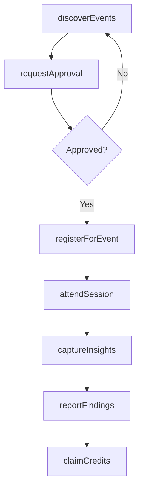
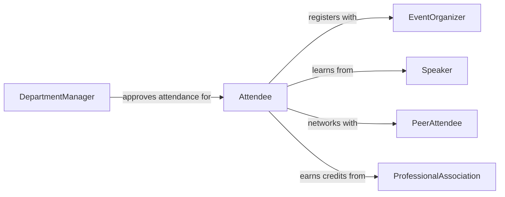

# Attend Conferences Workshops Maintain Professional

> Business-as-Code definition for attending conferences or workshops to maintain professional knowledge. Models the lifecycle from event discovery through attendance, knowledge capture, and application of insights.

## Overview

Attending conferences and workshops to maintain professional knowledge involves identifying relevant industry events, securing approval and registration, participating in sessions, and synthesizing key takeaways for organizational benefit. This activity keeps professionals current with emerging trends, research findings, and best practices within their fields. It also facilitates networking with peers, thought leaders, and vendors to exchange ideas and build professional relationships.

## Actors

| Actor | Description |
|-------|-------------|
| EventOrganizer | Entity that plans and hosts conferences, summits, or workshops |
| Speaker | Presenter delivering talks, panels, or technical sessions |
| ProfessionalAssociation | Industry body sponsoring or endorsing professional events |
| Sponsor | Organization funding or exhibiting at the event |
| PeerAttendee | Fellow professional attending the same event for knowledge sharing |

## Roles

| Role | Description |
|------|-------------|
| Attendee | Professional participating in conference sessions and workshops |
| TravelCoordinator | Arranges logistics including travel, lodging, and registration |
| KnowledgeManager | Captures and distributes insights gained from events |
| DepartmentManager | Approves attendance requests and evaluates ROI of participation |

## Entities

| Entity | Description |
|--------|-------------|
| Conference | A multi-session professional event focused on industry topics |
| Workshop | A hands-on, focused learning session within or separate from a conference |
| AttendanceRequest | A formal request to attend an event including justification and costs |
| SessionNotes | Documented takeaways and insights from individual event sessions |
| NetworkingContact | A professional connection made during an event |
| ContinuingEducationCredit | Professional development credit earned through attendance |

## Actions

| Action | Description |
|--------|-------------|
| discoverEvents | Search for relevant conferences and workshops by topic or industry |
| requestApproval | Submit an attendance request with business justification and budget |
| registerForEvent | Complete registration and secure a spot at the event |
| attendSession | Participate in a specific talk, panel, or workshop session |
| captureInsights | Document key takeaways, ideas, and action items from sessions |
| reportFindings | Share a summary of learnings with the team or organization |
| claimCredits | Submit attendance records to earn continuing education credits |

## Events

| Event | Description |
|-------|-------------|
| eventDiscovered | A relevant conference or workshop has been identified |
| approvalGranted | Attendance request has been approved by management |
| registrationCompleted | Event registration has been finalized |
| sessionAttended | A conference session or workshop has been completed |
| insightsCaptured | Key takeaways from an event have been documented |
| findingsReported | Event learnings have been shared with the organization |
| creditsClaimed | Continuing education credits have been submitted and recorded |

## Searches

| Search | Description |
|--------|-------------|
| findUpcomingEvents | List conferences and workshops by date, topic, or location |
| getAttendanceHistory | Retrieve past event attendance records by employee or department |
| getSessionNotes | Search documented insights by event, topic, or keyword |
| getCredits | Look up continuing education credits earned by professional |

## Workflow



## Actor Relationships



## Usage

### Calling Actions

```typescript
import { attendConferencesWorkshopsMaintainProfessional } from '@headlessly/attend-conferences-workshops-maintain-professional'

const conferences = attendConferencesWorkshopsMaintainProfessional()

// Discover relevant upcoming events
const events = await conferences.discoverEvents({
  topics: ['machine-learning', 'data-engineering'],
  dateRange: { start: '2026-04-01', end: '2026-09-30' },
  format: 'in-person'
})

// Request approval to attend
const request = await conferences.requestApproval({
  employeeId: 'emp-2210',
  eventId: events[0].id,
  justification: 'Directly relevant to Q3 ML pipeline initiative',
  estimatedCost: 2500
})

// Capture insights from a session
await conferences.captureInsights({
  eventId: events[0].id,
  sessionTitle: 'Scaling Real-Time Feature Stores',
  keyTakeaways: ['Use columnar storage for low-latency reads', 'Partition by feature group'],
  actionItems: ['Evaluate Apache Feast for internal pipeline']
})
```

### Event-Driven Automation

```typescript
// Auto-distribute findings to the team
conferences.findingsReported(async ({ employeeId, eventId, summary }) => {
  await distribute({
    to: 'engineering-team',
    subject: `Conference Takeaways: ${eventId}`,
    body: summary
  })
})

// Track continuing education progress
conferences.creditsClaimed(async ({ employeeId, credits, totalEarned }) => {
  if (totalEarned >= 40) {
    await notify({
      to: employeeId,
      message: 'Annual continuing education requirement met'
    })
  }
})
```
