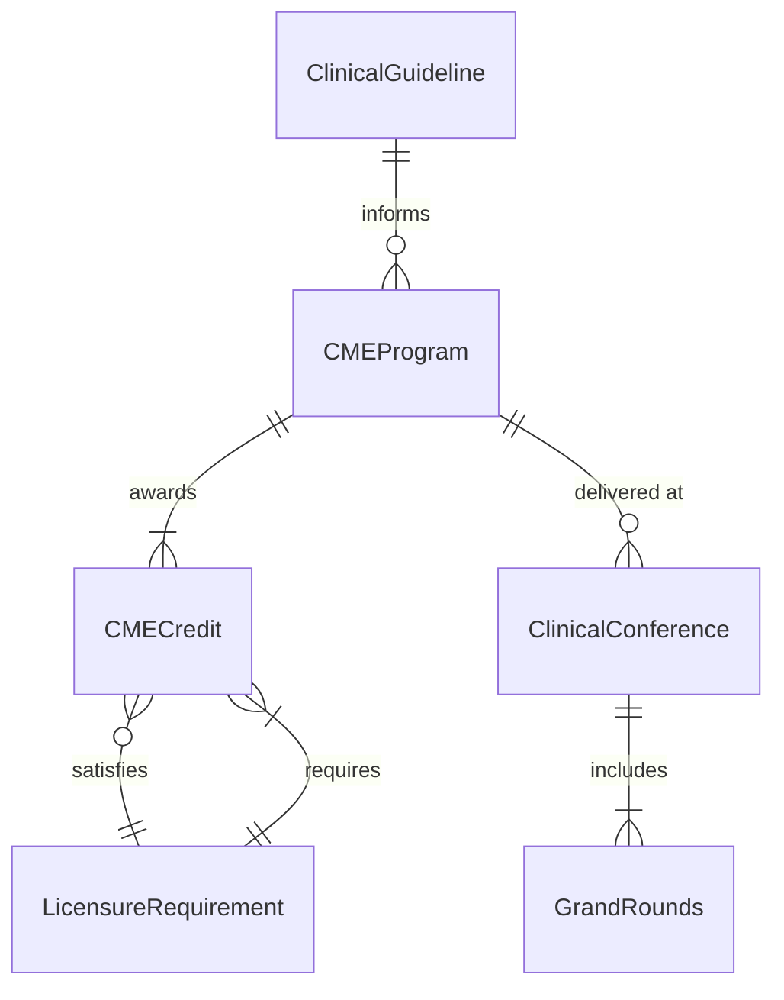
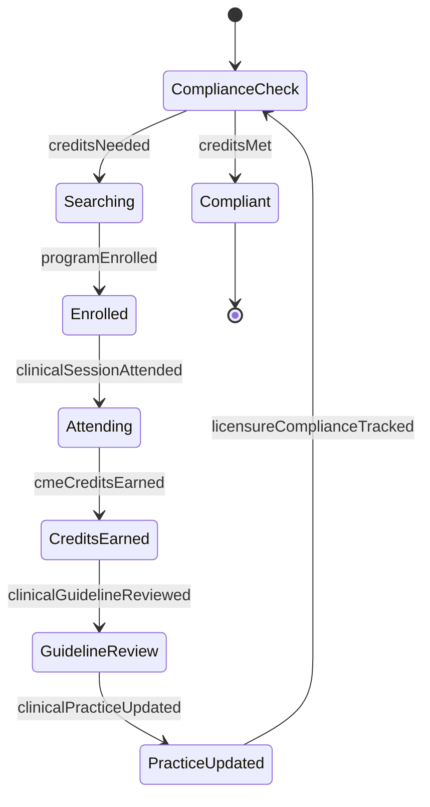
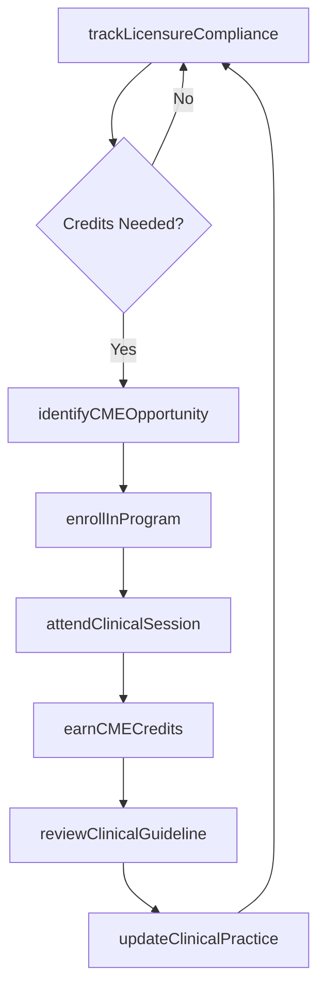
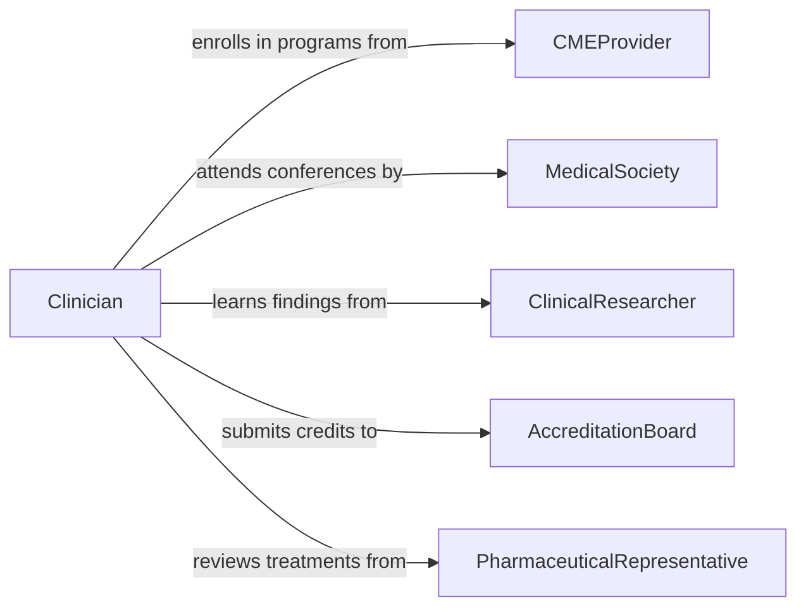

# Attend Educational Events Update Medical

> Business-as-Code definition for attending educational events to update medical knowledge. Models the participation in continuing medical education (CME) programs, clinical conferences, and healthcare seminars to maintain clinical competency.

## Overview

Attending educational events to update medical knowledge is essential for healthcare professionals to maintain licensure, stay current with evolving clinical guidelines, and deliver evidence-based patient care. This activity covers the full lifecycle of identifying relevant CME opportunities, participating in clinical conferences and grand rounds, earning required credits, and applying updated medical knowledge to practice. It ensures compliance with accreditation requirements while advancing clinical expertise.

## Actors

| Actor | Description |
|-------|-------------|
| CMEProvider | Accredited organizations offering continuing medical education programs |
| MedicalSociety | Professional body sponsoring clinical conferences and guidelines |
| ClinicalResearcher | Presents new findings from clinical trials and medical studies |
| AccreditationBoard | Certifies CME programs and tracks credit requirements |
| PharmaceuticalRepresentative | Provides information on new treatments and therapeutic options |

## Roles

| Role | Description |
|------|-------------|
| Clinician | Healthcare provider seeking to update medical knowledge |
| CMECoordinator | Manages CME program selection and credit tracking for staff |
| DepartmentChief | Ensures clinical staff meet continuing education requirements |
| MedicalEducator | Facilitates internal educational sessions and journal clubs |

## Entities

| Entity | Description |
|--------|-------------|
| CMEProgram | An accredited continuing medical education course or activity |
| ClinicalConference | A medical meeting featuring research presentations and discussions |
| CMECredit | A unit of continuing education earned through approved activities |
| ClinicalGuideline | An updated evidence-based recommendation for patient care |
| LicensureRequirement | Mandatory CME credits needed for medical license renewal |
| GrandRounds | A formal clinical teaching session within a healthcare institution |

## Actions

| Action | Description |
|--------|-------------|
| identifyCMEOpportunity | Find relevant continuing medical education programs |
| enrollInProgram | Register for a CME course or clinical conference |
| attendClinicalSession | Participate in a medical education session or grand rounds |
| earnCMECredits | Complete requirements to receive continuing education credits |
| reviewClinicalGuideline | Study updated evidence-based care recommendations |
| updateClinicalPractice | Integrate new medical knowledge into patient care protocols |
| trackLicensureCompliance | Monitor progress toward required CME credit thresholds |

## Events

| Event | Description |
|-------|-------------|
| cmeOpportunityIdentified | A relevant CME program has been found |
| programEnrolled | Registration for a CME program has been completed |
| clinicalSessionAttended | A medical education session has been completed |
| cmeCreditsEarned | Continuing education credits have been awarded |
| clinicalGuidelineReviewed | Updated care recommendations have been studied |
| clinicalPracticeUpdated | New medical knowledge has been applied to care protocols |
| licensureComplianceTracked | CME credit status has been verified against requirements |

## Searches

| Search | Description |
|--------|-------------|
| findCMEPrograms | Search CME opportunities by specialty, format, or credit type |
| getCMECredits | Retrieve earned credits by clinician, period, or accreditation body |
| getLicensureStatus | Check compliance with licensure renewal requirements |
| getClinicalGuidelines | Query updated guidelines by specialty or condition |

## Entity Relationships



## State Diagram



## Workflow



## Actor Relationships



## Usage

### Calling Actions

```typescript
import { attendEducationalEventsUpdateMedical } from '@headlessly/attend-educational-events-update-medical'

const medicalEd = attendEducationalEventsUpdateMedical()

// Check licensure compliance
const status = await medicalEd.trackLicensureCompliance({
  clinicianId: 'dr-4521',
  renewalDate: '2027-06-30',
  requiredCredits: 50
})

// Find and enroll in a CME program
const programs = await medicalEd.identifyCMEOpportunity({
  specialty: 'cardiology',
  creditType: 'AMA-PRA-Category-1',
  format: 'live-conference'
})

await medicalEd.enrollInProgram({
  programId: programs[0].id,
  clinicianId: 'dr-4521'
})

// Earn credits and update practice
await medicalEd.earnCMECredits({
  programId: programs[0].id,
  clinicianId: 'dr-4521',
  creditsEarned: 12
})

await medicalEd.updateClinicalPractice({
  clinicianId: 'dr-4521',
  guidelineId: 'gl-heart-failure-2026',
  changes: ['updated-medication-protocol', 'revised-monitoring-schedule']
})
```

### Event-Driven Automation

```typescript
// Alert clinicians approaching licensure deadline
medicalEd.licensureComplianceTracked(async ({ clinicianId, creditsRemaining, renewalDate }) => {
  const monthsLeft = monthsUntil(renewalDate)
  if (creditsRemaining > 0 && monthsLeft <= 6) {
    await notify({
      to: clinicianId,
      message: `${creditsRemaining} CME credits needed before ${renewalDate}`
    })
  }
})

// Auto-review guidelines after earning credits
medicalEd.cmeCreditsEarned(async ({ programId, specialty }) => {
  const guidelines = await medicalEd.getClinicalGuidelines({ specialty })
  for (const guideline of guidelines) {
    await medicalEd.reviewClinicalGuideline({ guidelineId: guideline.id })
  }
})
```
