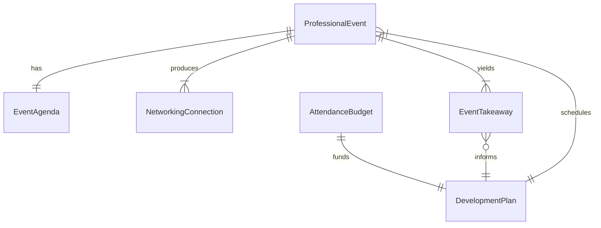
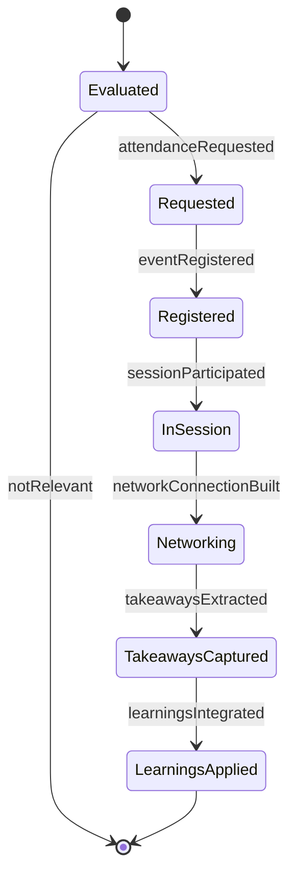
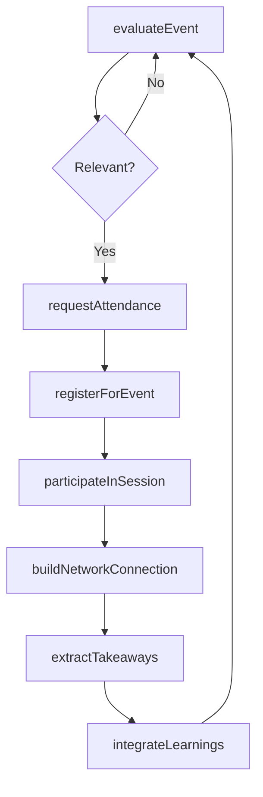
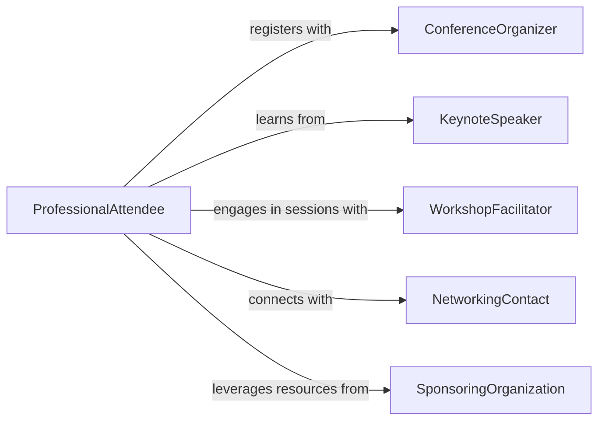

# Attend Events Develop Professional Knowledge

> Business-as-Code definition for attending events to develop professional knowledge. Models the selection, participation, and knowledge extraction from conferences, seminars, workshops, and networking events.

## Overview

Attending events to develop professional knowledge involves identifying high-value professional gatherings, participating actively in presentations and discussions, and converting those experiences into actionable knowledge. This encompasses industry conferences, seminars, symposia, webinars, and networking events that expose professionals to new ideas, established experts, and emerging practices relevant to their field.

## Actors

| Actor | Description |
|-------|-------------|
| ConferenceOrganizer | Plans and manages professional conferences and symposia |
| KeynoteSpeaker | Delivers expert presentations on industry topics |
| WorkshopFacilitator | Leads interactive sessions for skill-building and discussion |
| NetworkingContact | Provides professional connections and knowledge exchange opportunities |
| SponsoringOrganization | Funds or supports professional events and provides resources |

## Roles

| Role | Description |
|------|-------------|
| ProfessionalAttendee | Participates in events to expand domain knowledge |
| DevelopmentAdvisor | Recommends events aligned with career and organizational goals |
| EventLiaison | Coordinates attendance logistics and follow-up activities |
| KnowledgeBroker | Translates event learnings into organizational improvements |

## Entities

| Entity | Description |
|--------|-------------|
| ProfessionalEvent | A conference, seminar, workshop, or networking gathering |
| EventAgenda | The schedule of sessions, speakers, and activities at an event |
| NetworkingConnection | A professional relationship formed or strengthened at an event |
| EventTakeaway | A key insight, technique, or resource acquired from an event |
| DevelopmentPlan | A structured plan linking events to professional growth objectives |
| AttendanceBudget | Allocated funds for event registration, travel, and expenses |

## Actions

| Action | Description |
|--------|-------------|
| evaluateEvent | Assess an event's relevance to professional development goals |
| requestAttendance | Submit a request to attend a professional event |
| registerForEvent | Complete enrollment in a selected event |
| participateInSession | Actively engage in a presentation, workshop, or discussion |
| buildNetworkConnection | Establish or strengthen a professional relationship at the event |
| extractTakeaways | Document key insights and actionable items from the event |
| integrateLearnings | Apply event takeaways to professional practice or team processes |

## Events

| Event | Description |
|-------|-------------|
| eventEvaluated | An event has been assessed for professional relevance |
| attendanceRequested | A request to attend a professional event has been submitted |
| eventRegistered | Enrollment in a professional event has been completed |
| sessionParticipated | Active engagement in an event session has occurred |
| networkConnectionBuilt | A new professional connection has been established |
| takeawaysExtracted | Key insights from the event have been documented |
| learningsIntegrated | Event knowledge has been applied to professional practice |

## Searches

| Search | Description |
|--------|-------------|
| findProfessionalEvents | Search events by topic, date, location, or format |
| getAttendanceRequests | Retrieve pending or approved attendance requests by person or period |
| getNetworkConnections | List connections made at events by person or industry |
| getEventTakeaways | Query documented insights by event, topic, or applicability |

## Entity Relationships



## State Diagram



## Workflow



## Actor Relationships



## Usage

### Calling Actions

```typescript
import { attendEventsDevelopProfessionalKnowledge } from '@headlessly/attend-events-develop-professional-knowledge'

const events = attendEventsDevelopProfessionalKnowledge()

// Evaluate an upcoming event
const evaluation = await events.evaluateEvent({
  eventName: 'FinTech Innovation Summit 2026',
  topics: ['blockchain', 'regulatory-technology', 'open-banking'],
  alignmentScore: 0.9
})

// Request and register
const request = await events.requestAttendance({
  eventId: evaluation.eventId,
  employeeId: 'emp-2087',
  estimatedCost: 2200
})

await events.registerForEvent({
  requestId: request.id,
  sessions: ['keynote-defi-trends', 'workshop-regtech-compliance']
})

// Extract and integrate learnings
await events.extractTakeaways({
  eventId: evaluation.eventId,
  insights: [
    { topic: 'regtech', detail: 'Automated compliance reporting reduces audit time by 40%' },
    { topic: 'open-banking', detail: 'API standardization accelerating cross-border payments' }
  ]
})
```

### Event-Driven Automation

```typescript
// Auto-integrate high-value takeaways
events.takeawaysExtracted(async ({ eventId, insights }) => {
  const highValue = insights.filter(i => i.applicability === 'immediate')
  if (highValue.length > 0) {
    await events.integrateLearnings({
      eventId,
      actionItems: highValue.map(i => i.detail)
    })
  }
})

// Track networking ROI
events.networkConnectionBuilt(async ({ connectionId, context }) => {
  await crm.createContact({
    source: 'professional-event',
    connectionId,
    notes: context
  })
})
```
