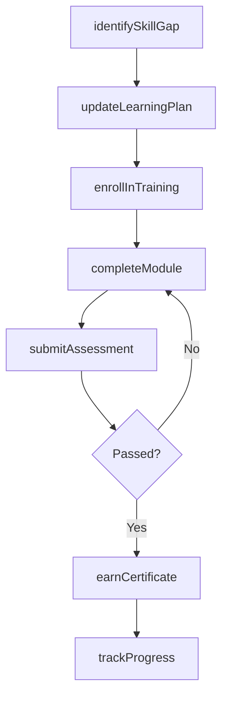
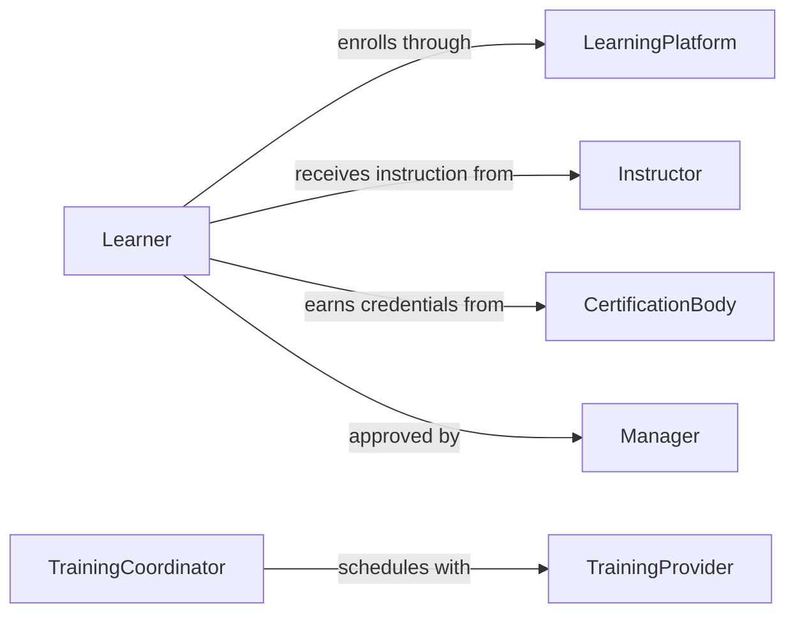

# Attend Training Learn New Skills

> Business-as-Code definition for attending training programs to learn new skills or update existing knowledge. Models the full lifecycle of identifying skill gaps, enrolling in training, completing coursework, and applying new competencies.

## Overview

Attending training to learn new skills or update knowledge encompasses the identification of professional development needs, enrollment in appropriate learning programs, and completion of coursework or hands-on training sessions. This activity ensures that employees remain proficient in evolving tools, technologies, and methodologies relevant to their roles. It supports continuous improvement by tracking training progress, certifications earned, and the application of newly acquired skills in the workplace.

## Actors

| Actor | Description |
|-------|-------------|
| TrainingProvider | External organization offering courses, certifications, or workshops |
| Instructor | Individual delivering training content and facilitating learning |
| LearningPlatform | Online system hosting courses, assessments, and learning materials |
| CertificationBody | Authority that validates and issues professional certifications |
| SubjectMatterExpert | Domain specialist providing specialized instruction or mentorship |

## Roles

| Role | Description |
|------|-------------|
| Learner | Employee attending training to acquire or update skills |
| TrainingCoordinator | Organizes and schedules training programs for the organization |
| Manager | Approves training requests and monitors employee development |
| LearningAdministrator | Manages the learning management system and training records |

## Entities

| Entity | Description |
|--------|-------------|
| TrainingProgram | A structured course or curriculum designed to build specific skills |
| Enrollment | A record of a learner's registration in a training program |
| SkillGap | An identified deficiency between current and required competencies |
| Certificate | A credential issued upon successful completion of training |
| LearningPlan | A personalized roadmap of training activities for an employee |
| CompletionRecord | Documentation of training hours, scores, and outcomes |

## Actions

| Action | Description |
|--------|-------------|
| identifySkillGap | Assess current competencies against role requirements to find gaps |
| enrollInTraining | Register a learner in a specific training program or course |
| completeModule | Mark a training module or session as finished |
| submitAssessment | Complete and submit a knowledge assessment or practical exam |
| earnCertificate | Issue a certificate upon successful training completion |
| updateLearningPlan | Revise a learner's development plan based on progress or new needs |
| trackProgress | Monitor completion status and scores across training activities |

## Events

| Event | Description |
|-------|-------------|
| skillGapIdentified | A gap between current and required skills has been detected |
| trainingEnrolled | A learner has been registered in a training program |
| moduleCompleted | A training module or session has been finished |
| assessmentSubmitted | A knowledge assessment has been completed and submitted |
| certificateEarned | A professional certificate has been awarded |
| learningPlanUpdated | A learner's development plan has been revised |
| trainingCompleted | All modules in a training program have been finished |

## Searches

| Search | Description |
|--------|-------------|
| findTrainingPrograms | List available training programs by topic, format, or provider |
| getEnrollments | Retrieve enrollment records by learner, status, or date range |
| getSkillGaps | Find identified skill gaps by employee, department, or competency |
| getCertificates | Look up certificates earned by learner or certification type |

## Workflow



## Actor Relationships



## Usage

### Calling Actions

```typescript
import { attendTrainingLearnNewSkills } from '@headlessly/attend-training-learn-new-skills'

const training = attendTrainingLearnNewSkills()

// Identify skill gaps for an employee
const gaps = await training.identifySkillGap({
  employeeId: 'emp-4421',
  roleRequirements: ['data-analysis', 'python', 'cloud-infrastructure'],
  currentSkills: ['data-analysis', 'sql']
})

// Enroll in a training program
const enrollment = await training.enrollInTraining({
  learnerId: 'emp-4421',
  programId: 'prog-python-advanced',
  startDate: '2026-03-01',
  format: 'online-self-paced'
})

// Track training progress
const progress = await training.trackProgress({
  learnerId: 'emp-4421',
  programId: 'prog-python-advanced'
})
```

### Event-Driven Automation

```typescript
// Notify manager when training is completed
training.trainingCompleted(async ({ learnerId, programId, completionDate }) => {
  await notify({
    to: 'manager',
    message: `Employee ${learnerId} completed ${programId} on ${completionDate}`
  })
})

// Auto-update learning plan when a skill gap is identified
training.skillGapIdentified(async ({ employeeId, gaps }) => {
  const programs = await training.findTrainingPrograms({
    skills: gaps.map(g => g.skill),
    format: 'online'
  })
  await training.updateLearningPlan({
    employeeId,
    recommendedPrograms: programs.map(p => p.id)
  })
})
```
