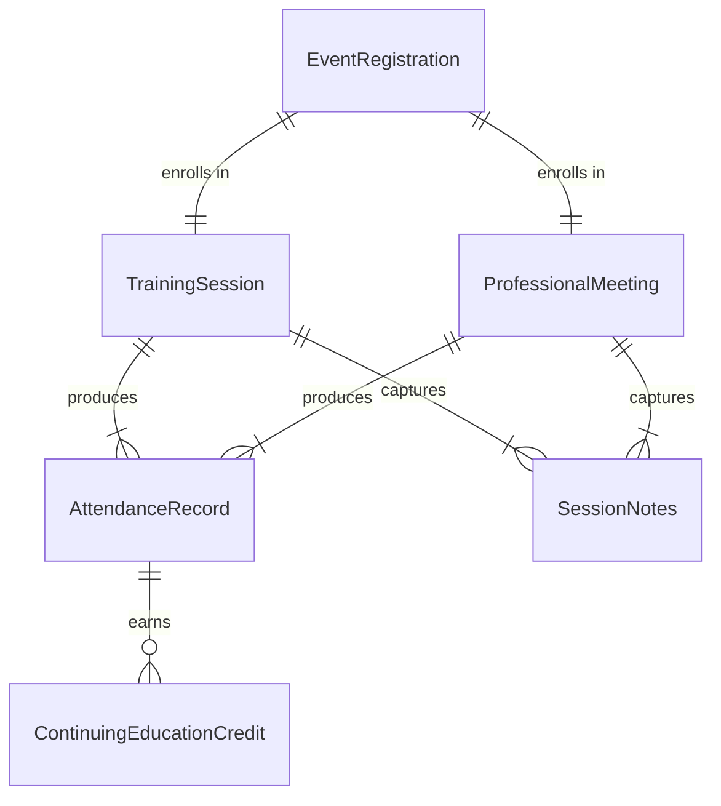
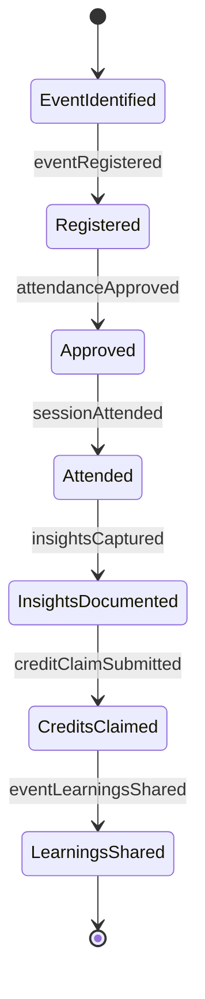
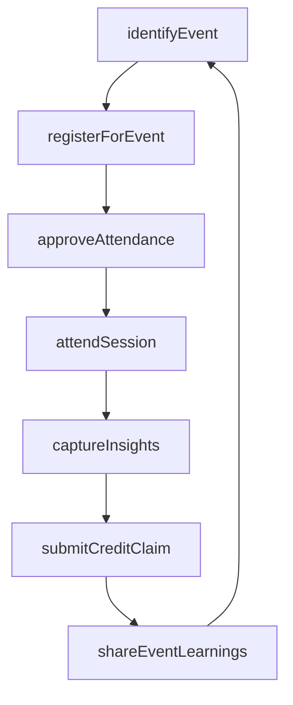
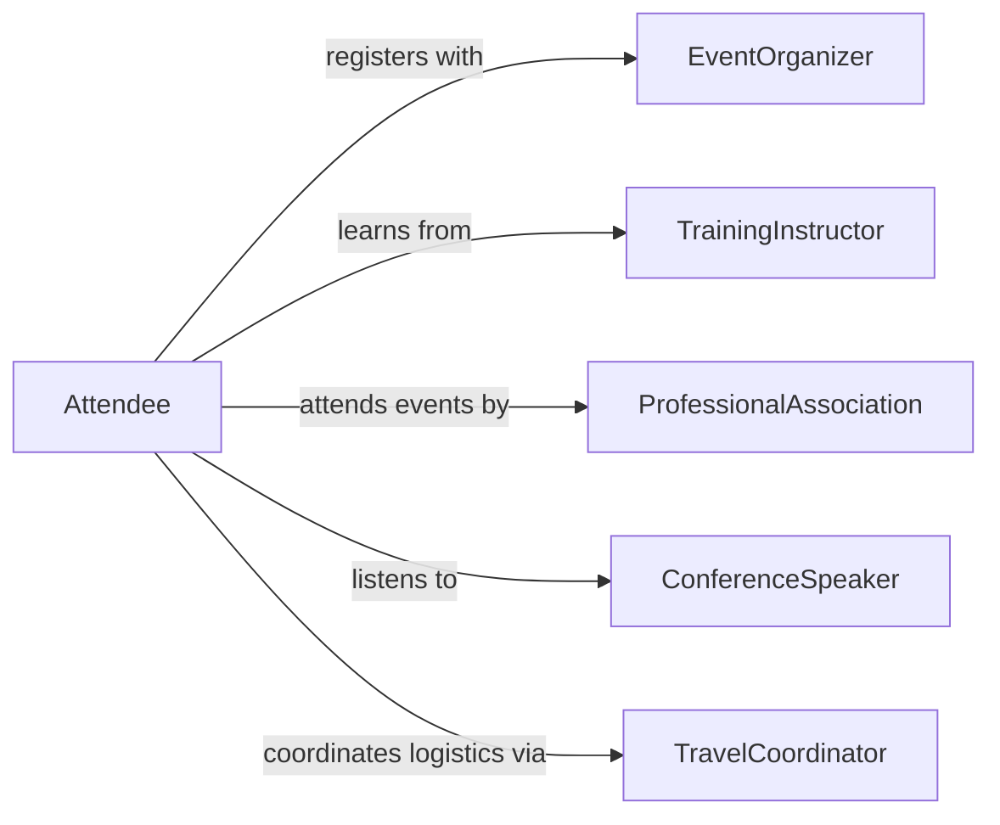

# Attend Training Sessions Professional Meetings

> Business-as-Code definition for attending training sessions or professional meetings. Models the planning, participation, and follow-up involved in formal learning and professional development events.

## Overview

Attending training sessions and professional meetings is a structured approach to maintaining and expanding professional knowledge. This involves identifying relevant events, securing approvals and logistics, actively participating in sessions, and applying insights gained back to the workplace. It ensures individuals and organizations stay current with evolving practices, technologies, and industry standards.

## Actors

| Actor | Description |
|-------|-------------|
| EventOrganizer | Plans and hosts conferences, workshops, and training programs |
| TrainingInstructor | Delivers structured learning content and facilitates sessions |
| ProfessionalAssociation | Sponsors industry meetings and continuing education programs |
| ConferenceSpeaker | Presents research, case studies, or thought leadership at events |
| TravelCoordinator | Manages logistics for off-site event attendance |

## Roles

| Role | Description |
|------|-------------|
| Attendee | Participates in training sessions and professional meetings |
| DevelopmentManager | Approves and tracks professional development activities |
| TrainingCoordinator | Identifies relevant events and manages enrollment |
| KnowledgeChampion | Shares learnings from events with the broader team |

## Entities

| Entity | Description |
|--------|-------------|
| TrainingSession | A scheduled instructional event focused on specific skills or topics |
| ProfessionalMeeting | A gathering for knowledge sharing, networking, or industry updates |
| AttendanceRecord | Documentation of participation in an event |
| ContinuingEducationCredit | Formal credit earned through approved learning activities |
| EventRegistration | An enrollment in an upcoming training or meeting |
| SessionNotes | Key takeaways and insights captured during an event |

## Actions

| Action | Description |
|--------|-------------|
| identifyEvent | Find relevant training sessions or professional meetings |
| registerForEvent | Enroll in a selected training session or meeting |
| approveAttendance | Authorize participation and associated costs |
| attendSession | Participate in the training or meeting event |
| captureInsights | Document key learnings and takeaways from the session |
| submitCreditClaim | Request continuing education credits for attendance |
| shareEventLearnings | Distribute insights and materials to colleagues |

## Events

| Event | Description |
|-------|-------------|
| eventIdentified | A relevant training or meeting opportunity has been found |
| eventRegistered | Enrollment in a session or meeting has been completed |
| attendanceApproved | Participation and costs have been authorized |
| sessionAttended | The training or meeting has been completed |
| insightsCaptured | Key learnings have been documented from the event |
| creditClaimSubmitted | A continuing education credit request has been filed |
| eventLearningsShared | Insights from the event have been distributed to the team |

## Searches

| Search | Description |
|--------|-------------|
| findUpcomingEvents | Retrieve training sessions and meetings by topic, date, or location |
| getAttendanceHistory | List past event participation by person or team |
| getContinuingCredits | Query earned credits by individual, period, or certification |
| getSessionNotes | Retrieve captured insights by event or topic |

## Entity Relationships



## State Diagram



## Workflow



## Actor Relationships



## Usage

### Calling Actions

```typescript
import { attendTrainingSessionsProfessionalMeetings } from '@headlessly/attend-training-sessions-professional-meetings'

const sessions = attendTrainingSessionsProfessionalMeetings()

// Find relevant upcoming events
const events = await sessions.identifyEvent({
  topics: ['project-management', 'agile-methodology'],
  dateRange: { start: '2026-03-01', end: '2026-06-30' },
  format: 'in-person'
})

// Register and get approval
const registration = await sessions.registerForEvent({
  eventId: events[0].id,
  attendeeId: 'emp-1042'
})

await sessions.approveAttendance({
  registrationId: registration.id,
  budget: 1500,
  travelRequired: true
})

// Capture and share insights
await sessions.captureInsights({
  eventId: events[0].id,
  notes: 'New sprint retrospective framework with quantitative metrics',
  actionItems: ['pilot-new-retro-format', 'update-team-handbook']
})
```

### Event-Driven Automation

```typescript
// Auto-submit credit claims after session attendance
sessions.sessionAttended(async ({ eventId, attendeeId, creditEligible }) => {
  if (creditEligible) {
    await sessions.submitCreditClaim({
      eventId,
      attendeeId,
      creditType: 'continuing-education'
    })
  }
})

// Notify team when learnings are shared
sessions.eventLearningsShared(async ({ eventId, insights, sharedBy }) => {
  await notify({
    to: 'team-channel',
    message: `${sharedBy} shared insights from ${eventId}: ${insights.summary}`
  })
})
```
