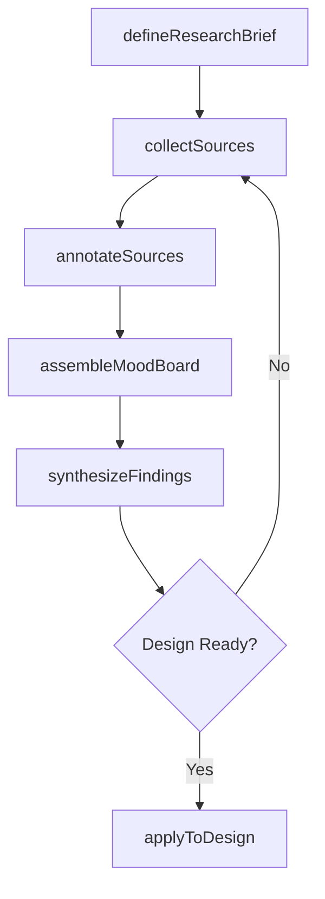
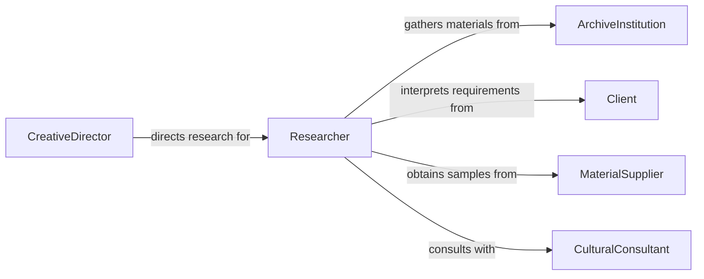

# Conduct Research Inform Art Designs

> Business-as-Code definition for conducting research to inform art, designs, or other creative work. Models the research lifecycle from topic exploration through source collection, synthesis, and application to creative outputs.

## Overview

Conducting research to inform art, designs, or other creative work involves investigating historical, cultural, technical, and aesthetic sources to ground creative decisions in evidence and context. This activity spans gathering visual references, studying material properties, reviewing precedent works, and consulting subject matter experts. The research findings directly shape design concepts, artistic direction, and the authenticity of creative output across disciplines such as architecture, graphic design, fine arts, and product design.

## Actors

| Actor | Description |
|-------|-------------|
| ArchiveInstitution | Library, museum, or archive holding historical and reference materials |
| Client | Individual or organization commissioning the creative work |
| MaterialSupplier | Vendor providing physical materials, samples, or technical specifications |
| CulturalConsultant | Expert providing guidance on cultural, historical, or regional context |
| PeerDesigner | Fellow creative professional sharing techniques, critiques, or references |

## Roles

| Role | Description |
|------|-------------|
| Researcher | Gathers and organizes source materials to support design decisions |
| CreativeDirector | Guides the overall artistic vision and validates research relevance |
| Designer | Applies research findings to create visual concepts and prototypes |
| Archivist | Curates and maintains the reference material collection |

## Entities

| Entity | Description |
|--------|-------------|
| ResearchBrief | A document outlining the research objectives, scope, and questions |
| ReferenceSource | A book, article, image, artifact, or digital resource used for inspiration |
| MoodBoard | A curated collection of visual references establishing aesthetic direction |
| DesignConcept | A preliminary creative idea informed by research findings |
| FieldStudy | An on-site investigation of environments, materials, or cultural contexts |
| SourceAnnotation | Notes and analysis attached to a specific reference source |

## Actions

| Action | Description |
|--------|-------------|
| defineResearchBrief | Establish the scope, objectives, and key questions for the research effort |
| collectSources | Gather reference materials from archives, databases, and field visits |
| annotateSources | Add analysis, notes, and relevance tags to collected reference materials |
| assembleMoodBoard | Curate visual references into a cohesive aesthetic direction board |
| synthesizeFindings | Distill research insights into actionable design principles or themes |
| applyToDesign | Integrate research conclusions into design concepts or artistic work |

## Events

| Event | Description |
|-------|-------------|
| researchBriefDefined | Research objectives and scope have been established |
| sourcesCollected | Reference materials have been gathered from relevant repositories |
| sourcesAnnotated | Analysis and notes have been attached to collected sources |
| moodBoardAssembled | A curated set of visual references has been compiled |
| findingsSynthesized | Research insights have been distilled into design principles |
| researchAppliedToDesign | Research conclusions have been integrated into creative output |

## Searches

| Search | Description |
|--------|-------------|
| findReferences | Search reference sources by medium, period, style, or keyword |
| getMoodBoards | Retrieve mood boards by project, designer, or aesthetic theme |
| getFieldStudies | Find field study records by location, date, or subject matter |
| getResearchBriefs | List research briefs by project, status, or creative discipline |

## Workflow



## Actor Relationships



## Usage

### Calling Actions

```typescript
import { conductResearchInformArtDesigns } from '@headlessly/conduct-research-inform-art-designs'

const research = conductResearchInformArtDesigns()

// Define the research brief for a project
const brief = await research.defineResearchBrief({
  projectId: 'proj-museum-exhibit-2026',
  objectives: ['Explore Art Deco typography in 1920s Paris', 'Identify period-accurate color palettes'],
  deliverables: ['mood-board', 'design-principles-document'],
  deadline: '2026-04-15'
})

// Collect reference sources
const sources = await research.collectSources({
  briefId: brief.id,
  repositories: ['smithsonian-digital', 'getty-open-content', 'library-of-congress'],
  keywords: ['art-deco', 'typography', 'poster-design', '1920s']
})

// Assemble a mood board from collected sources
await research.assembleMoodBoard({
  briefId: brief.id,
  sourceIds: sources.map(s => s.id),
  title: 'Art Deco Typography - Visual Direction'
})
```

### Event-Driven Automation

```typescript
// Notify creative director when findings are synthesized
research.findingsSynthesized(async ({ briefId, principles, projectId }) => {
  await notify({
    to: 'creative-director',
    message: `Research findings ready for ${projectId}: ${principles.length} design principles identified`
  })
})

// Auto-archive sources when research is applied to design
research.researchAppliedToDesign(async ({ briefId, sourceIds }) => {
  for (const sourceId of sourceIds) {
    await archive({
      collection: 'project-references',
      sourceId,
      briefId
    })
  }
})
```
