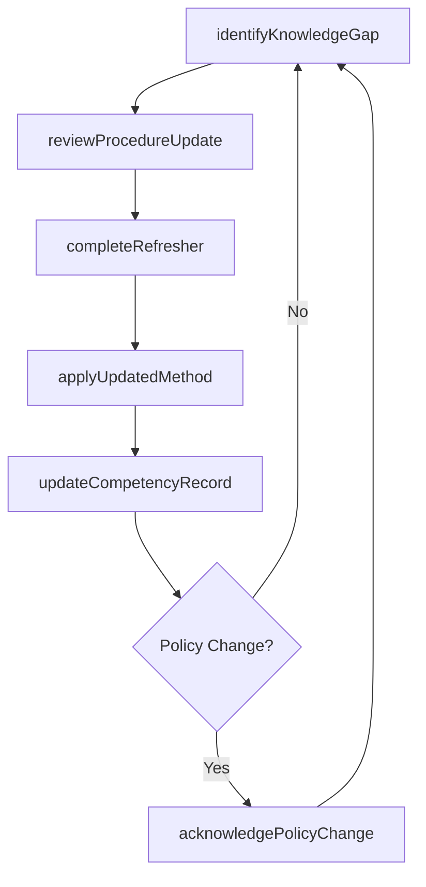
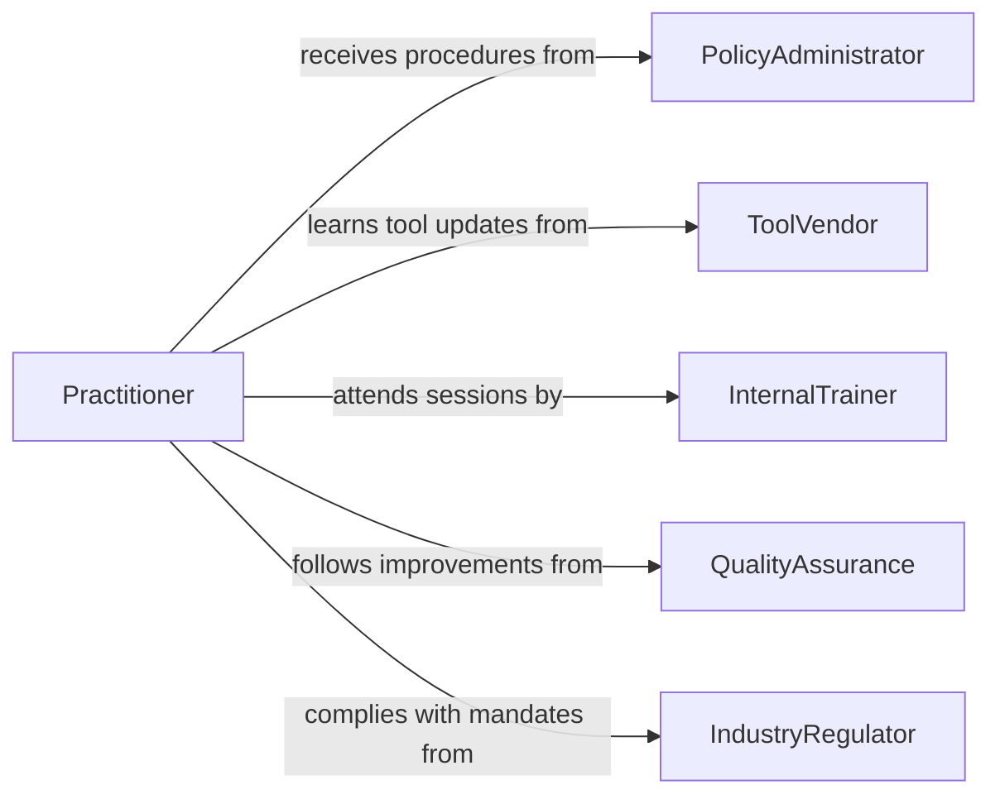

# Maintain Current Knowledge Related Work

> Business-as-Code definition for maintaining current knowledge related to work activities. Models the continuous effort to keep skills, procedures, and situational awareness aligned with evolving job requirements.

## Overview

Maintaining current knowledge related to work activities involves regularly reviewing updates to procedures, policies, tools, and methods that directly affect day-to-day job performance. This ensures professionals can execute their responsibilities effectively as organizational practices, technologies, and external conditions change. It encompasses both proactive learning and responsive adaptation to workplace changes.

## Actors

| Actor | Description |
|-------|-------------|
| PolicyAdministrator | Issues updated workplace procedures and operational guidelines |
| ToolVendor | Releases updates, patches, and new features for workplace tools |
| InternalTrainer | Delivers refresher courses and procedural walkthroughs |
| QualityAssurance | Communicates process improvements and corrective actions |
| IndustryRegulator | Mandates practice changes through updated regulations |

## Roles

| Role | Description |
|------|-------------|
| Practitioner | Applies current knowledge to daily work activities |
| Supervisor | Ensures team members stay current with procedural changes |
| KnowledgeCoordinator | Tracks and distributes work-relevant updates |
| ComplianceOfficer | Verifies that staff knowledge meets regulatory requirements |

## Entities

| Entity | Description |
|--------|-------------|
| WorkProcedure | A documented set of steps for performing a specific task |
| KnowledgeUpdate | A notification of changes to tools, processes, or requirements |
| CompetencyRecord | A log of an individual's current skill and knowledge levels |
| PolicyChange | A modification to organizational rules or guidelines |
| RefresherModule | A short training unit designed to reinforce existing knowledge |
| KnowledgeGap | An identified area where current understanding is insufficient |

## Actions

| Action | Description |
|--------|-------------|
| reviewProcedureUpdate | Examine changes to a work procedure or policy |
| completeRefresher | Finish a refresher training module on current practices |
| identifyKnowledgeGap | Detect areas where work knowledge has become outdated |
| updateCompetencyRecord | Record newly acquired or refreshed knowledge |
| acknowledgePolicyChange | Confirm understanding of an updated policy or guideline |
| applyUpdatedMethod | Implement a revised technique or process in daily work |

## Events

| Event | Description |
|-------|-------------|
| procedureUpdateReviewed | A change to a work procedure has been examined |
| refresherCompleted | A refresher training module has been finished |
| knowledgeGapIdentified | An area of outdated knowledge has been detected |
| competencyRecordUpdated | A knowledge or skill record has been updated |
| policyChangeAcknowledged | Understanding of a policy update has been confirmed |
| updatedMethodApplied | A revised work method has been put into practice |

## Searches

| Search | Description |
|--------|-------------|
| findProcedureUpdates | Retrieve recent changes to work procedures by role or department |
| getCompetencyRecords | Query knowledge records by individual, skill, or review date |
| getKnowledgeGaps | List identified gaps by severity, role, or domain |
| findRefresherModules | Search available refresher training by topic or requirement |

## Workflow



## Actor Relationships



## Usage

### Calling Actions

```typescript
import { maintainCurrentKnowledgeRelatedWork } from '@headlessly/maintain-current-knowledge-related-work'

const workKnowledge = maintainCurrentKnowledgeRelatedWork()

// Identify knowledge gaps for a role
const gaps = await workKnowledge.identifyKnowledgeGap({
  roleId: 'production-operator',
  lastAssessment: '2025-12-01',
  threshold: 0.8
})

// Review a procedure update
await workKnowledge.reviewProcedureUpdate({
  procedureId: 'proc-safety-lockout',
  version: '3.2',
  changeType: 'regulatory-update'
})

// Complete a refresher module
await workKnowledge.completeRefresher({
  moduleId: 'mod-lockout-tagout-2026',
  employeeId: 'emp-3021',
  score: 0.92
})

// Update the competency record
await workKnowledge.updateCompetencyRecord({
  employeeId: 'emp-3021',
  skill: 'lockout-tagout-procedure',
  level: 'proficient',
  validUntil: '2027-03-01'
})
```

### Event-Driven Automation

```typescript
// Auto-assign refreshers when knowledge gaps are found
workKnowledge.knowledgeGapIdentified(async ({ employeeId, skill, severity }) => {
  const module = await workKnowledge.findRefresherModules({
    topic: skill,
    difficulty: severity
  })
  await assignTraining({ employeeId, moduleId: module[0].id })
})

// Notify supervisors of policy acknowledgments
workKnowledge.policyChangeAcknowledged(async ({ employeeId, policyId }) => {
  await notify({
    to: 'supervisor',
    message: `Employee ${employeeId} acknowledged policy ${policyId}`
  })
})
```
