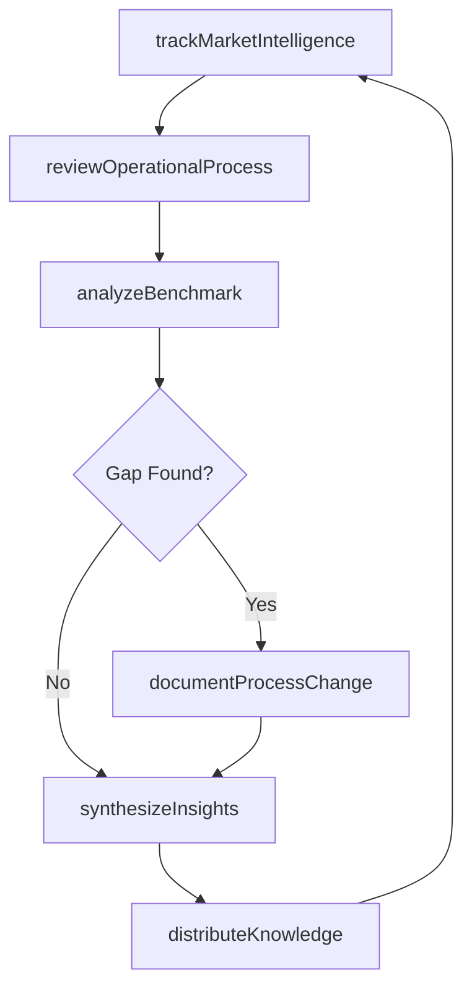
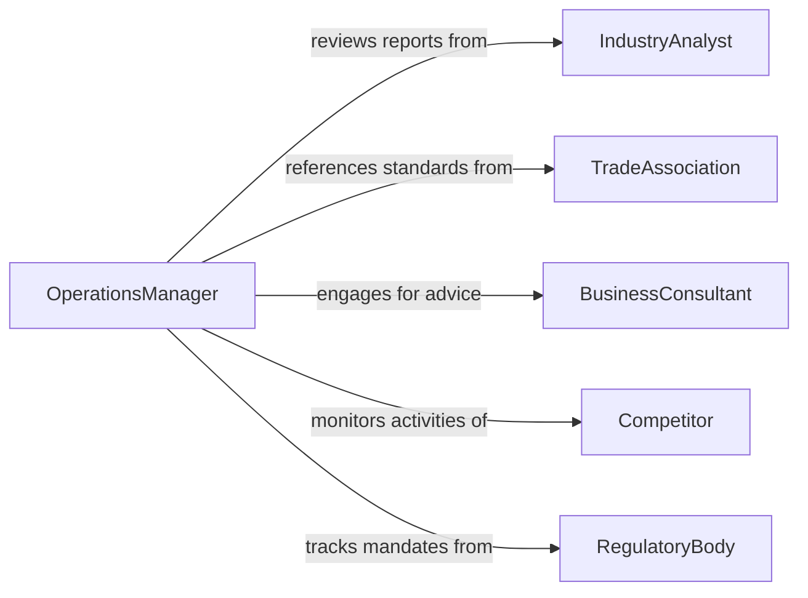

# Maintain Knowledge Business Operations

> Business-as-Code definition for maintaining knowledge of business operations. Models the ongoing effort to stay current with operational processes, market conditions, and organizational practices.

## Overview

Maintaining knowledge of business operations involves continuously learning about internal processes, market dynamics, competitive positioning, and industry best practices. This ensures decision-makers and operational staff understand how the business functions and can adapt to changing conditions. It covers tracking operational metrics, reviewing process changes, and benchmarking against industry standards.

## Actors

| Actor | Description |
|-------|-------------|
| IndustryAnalyst | Publishes reports on market trends and competitive landscapes |
| TradeAssociation | Provides industry benchmarks and operational standards |
| BusinessConsultant | Advises on operational improvements and best practices |
| Competitor | Drives awareness of alternative approaches and market shifts |
| RegulatoryBody | Issues operational compliance requirements and guidelines |

## Roles

| Role | Description |
|------|-------------|
| OperationsManager | Oversees day-to-day business processes and performance |
| BusinessAnalyst | Researches and synthesizes operational intelligence |
| DepartmentDirector | Maintains cross-functional awareness of organizational activities |
| ProcessOwner | Tracks changes and improvements to specific business processes |

## Entities

| Entity | Description |
|--------|-------------|
| OperationalProcess | A documented business workflow or procedure |
| MarketIntelligence | Data about competitors, customers, and industry trends |
| PerformanceMetric | A quantitative measure of operational effectiveness |
| BenchmarkReport | Comparison of internal performance against industry standards |
| ProcessUpdate | A change or improvement to an existing business process |
| ComplianceRequirement | A regulatory or industry mandate affecting operations |

## Actions

| Action | Description |
|--------|-------------|
| reviewOperationalProcess | Examine a business process for currency and effectiveness |
| trackMarketIntelligence | Monitor competitive and market developments |
| analyzeBenchmark | Compare internal metrics against industry standards |
| documentProcessChange | Record updates to operational procedures |
| assessComplianceImpact | Evaluate how regulatory changes affect operations |
| synthesizeInsights | Consolidate operational learnings into actionable summaries |
| distributeKnowledge | Share operational updates with relevant stakeholders |

## Events

| Event | Description |
|-------|-------------|
| operationalProcessReviewed | A business process has been examined for relevance |
| marketIntelligenceTracked | New market or competitive data has been captured |
| benchmarkAnalyzed | Performance has been compared against industry standards |
| processChangeDocumented | An operational procedure update has been recorded |
| complianceImpactAssessed | A regulatory change impact has been evaluated |
| insightsSynthesized | Operational learnings have been consolidated |
| knowledgeDistributed | Operational updates have been shared with stakeholders |

## Searches

| Search | Description |
|--------|-------------|
| findOperationalProcesses | Retrieve processes by department, status, or last review date |
| getMarketIntelligence | Query market data by topic, competitor, or date range |
| getBenchmarkReports | List benchmark comparisons by metric or period |
| getProcessChanges | Find recent updates to operational procedures |

## Workflow



## Actor Relationships



## Usage

### Calling Actions

```typescript
import { maintainKnowledgeBusinessOperations } from '@headlessly/maintain-knowledge-business-operations'

const operations = maintainKnowledgeBusinessOperations()

// Track new market intelligence
const intel = await operations.trackMarketIntelligence({
  source: 'Q1 Industry Report',
  topics: ['supply-chain', 'digital-transformation'],
  relevance: 'high'
})

// Analyze benchmark against industry standards
const benchmark = await operations.analyzeBenchmark({
  metric: 'order-fulfillment-time',
  internalValue: 2.3,
  industryAverage: 1.8,
  unit: 'days'
})

// Document a process change
await operations.documentProcessChange({
  processId: 'proc-inventory-mgmt',
  changeDescription: 'Implemented automated reorder triggers',
  effectiveDate: '2026-04-01'
})
```

### Event-Driven Automation

```typescript
// Alert when benchmarks reveal performance gaps
operations.benchmarkAnalyzed(async ({ metric, gap }) => {
  if (gap.percentage > 20) {
    await notify({
      to: 'operations-leadership',
      message: `Significant gap in ${metric}: ${gap.percentage}% below industry average`
    })
  }
})

// Auto-distribute when insights are synthesized
operations.insightsSynthesized(async ({ summary, topics }) => {
  await operations.distributeKnowledge({
    content: summary,
    audience: topics.map(t => `${t}-stakeholders`)
  })
})
```
