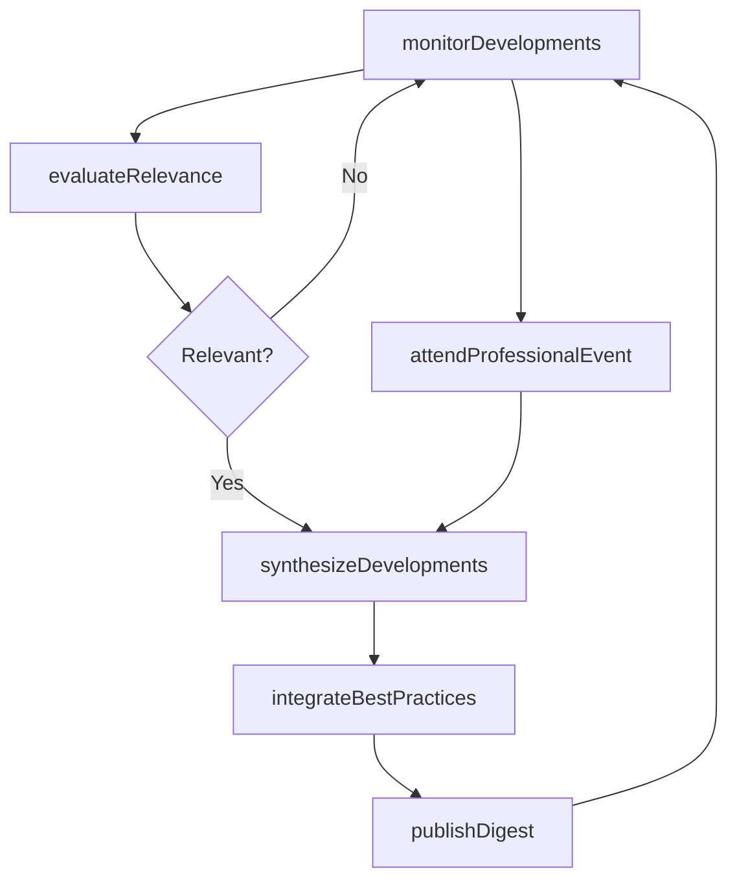
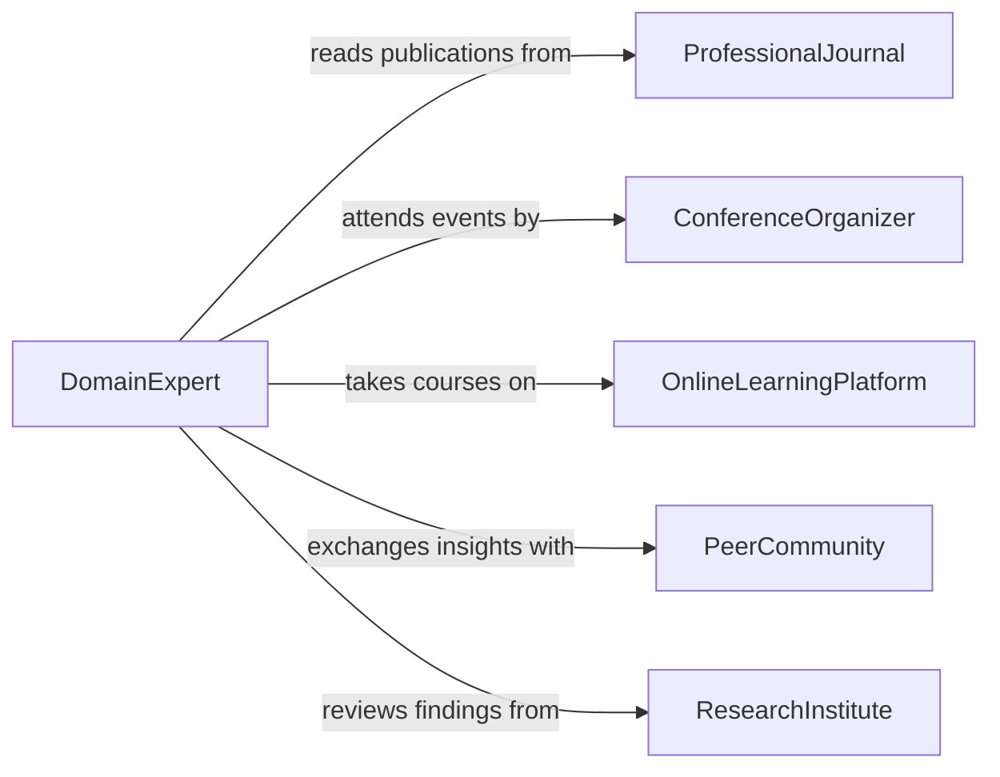

# Maintain Knowledge Current Developments Area

> Business-as-Code definition for maintaining knowledge of current developments in area of expertise. Models the ongoing monitoring, synthesis, and application of new advances, best practices, and innovations within a professional domain.

## Overview

Maintaining knowledge of current developments in an area of expertise involves continuously monitoring new research findings, industry advances, methodological innovations, and evolving best practices relevant to one's professional field. This activity ensures practitioners remain effective, credible, and capable of delivering work that reflects the current state of knowledge in their discipline.

## Actors

| Actor | Description |
|-------|-------------|
| ProfessionalJournal | Publishes current research, case studies, and practice updates |
| ConferenceOrganizer | Hosts events featuring the latest developments and expert presentations |
| OnlineLearningPlatform | Provides courses and webinars on current topics in the field |
| PeerCommunity | Network of professionals who share knowledge and discuss developments |
| ResearchInstitute | Produces new findings and methodological advances in the domain |

## Roles

| Role | Description |
|------|-------------|
| DomainExpert | Stays current with developments to maintain expertise and credibility |
| KnowledgeBroker | Bridges new developments between research communities and practitioners |
| ProfessionalDeveloper | Integrates current developments into organizational training programs |
| PracticeInnovator | Applies new developments to improve methods and outcomes |

## Entities

| Entity | Description |
|--------|-------------|
| DevelopmentFeed | A curated stream of updates from journals, blogs, and news sources |
| PracticeUpdate | A documented change in best practices based on new evidence |
| ConferenceNotes | Summaries and insights captured from professional events |
| InnovationLog | Record of new techniques, tools, or methods identified for adoption |
| ExpertiseProfile | Current snapshot of knowledge areas and currency status |
| DevelopmentDigest | A periodic summary of key developments in the field |

## Actions

| Action | Description |
|--------|-------------|
| monitorDevelopments | Track new publications, announcements, and advances in the field |
| attendProfessionalEvent | Participate in conferences, symposia, or workshops for current updates |
| synthesizeDevelopments | Compile and analyze recent advances into actionable summaries |
| evaluateRelevance | Assess which developments are applicable to current practice |
| integrateBestPractices | Incorporate validated new approaches into professional workflow |
| publishDigest | Create and distribute a summary of key developments to the team |

## Events

| Event | Description |
|-------|-------------|
| developmentMonitored | A new advance or publication has been identified and tracked |
| eventAttended | A professional conference or workshop has been completed |
| developmentsSynthesized | Recent advances have been compiled into a summary |
| relevanceEvaluated | A development has been assessed for applicability to practice |
| bestPracticesIntegrated | A new approach has been adopted into professional workflow |
| digestPublished | A summary of key developments has been distributed |
| significantAdvanceDetected | A major development with high practice impact has been identified |

## Searches

| Search | Description |
|--------|-------------|
| findRecentDevelopments | Retrieve new advances by domain, date range, or impact level |
| getUpcomingEvents | Query professional conferences and workshops by topic and date |
| searchInnovationLog | Look up identified innovations by method, tool, or adoption status |
| getDigestHistory | Retrieve past development digests by period or topic |

## Workflow



## Actor Relationships



## Usage

### Calling Actions

```typescript
import { maintainKnowledgeCurrentDevelopmentsArea } from '@headlessly/maintain-knowledge-current-developments-area'

const developments = maintainKnowledgeCurrentDevelopmentsArea()

// Monitor developments in the field
const feed = await developments.monitorDevelopments({
  domains: ['structural-engineering', 'seismic-design', 'composite-materials'],
  sources: ['ASCE-Journal', 'Engineering-News-Record', 'arXiv-CE'],
  since: '2026-01-01'
})

// Evaluate relevance of a specific development
const evaluation = await developments.evaluateRelevance({
  developmentId: feed.items[0].id,
  practiceContext: 'commercial-building-design',
  criteria: ['applicability', 'evidenceStrength', 'implementationEase']
})

// Synthesize and publish a digest
await developments.publishDigest({
  title: 'January 2026 Structural Engineering Developments',
  developments: feed.items.filter(d => d.relevanceScore >= 7),
  audience: ['engineering-team', 'project-managers']
})
```

### Event-Driven Automation

```typescript
// Flag major advances for immediate team attention
developments.significantAdvanceDetected(async ({ development, impactLevel, domain }) => {
  await notify({
    to: 'department-leads',
    message: `Significant advance in ${domain}: ${development.title} - impact: ${impactLevel}`
  })
})

// Auto-update expertise profiles when best practices are integrated
developments.bestPracticesIntegrated(async ({ practiceId, domain, professionalId }) => {
  await updateExpertiseProfile({
    professionalId,
    domain,
    addedCapability: practiceId,
    updatedDate: today()
  })
})
```
