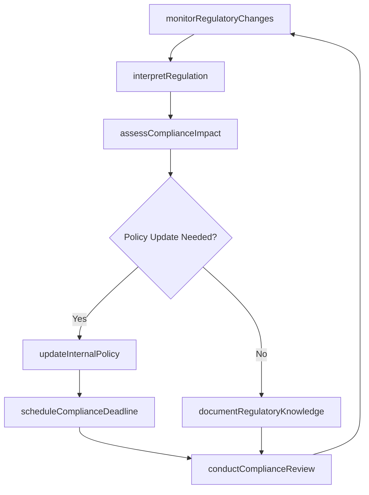
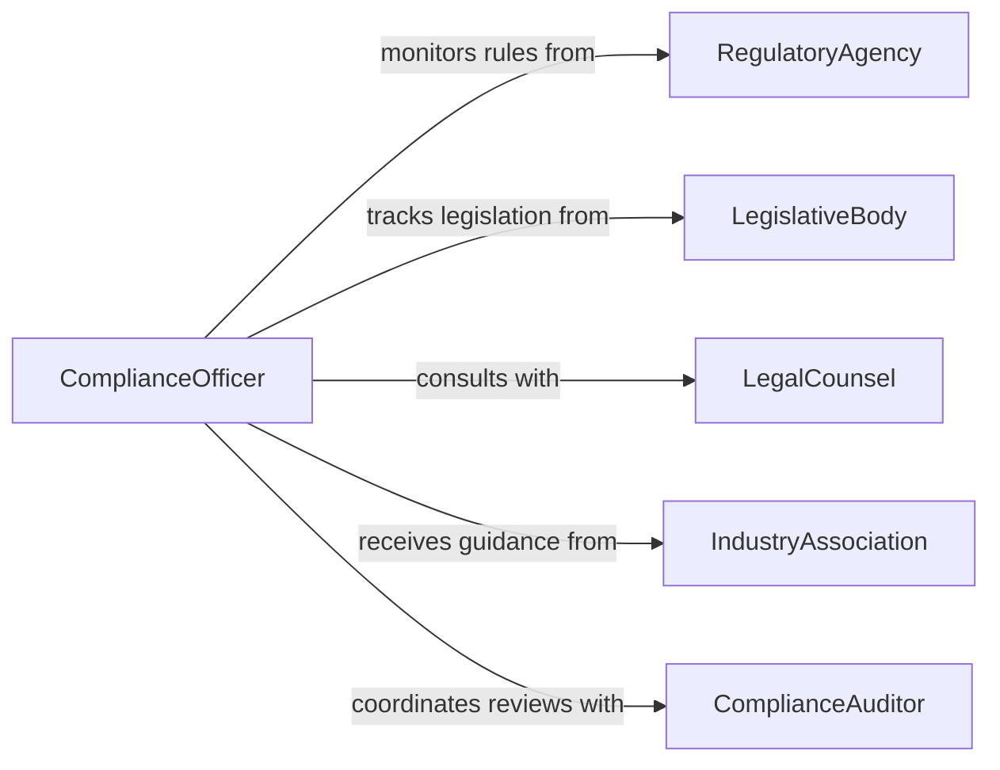

# Maintain Knowledge Laws Regulations

> Business-as-Code definition for maintaining knowledge of laws or regulations. Models the systematic tracking, interpretation, and application of legal and regulatory changes that affect organizational operations.

## Overview

Maintaining knowledge of laws and regulations involves monitoring legislative bodies, regulatory agencies, and legal publications for changes that affect business operations. This activity ensures organizations remain compliant by identifying relevant legal updates, interpreting their operational implications, and updating internal policies and procedures accordingly. It spans federal, state, local, and industry-specific regulatory frameworks.

## Actors

| Actor | Description |
|-------|-------------|
| RegulatoryAgency | Government body that issues and enforces regulations |
| LegislativeBody | Enacts laws that create compliance obligations |
| LegalCounsel | Provides expert interpretation of legal requirements |
| IndustryAssociation | Publishes guidance on regulatory impacts for member organizations |
| ComplianceAuditor | Evaluates adherence to legal and regulatory requirements |

## Roles

| Role | Description |
|------|-------------|
| ComplianceOfficer | Monitors and ensures organizational regulatory compliance |
| LegalAnalyst | Researches and interprets new laws and regulations |
| PolicyManager | Updates internal policies to reflect legal changes |
| RiskManager | Assesses the impact of regulatory changes on business operations |

## Entities

| Entity | Description |
|--------|-------------|
| Regulation | A specific rule or requirement issued by a regulatory authority |
| Statute | A law enacted by a legislative body |
| ComplianceObligation | A binding requirement the organization must fulfill |
| RegulatoryUpdate | A change to an existing law, rule, or regulation |
| PolicyRevision | An internal policy modification triggered by a legal change |
| ComplianceCalendar | A schedule of regulatory deadlines and reporting requirements |

## Actions

| Action | Description |
|--------|-------------|
| monitorRegulatoryChanges | Track new and amended laws and regulations |
| interpretRegulation | Analyze the meaning and implications of a legal requirement |
| assessComplianceImpact | Evaluate how a regulatory change affects current operations |
| updateInternalPolicy | Revise organizational policies to reflect legal changes |
| scheduleComplianceDeadline | Add regulatory milestones to the compliance calendar |
| conductComplianceReview | Perform a systematic check of regulatory adherence |
| documentRegulatoryKnowledge | Record interpretations and compliance strategies |

## Events

| Event | Description |
|-------|-------------|
| regulatoryChangeMonitored | A new or amended regulation has been identified |
| regulationInterpreted | The implications of a legal requirement have been analyzed |
| complianceImpactAssessed | The effect of a regulatory change on operations has been evaluated |
| internalPolicyUpdated | An organizational policy has been revised for compliance |
| complianceDeadlineScheduled | A regulatory milestone has been added to the calendar |
| complianceReviewConducted | A systematic compliance check has been completed |
| regulatoryKnowledgeDocumented | Legal interpretations have been recorded |

## Searches

| Search | Description |
|--------|-------------|
| findRegulatoryUpdates | Retrieve recent regulatory changes by jurisdiction or topic |
| getComplianceObligations | List active obligations by regulation, department, or deadline |
| getComplianceCalendar | Query upcoming regulatory deadlines and milestones |
| findPolicyRevisions | Search internal policy changes by regulation or effective date |

## Workflow



## Actor Relationships



## Usage

### Calling Actions

```typescript
import { maintainKnowledgeLawsRegulations } from '@headlessly/maintain-knowledge-laws-regulations'

const regulatory = maintainKnowledgeLawsRegulations()

// Monitor for regulatory changes
const updates = await regulatory.monitorRegulatoryChanges({
  jurisdictions: ['federal', 'state-CA'],
  topics: ['data-privacy', 'employment-law'],
  since: '2026-01-01'
})

// Interpret and assess impact
const interpretation = await regulatory.interpretRegulation({
  regulationId: updates[0].id,
  summary: 'New data retention requirements for consumer records'
})

const impact = await regulatory.assessComplianceImpact({
  regulationId: updates[0].id,
  departments: ['IT', 'legal', 'customer-service'],
  currentPolicies: ['data-retention-policy-v4']
})

// Update policy and schedule deadlines
await regulatory.updateInternalPolicy({
  policyId: 'data-retention-policy-v4',
  changes: 'Extended retention period from 3 to 5 years for consumer data',
  effectiveDate: '2026-07-01'
})

await regulatory.scheduleComplianceDeadline({
  regulationId: updates[0].id,
  deadline: '2026-06-15',
  description: 'Complete data retention policy update and staff training'
})
```

### Event-Driven Automation

```typescript
// Alert on new regulatory changes
regulatory.regulatoryChangeMonitored(async ({ regulationId, jurisdiction, topic }) => {
  await notify({
    to: 'compliance-team',
    message: `New ${topic} regulation in ${jurisdiction}: ${regulationId}`
  })
})

// Auto-schedule review after policy updates
regulatory.internalPolicyUpdated(async ({ policyId, regulationId }) => {
  await regulatory.scheduleComplianceDeadline({
    regulationId,
    deadline: addDays(new Date(), 90),
    description: `Post-update compliance review for ${policyId}`
  })
})
```
