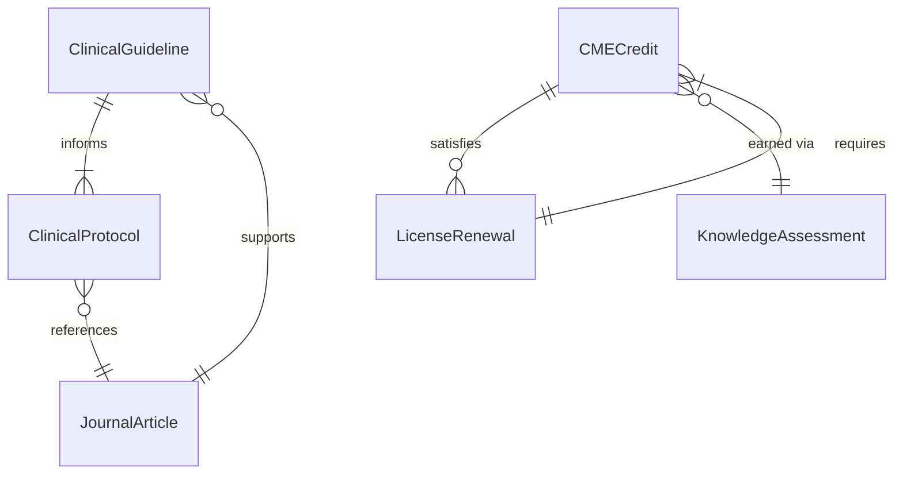
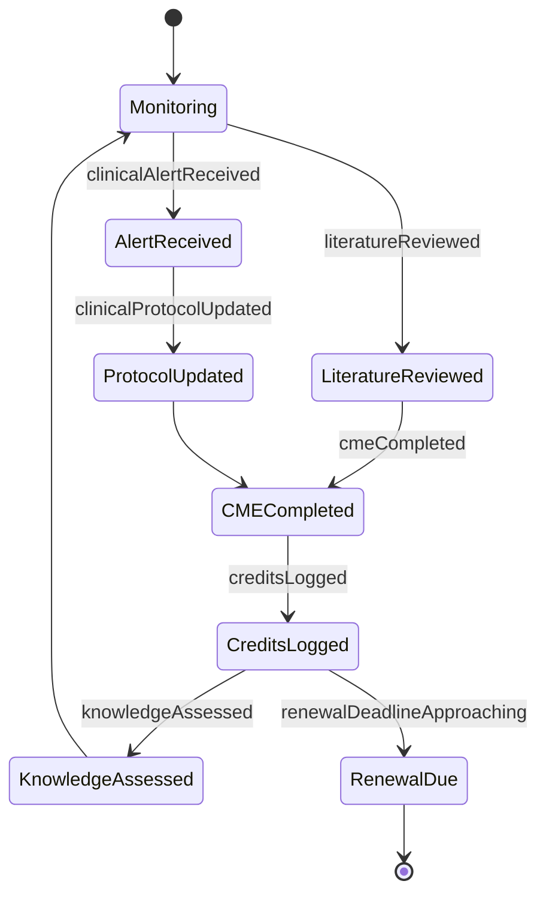
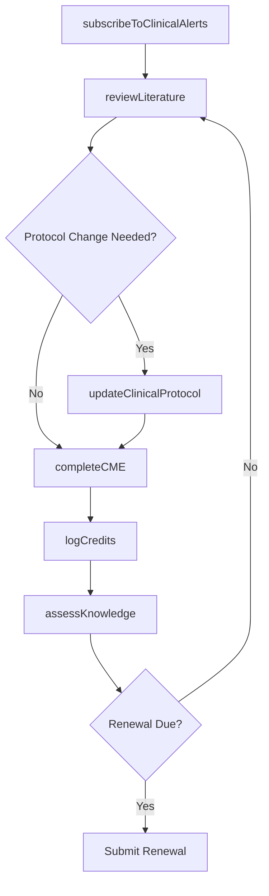
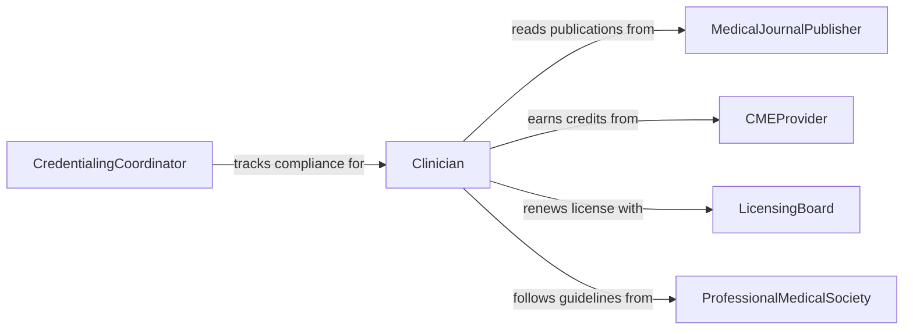

# Maintain Medical Professional Knowledge

> Business-as-Code definition for maintaining medical or professional knowledge. Models the continuous learning cycle of reviewing literature, completing continuing education, and applying clinical evidence to practice.

## Overview

Maintaining medical or professional knowledge involves the ongoing review of clinical research, medical journals, treatment guidelines, and professional standards to ensure that healthcare practitioners deliver evidence-based care. This activity covers participation in continuing medical education, peer review activities, and the integration of new clinical findings into daily practice. It is critical for meeting licensure renewal requirements and upholding patient safety standards.

## Actors

| Actor | Description |
|-------|-------------|
| MedicalJournalPublisher | Organization publishing peer-reviewed clinical research and reviews |
| CMEProvider | Accredited institution offering continuing medical education programs |
| LicensingBoard | Regulatory body that sets and enforces licensure requirements |
| ProfessionalMedicalSociety | Specialty organization publishing clinical guidelines and standards |
| PharmaceuticalCompany | Manufacturer providing drug updates, clinical trial data, and safety alerts |

## Roles

| Role | Description |
|------|-------------|
| Clinician | Healthcare provider maintaining knowledge to deliver evidence-based care |
| MedicalEducator | Facilitates learning programs and disseminates clinical updates |
| ChiefMedicalOfficer | Oversees clinical standards and knowledge maintenance across the organization |
| CredentialingCoordinator | Tracks licensure, certifications, and CME credit compliance |

## Entities

| Entity | Description |
|--------|-------------|
| ClinicalGuideline | An evidence-based recommendation for diagnosis or treatment |
| CMECredit | A unit of continuing medical education earned through approved activities |
| JournalArticle | A peer-reviewed publication reporting clinical research findings |
| LicenseRenewal | A periodic requirement to demonstrate ongoing competency for practice |
| ClinicalProtocol | A standardized procedure for managing specific medical conditions |
| KnowledgeAssessment | An evaluation of clinical knowledge through exams or case reviews |

## Actions

| Action | Description |
|--------|-------------|
| reviewLiterature | Read and analyze recent medical journal articles and research studies |
| completeCME | Finish an accredited continuing medical education course or activity |
| updateClinicalProtocol | Revise clinical procedures based on new evidence or guidelines |
| logCredits | Record earned CME credits toward licensure renewal requirements |
| assessKnowledge | Evaluate clinical knowledge through self-assessment or board review |
| subscribeToClinicalAlerts | Enroll in notifications for drug recalls, safety alerts, or guideline updates |

## Events

| Event | Description |
|-------|-------------|
| literatureReviewed | A medical journal article or research study has been analyzed |
| cmeCompleted | A continuing medical education activity has been finished |
| clinicalProtocolUpdated | A clinical protocol has been revised with new evidence |
| creditsLogged | CME credits have been recorded in the practitioner's profile |
| knowledgeAssessed | A clinical knowledge assessment has been completed |
| clinicalAlertReceived | A drug safety alert or guideline update has been received |
| renewalDeadlineApproaching | A licensure renewal deadline is approaching within the notification window |

## Searches

| Search | Description |
|--------|-------------|
| findCMECourses | List available CME courses by specialty, format, or accreditation |
| getCreditHistory | Retrieve CME credits earned by clinician, period, or specialty |
| getClinicalGuidelines | Find current clinical guidelines by condition, specialty, or issuing body |
| getRenewalStatus | Check licensure renewal status and outstanding requirements |

## Entity Relationships



## State Diagram



## Workflow



## Actor Relationships



## Usage

### Calling Actions

```typescript
import { maintainMedicalProfessionalKnowledge } from '@headlessly/maintain-medical-professional-knowledge'

const medKnowledge = maintainMedicalProfessionalKnowledge()

// Review recent literature in a specialty area
const articles = await medKnowledge.reviewLiterature({
  specialty: 'cardiology',
  topics: ['heart-failure-management', 'anticoagulation-therapy'],
  dateRange: { start: '2025-10-01', end: '2026-02-01' }
})

// Complete a CME activity and log credits
const completion = await medKnowledge.completeCME({
  clinicianId: 'dr-8891',
  courseId: 'cme-cardio-2026-advanced-hf',
  completionDate: '2026-02-04',
  creditsEarned: 12
})

// Check renewal status
const renewal = await medKnowledge.getRenewalStatus({
  clinicianId: 'dr-8891',
  licenseType: 'medical-license-CA'
})
```

### Event-Driven Automation

```typescript
// Alert clinician when licensure renewal deadline approaches
medKnowledge.renewalDeadlineApproaching(async ({ clinicianId, licenseType, deadline }) => {
  await notify({
    to: clinicianId,
    message: `Your ${licenseType} renewal is due by ${deadline}. You have ${creditsRemaining} CME credits outstanding.`
  })
})

// Auto-flag protocols for review when clinical alerts arrive
medKnowledge.clinicalAlertReceived(async ({ alertType, condition, guideline }) => {
  await createTask({
    assignee: 'chief-medical-officer',
    title: `Review protocol for ${condition} - new ${alertType}`,
    reference: guideline
  })
})
```
