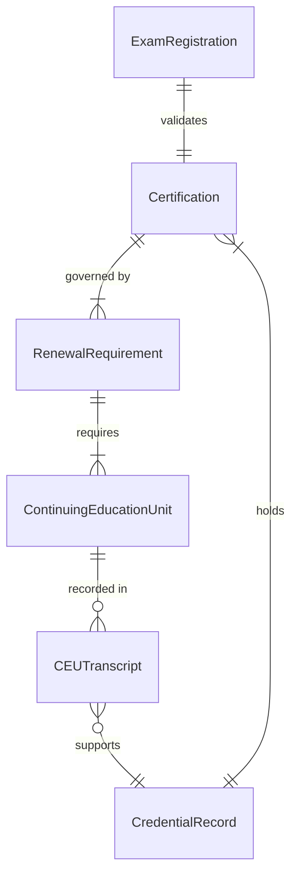
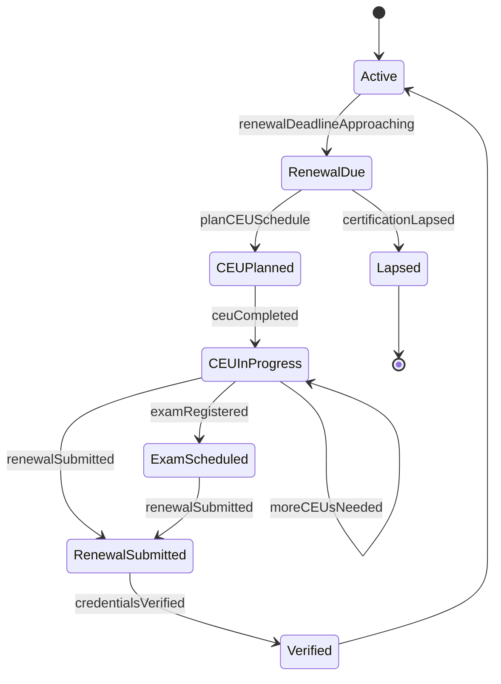
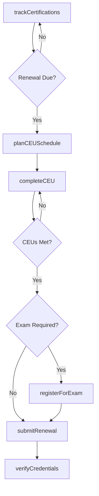
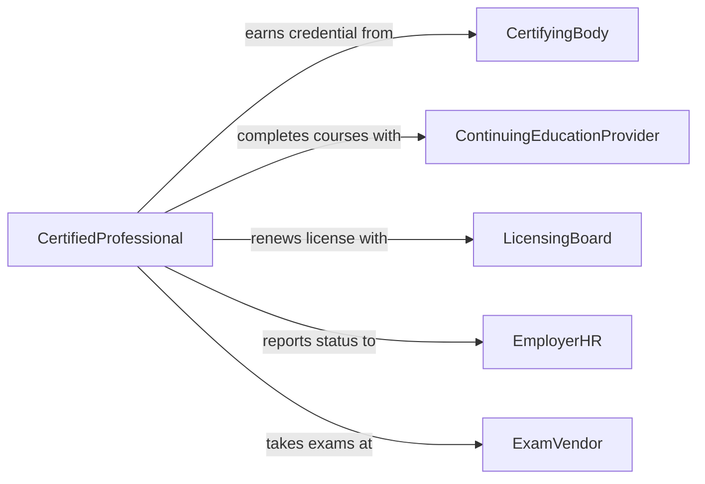

# Maintain Professional Knowledge Certifications

> Business-as-Code definition for maintaining professional knowledge and certifications. Models the lifecycle of earning, renewing, and tracking professional credentials and continuing education requirements.

## Overview

Maintaining professional knowledge and certifications involves tracking credential requirements, completing continuing education units, preparing for and passing certification exams, and renewing licenses on schedule. This activity is critical for regulated professions where lapsed certifications can result in loss of practice privileges, legal liability, or employment disqualification.

## Actors

| Actor | Description |
|-------|-------------|
| CertifyingBody | Issues and administers professional certifications and exams |
| ContinuingEducationProvider | Offers approved courses that satisfy credential maintenance requirements |
| LicensingBoard | Grants and renews professional licenses for regulated occupations |
| EmployerHR | Tracks employee certifications and supports professional development |
| ExamVendor | Administers testing facilities and proctored certification exams |

## Roles

| Role | Description |
|------|-------------|
| CertifiedProfessional | Holds credentials and is responsible for maintaining them |
| CredentialCoordinator | Tracks certification statuses and renewal deadlines across a team |
| CEUAdvisor | Recommends continuing education activities aligned to requirements |
| ComplianceOfficer | Ensures workforce certifications meet regulatory requirements |

## Entities

| Entity | Description |
|--------|-------------|
| Certification | A professional credential issued by an authorizing body |
| ContinuingEducationUnit | A measurable unit of approved learning activity |
| RenewalRequirement | Conditions that must be met to maintain a certification |
| ExamRegistration | Enrollment for a certification or recertification exam |
| CredentialRecord | Documentation of certifications held, dates, and statuses |
| CEUTranscript | Official record of completed continuing education credits |

## Actions

| Action | Description |
|--------|-------------|
| trackCertifications | Monitor current certifications and their renewal deadlines |
| completeCEU | Finish an approved continuing education activity and log credits |
| registerForExam | Enroll in a certification or recertification examination |
| submitRenewal | Apply for certification renewal with supporting documentation |
| verifyCredentials | Confirm the validity and standing of professional certifications |
| planCEUSchedule | Organize continuing education activities to meet requirements on time |

## Events

| Event | Description |
|-------|-------------|
| certificationTracked | A certification has been added or updated in the tracking system |
| ceuCompleted | A continuing education unit has been finished and recorded |
| examRegistered | Registration for a certification exam has been confirmed |
| renewalSubmitted | A certification renewal application has been filed |
| credentialsVerified | Professional credentials have been confirmed as valid |
| renewalDeadlineApproaching | A certification renewal date is coming up within the notice period |
| certificationLapsed | A certification has expired without timely renewal |

## Searches

| Search | Description |
|--------|-------------|
| findCertifications | Retrieve certifications by professional, type, or status |
| getCEUProgress | Query completed credits versus requirements for a certification |
| findUpcomingRenewals | List certifications approaching their renewal deadlines |
| getApprovedCourses | Search for continuing education courses by certification and provider |

## Entity Relationships



## State Diagram



## Workflow



## Actor Relationships



## Usage

### Calling Actions

```typescript
import { maintainProfessionalKnowledgeCertifications } from '@headlessly/maintain-professional-knowledge-certifications'

const certs = maintainProfessionalKnowledgeCertifications()

// Track all certifications for a professional
const certList = await certs.trackCertifications({
  professionalId: 'EMP-3321',
  includeExpired: false
})

// Log completion of a CEU course
await certs.completeCEU({
  professionalId: 'EMP-3321',
  courseId: 'AMA-PRA-2026-045',
  credits: 12,
  category: 'Category-1',
  completionDate: '2026-02-01'
})

// Submit renewal application
await certs.submitRenewal({
  certificationId: 'BOARD-CERT-IM-2023',
  professionalId: 'EMP-3321',
  ceuTranscriptId: 'TR-2026-3321',
  renewalFee: 450
})
```

### Event-Driven Automation

```typescript
// Send reminder when renewal deadline approaches
certs.renewalDeadlineApproaching(async ({ certificationId, professionalId, daysRemaining }) => {
  await notify({
    to: professionalId,
    message: `Certification ${certificationId} expires in ${daysRemaining} days - complete renewal now`
  })
})

// Escalate lapsed certifications to compliance
certs.certificationLapsed(async ({ certificationId, professionalId }) => {
  await notify({
    to: 'compliance-office',
    message: `Certification ${certificationId} for ${professionalId} has lapsed - immediate action required`
  })
  await restrictPracticePrivileges({ professionalId, reason: 'lapsed-certification' })
})
```
