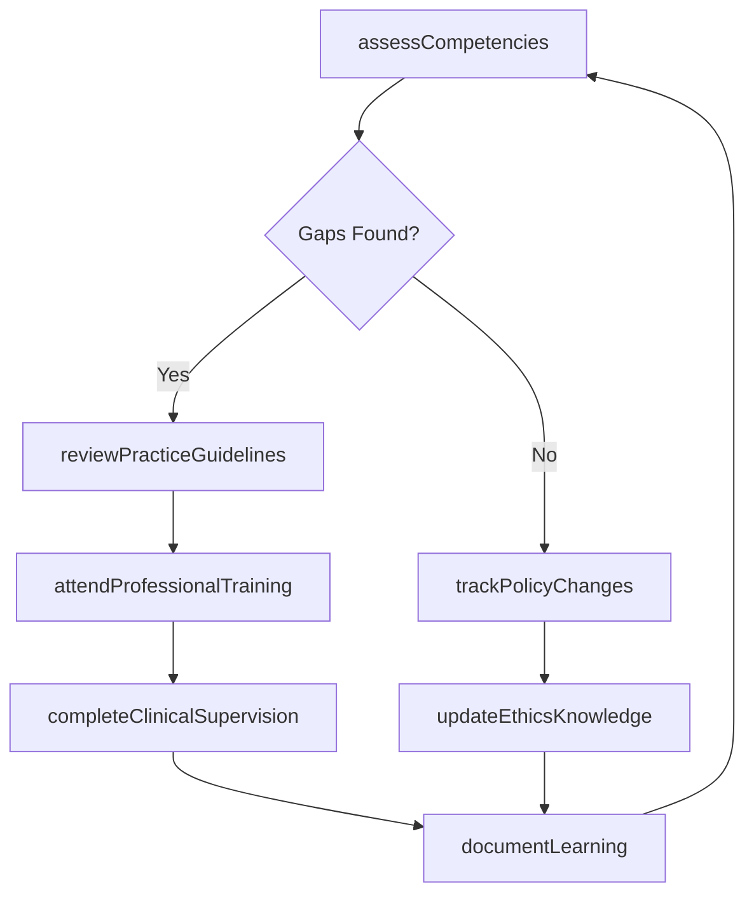
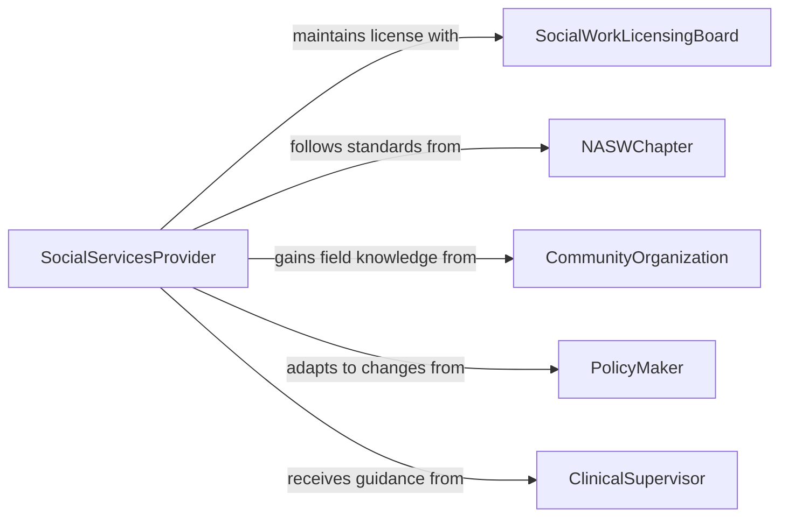

# Maintain Professional Social Services Knowledge

> Business-as-Code definition for maintaining professional social services knowledge. Models the continuous learning process for social workers, counselors, and human services professionals to stay current with practice standards, intervention methods, and policy changes.

## Overview

Maintaining professional social services knowledge involves tracking evolving clinical practices, intervention methodologies, social policy changes, and ethical standards that govern human services delivery. This activity ensures social workers, counselors, case managers, and related professionals can provide effective, evidence-based services to clients and communities while meeting licensure and accreditation requirements.

## Actors

| Actor | Description |
|-------|-------------|
| SocialWorkLicensingBoard | Issues and renews professional social work licenses |
| NASWChapter | Provides practice standards, ethics guidelines, and continuing education |
| CommunityOrganization | Offers field experience and awareness of local service needs |
| PolicyMaker | Enacts legislation affecting social services delivery and funding |
| ClinicalSupervisor | Provides guided practice oversight and knowledge mentoring |

## Roles

| Role | Description |
|------|-------------|
| SocialServicesProvider | Delivers direct services and must stay current with practice standards |
| ClinicalDirector | Ensures staff maintain required knowledge and clinical competencies |
| PolicyAnalyst | Interprets social policy changes and communicates practice implications |
| ContinuingEducationCoordinator | Organizes training aligned with licensure and accreditation requirements |

## Entities

| Entity | Description |
|--------|-------------|
| PracticeGuideline | Evidence-based standards for social services intervention methods |
| SocialPolicy | Legislation or regulation affecting services delivery and eligibility |
| ClinicalSupervisionRecord | Documentation of supervised practice hours and feedback |
| EthicsStandard | Professional code of conduct governing social services practice |
| LicensureRequirement | Conditions for maintaining professional social work licensure |
| InterventionMethod | A specific therapeutic or service delivery approach |

## Actions

| Action | Description |
|--------|-------------|
| reviewPracticeGuidelines | Study updated evidence-based standards for social services delivery |
| trackPolicyChanges | Monitor legislative and regulatory changes affecting social services |
| completeClinicalSupervision | Participate in supervised practice sessions for skill development |
| attendProfessionalTraining | Complete workshops and courses on social services topics |
| updateEthicsKnowledge | Review and internalize current professional ethics standards |
| assessCompetencies | Evaluate current knowledge against licensure and practice requirements |
| documentLearning | Record completed learning activities and insights |

## Events

| Event | Description |
|-------|-------------|
| practiceGuidelinesReviewed | Updated practice standards have been studied and understood |
| policyChangeTracked | A legislative or regulatory change has been identified and analyzed |
| clinicalSupervisionCompleted | A supervised practice session has been finished |
| trainingAttended | A professional workshop or course has been completed |
| ethicsKnowledgeUpdated | Current ethics standards have been reviewed and internalized |
| competenciesAssessed | Knowledge has been evaluated against requirements |
| newInterventionMethodIdentified | A promising new service delivery approach has been found |

## Searches

| Search | Description |
|--------|-------------|
| findPracticeGuidelines | Search for current guidelines by intervention type or population |
| getPolicyUpdates | Retrieve recent policy changes by jurisdiction or service area |
| getTrainingOpportunities | Query available courses by topic, format, and CEU eligibility |
| findSupervisionRecords | Look up clinical supervision history by provider or date range |

## Workflow



## Actor Relationships



## Usage

### Calling Actions

```typescript
import { maintainProfessionalSocialServicesKnowledge } from '@headlessly/maintain-professional-social-services-knowledge'

const socialServices = maintainProfessionalSocialServicesKnowledge()

// Assess current competencies against requirements
const assessment = await socialServices.assessCompetencies({
  providerId: 'SW-1124',
  domains: ['trauma-informed-care', 'substance-abuse-treatment', 'child-welfare'],
  benchmarkAgainst: 'LCSW-renewal-requirements'
})

// Track recent policy changes
const policyUpdates = await socialServices.trackPolicyChanges({
  jurisdictions: ['federal', 'state-NY'],
  serviceAreas: ['mental-health', 'child-protective-services'],
  since: '2025-07-01'
})

// Complete a clinical supervision session
await socialServices.completeClinicalSupervision({
  providerId: 'SW-1124',
  supervisorId: 'CS-0089',
  sessionDate: '2026-02-04',
  topics: ['complex-trauma-cases', 'mandated-reporting-updates'],
  hoursLogged: 2
})
```

### Event-Driven Automation

```typescript
// Alert staff when practice guidelines change
socialServices.practiceGuidelinesReviewed(async ({ guidelineId, changes, affectedServices }) => {
  await notify({
    to: 'clinical-staff',
    message: `Updated practice guidelines for ${affectedServices.join(', ')} - review required`
  })
})

// Auto-schedule training when competency gaps are found
socialServices.competenciesAssessed(async ({ providerId, gaps }) => {
  for (const gap of gaps) {
    await assignTraining({
      providerId,
      topic: gap.domain,
      deadline: inMonths(2),
      priority: gap.severity === 'critical' ? 'immediate' : 'standard'
    })
  }
})
```
