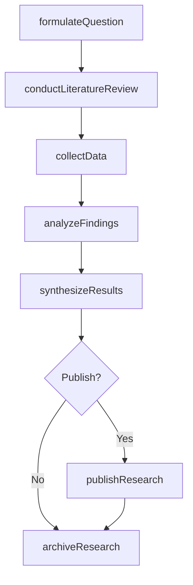
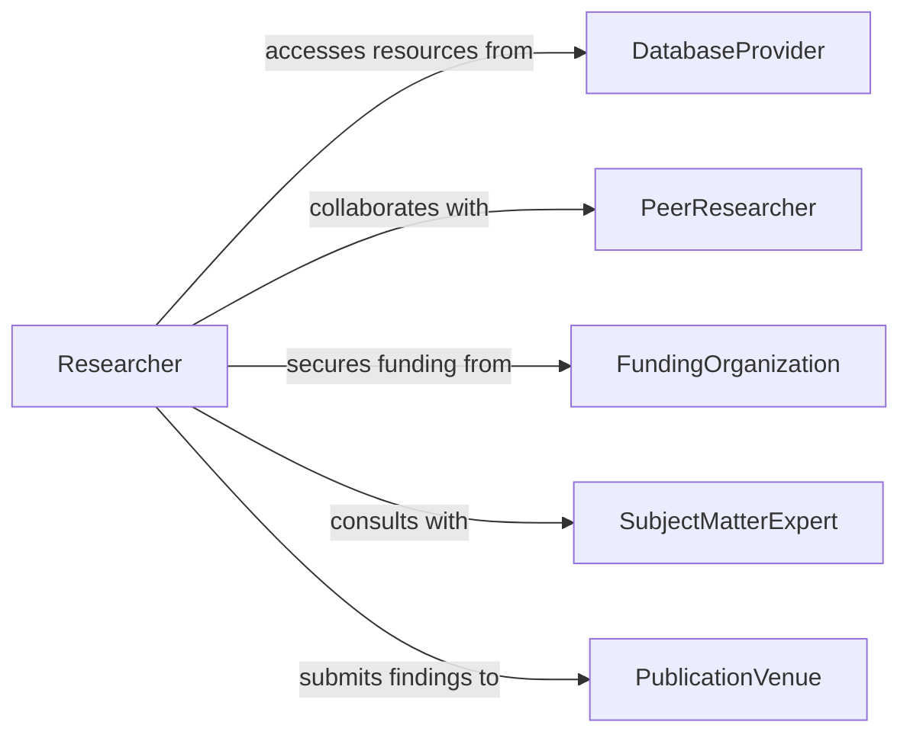

# Research Topics Area Expertise

> Business-as-Code definition for researching topics in area of expertise. Models the systematic investigation of domain-specific questions through literature review, data analysis, and knowledge synthesis.

## Overview

Researching topics in an area of expertise involves formulating research questions, gathering information from authoritative sources, analyzing findings, and producing insights that advance professional understanding. This activity supports evidence-based decision-making, innovation, and the development of new methodologies, products, or services within a professional domain.

## Actors

| Actor | Description |
|-------|-------------|
| DatabaseProvider | Supplies access to academic databases, archives, and research repositories |
| PeerResearcher | Collaborates on research projects and provides peer review |
| FundingOrganization | Provides grants and financial support for research activities |
| SubjectMatterExpert | Offers specialized knowledge and consultation on research topics |
| PublicationVenue | Accepts and publishes research findings in journals or conferences |

## Roles

| Role | Description |
|------|-------------|
| Researcher | Designs and conducts investigations into domain-specific topics |
| PrincipalInvestigator | Leads research projects and ensures methodological rigor |
| ResearchAssistant | Supports data collection, literature searches, and analysis tasks |
| KnowledgeSynthesizer | Integrates findings across multiple sources into coherent insights |

## Entities

| Entity | Description |
|--------|-------------|
| ResearchQuestion | A specific inquiry driving the investigation |
| LiteratureReview | A systematic survey of existing knowledge on a topic |
| DataSource | A dataset, database, or information repository used in research |
| ResearchFinding | A conclusion or insight derived from investigation and analysis |
| ResearchReport | A formal document presenting methodology, findings, and implications |
| Citation | A reference to a source used in the research process |

## Actions

| Action | Description |
|--------|-------------|
| formulateQuestion | Define a specific research question or hypothesis |
| conductLiteratureReview | Systematically survey existing knowledge on the topic |
| collectData | Gather relevant data from identified sources |
| analyzeFindings | Examine collected data to extract patterns and insights |
| synthesizeResults | Integrate findings into coherent conclusions and recommendations |
| publishResearch | Prepare and submit research outputs for dissemination |
| archiveResearch | Store research materials and data for future reference |

## Events

| Event | Description |
|-------|-------------|
| questionFormulated | A research question has been defined and scoped |
| literatureReviewCompleted | Survey of existing knowledge has been finished |
| dataCollected | Relevant data has been gathered from identified sources |
| findingsAnalyzed | Data analysis has produced initial insights |
| resultsSynthesized | Research findings have been integrated into conclusions |
| researchPublished | Research outputs have been submitted or distributed |
| researchArchived | All research materials have been stored for reference |

## Searches

| Search | Description |
|--------|-------------|
| findResearchTopics | Retrieve active research questions by domain or status |
| searchLiterature | Query academic databases for publications on a topic |
| getDataSources | Identify available datasets relevant to a research question |
| findResearchOutputs | Look up completed research reports by topic, author, or date |

## Workflow



## Actor Relationships



## Usage

### Calling Actions

```typescript
import { researchTopicsAreaExpertise } from '@headlessly/research-topics-area-expertise'

const research = researchTopicsAreaExpertise()

// Define a research question
const question = await research.formulateQuestion({
  topic: 'impact of telehealth on patient outcomes in rural communities',
  scope: 'systematic-review',
  domain: 'healthcare-delivery'
})

// Conduct a literature review
const review = await research.conductLiteratureReview({
  questionId: question.id,
  databases: ['PubMed', 'CINAHL', 'Cochrane'],
  dateRange: { from: '2020-01-01', to: '2026-01-31' },
  inclusionCriteria: ['peer-reviewed', 'English-language', 'quantitative']
})

// Analyze and synthesize findings
const analysis = await research.analyzeFindings({
  questionId: question.id,
  sources: review.includedStudies,
  method: 'meta-analysis'
})
```

### Event-Driven Automation

```typescript
// Notify team when literature review is complete
research.literatureReviewCompleted(async ({ questionId, studiesFound, gaps }) => {
  await notify({
    to: 'research-team',
    message: `Literature review complete: ${studiesFound} studies found, ${gaps.length} knowledge gaps identified`
  })
})

// Auto-archive after publication
research.researchPublished(async ({ reportId, venue }) => {
  await research.archiveResearch({
    reportId,
    archiveLocation: 'institutional-repository',
    metadata: { venue, publicationDate: today() }
  })
})
```
