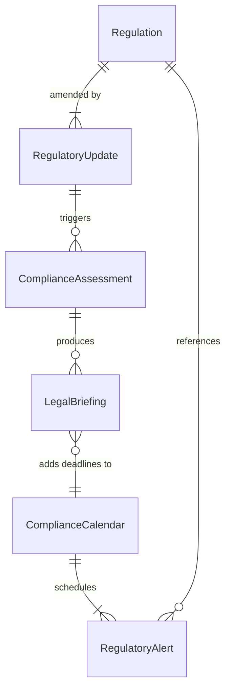
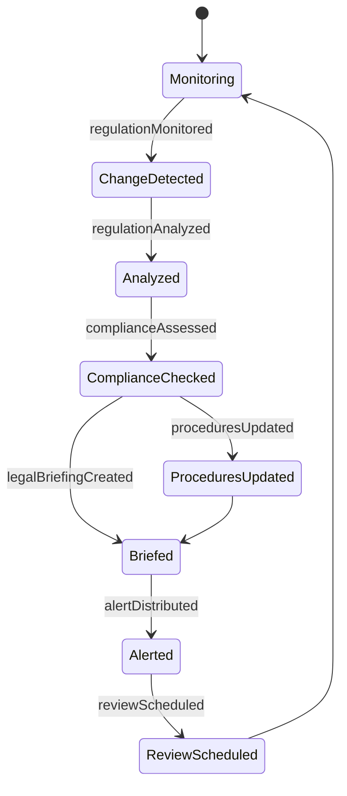
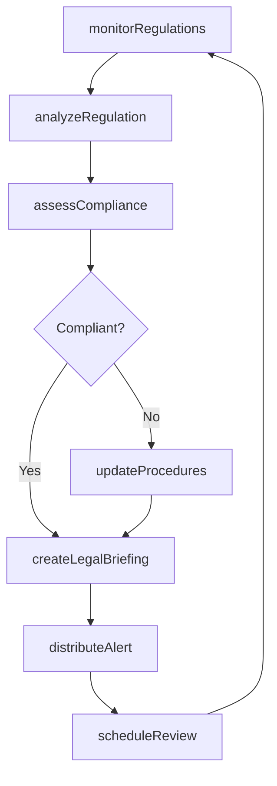
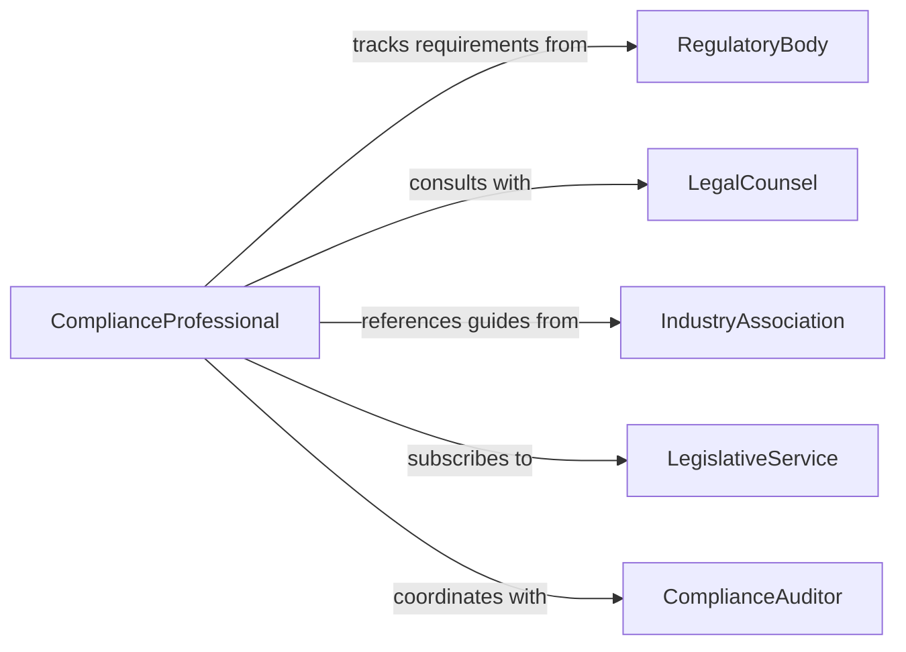

# Review Laws Regulations Maintain Professional

> Business-as-Code definition for reviewing laws and regulations to maintain professional knowledge. Models the systematic monitoring, analysis, and integration of legal and regulatory changes into professional practice.

## Overview

Reviewing laws and regulations to maintain professional knowledge involves tracking legislative changes, regulatory updates, and compliance requirements that affect one's field of practice. This activity ensures professionals understand current legal obligations, anticipate upcoming regulatory shifts, and adapt their practices to remain compliant and effective.

## Actors

| Actor | Description |
|-------|-------------|
| RegulatoryBody | Government agency that issues and enforces regulations |
| LegalCounsel | Provides interpretation and guidance on legal requirements |
| IndustryAssociation | Publishes compliance guides and regulatory impact summaries |
| LegislativeService | Monitors and distributes updates on new laws and amendments |
| ComplianceAuditor | Evaluates adherence to regulatory requirements |

## Roles

| Role | Description |
|------|-------------|
| ComplianceProfessional | Monitors regulatory landscape and ensures organizational compliance |
| PracticeLeader | Integrates legal requirements into professional standards and procedures |
| RegulatoryAnalyst | Analyzes new regulations for operational and strategic impact |
| TrainingCoordinator | Develops training on regulatory changes for staff |

## Entities

| Entity | Description |
|--------|-------------|
| Regulation | A specific law, rule, or regulatory requirement |
| RegulatoryUpdate | A notification of a new or amended regulation |
| ComplianceAssessment | Evaluation of current practices against regulatory requirements |
| LegalBriefing | A summary document explaining regulatory changes and implications |
| ComplianceCalendar | Schedule of regulatory deadlines and review dates |
| RegulatoryAlert | An automated notification of pending or enacted regulatory changes |

## Actions

| Action | Description |
|--------|-------------|
| monitorRegulations | Track legislative and regulatory changes across relevant jurisdictions |
| analyzeRegulation | Evaluate the scope and impact of a specific regulatory change |
| assessCompliance | Check current practices against updated regulatory requirements |
| createLegalBriefing | Prepare a summary of regulatory changes and their implications |
| updateProcedures | Modify professional practices to align with new regulations |
| distributeAlert | Notify relevant stakeholders of regulatory changes |
| scheduleReview | Set up periodic reviews of regulatory compliance status |

## Events

| Event | Description |
|-------|-------------|
| regulationMonitored | A new regulatory change has been detected and logged |
| regulationAnalyzed | Impact analysis of a regulatory change has been completed |
| complianceAssessed | Current practices have been evaluated against regulations |
| legalBriefingCreated | A regulatory change summary has been prepared |
| proceduresUpdated | Professional practices have been modified for compliance |
| alertDistributed | Stakeholders have been notified of a regulatory change |
| reviewScheduled | A compliance review has been added to the calendar |

## Searches

| Search | Description |
|--------|-------------|
| findRegulations | Search regulations by jurisdiction, topic, or effective date |
| getComplianceStatus | Query current compliance posture across regulatory domains |
| findUpcomingDeadlines | Retrieve regulatory deadlines and review dates |
| searchBriefings | Look up legal briefings by regulation, topic, or date |

## Entity Relationships



## State Diagram



## Workflow



## Actor Relationships



## Usage

### Calling Actions

```typescript
import { reviewLawsRegulationsMaintainProfessional } from '@headlessly/review-laws-regulations-maintain-professional'

const regulatory = reviewLawsRegulationsMaintainProfessional()

// Monitor regulations in relevant domains
const updates = await regulatory.monitorRegulations({
  jurisdictions: ['federal', 'state-CA', 'EU'],
  domains: ['data-privacy', 'healthcare-compliance', 'employment-law'],
  since: '2026-01-01'
})

// Analyze a specific regulation
const analysis = await regulatory.analyzeRegulation({
  regulationId: updates.changes[0].id,
  assessAreas: ['operationalImpact', 'complianceCost', 'implementationTimeline']
})

// Assess current compliance
const status = await regulatory.assessCompliance({
  regulationId: updates.changes[0].id,
  currentPractices: 'data-handling-policy-v3',
  scope: 'organization-wide'
})
```

### Event-Driven Automation

```typescript
// Auto-alert leadership on high-impact regulatory changes
regulatory.regulationAnalyzed(async ({ regulationId, impact, domain }) => {
  if (impact.severity === 'high') {
    await regulatory.distributeAlert({
      regulationId,
      recipients: ['legal-team', 'executive-leadership'],
      urgency: 'immediate',
      message: `High-impact regulatory change in ${domain} requires attention`
    })
  }
})

// Schedule reviews when procedures are updated
regulatory.proceduresUpdated(async ({ regulationId, procedureId }) => {
  await regulatory.scheduleReview({
    regulationId,
    procedureId,
    reviewDate: inMonths(3),
    reviewType: 'compliance-verification'
  })
})
```
