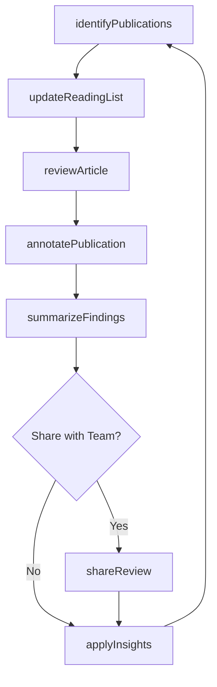
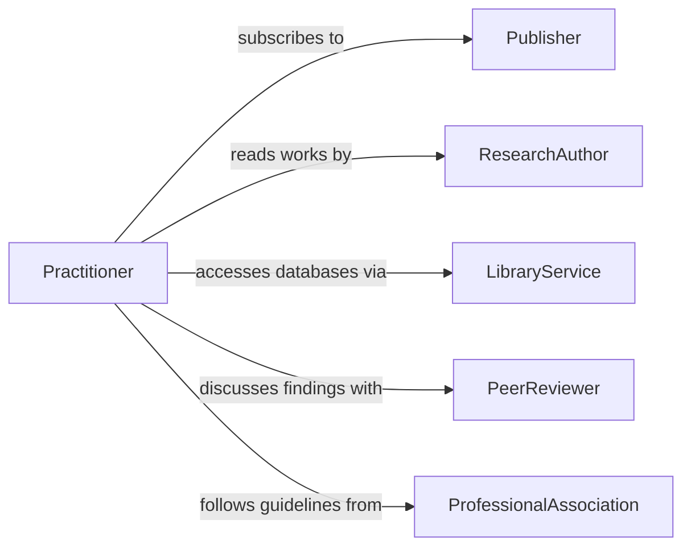

# Review Professional Literature Maintain Professional

> Business-as-Code definition for reviewing professional literature to maintain professional knowledge. Models the systematic reading, analysis, and application of journals, research papers, and technical publications.

## Overview

Reviewing professional literature involves systematically reading, evaluating, and synthesizing information from journals, research papers, books, white papers, and technical publications relevant to one's professional domain. This activity ensures practitioners stay current with evolving best practices, research findings, and methodological advances that directly impact the quality of their work.

## Actors

| Actor | Description |
|-------|-------------|
| Publisher | Produces and distributes professional journals, books, and periodicals |
| ResearchAuthor | Writes peer-reviewed papers and technical articles |
| LibraryService | Provides access to databases, subscriptions, and literature collections |
| PeerReviewer | Validates and contextualizes findings in professional literature |
| ProfessionalAssociation | Curates recommended reading lists and practice guidelines |

## Roles

| Role | Description |
|------|-------------|
| Practitioner | Reads and applies literature findings to professional practice |
| ResearchLead | Identifies critical literature and guides team reading priorities |
| KnowledgeManager | Organizes literature summaries and maintains a knowledge library |
| JournalClubFacilitator | Coordinates group discussions of key publications |

## Entities

| Entity | Description |
|--------|-------------|
| Publication | A journal article, book, white paper, or technical report |
| ReadingList | A curated set of publications organized by topic or priority |
| LiteratureSummary | A concise synthesis of key findings from a reviewed publication |
| Subscription | An active subscription to a journal or publication database |
| Annotation | Notes, highlights, and commentary recorded during review |
| KnowledgeLibrary | Centralized repository of reviewed and summarized literature |

## Actions

| Action | Description |
|--------|-------------|
| identifyPublications | Search for and select relevant literature for review |
| reviewArticle | Read and critically evaluate a professional publication |
| summarizeFindings | Extract and document key insights from reviewed literature |
| annotatePublication | Add notes, highlights, and commentary to a publication |
| shareReview | Distribute literature summaries and insights to colleagues |
| updateReadingList | Add new publications and reprioritize the reading queue |
| applyInsights | Integrate literature findings into professional practice |

## Events

| Event | Description |
|-------|-------------|
| publicationsIdentified | New relevant literature has been found and queued for review |
| articleReviewed | A publication has been read and critically evaluated |
| findingsSummarized | Key insights from a publication have been documented |
| publicationAnnotated | Notes and commentary have been added to a publication |
| reviewShared | Literature summary has been distributed to the team |
| readingListUpdated | The reading queue has been modified with new priorities |
| insightsApplied | Findings from literature have been integrated into practice |

## Searches

| Search | Description |
|--------|-------------|
| findPublications | Search for literature by topic, author, journal, or date |
| getReadingList | Retrieve the current prioritized reading queue |
| getSummaries | Look up literature summaries by topic or publication |
| findAnnotations | Search notes and highlights across reviewed publications |

## Workflow



## Actor Relationships



## Usage

### Calling Actions

```typescript
import { reviewProfessionalLiteratureMaintainProfessional } from '@headlessly/review-professional-literature-maintain-professional'

const literature = reviewProfessionalLiteratureMaintainProfessional()

// Search for relevant publications
const results = await literature.identifyPublications({
  topics: ['cognitive-behavioral-therapy', 'trauma-informed-care'],
  sources: ['PubMed', 'APA-PsycINFO', 'Cochrane-Library'],
  dateRange: { from: '2025-01-01', to: '2026-01-31' },
  peerReviewedOnly: true
})

// Review a specific article
const review = await literature.reviewArticle({
  publicationId: results.articles[0].id,
  reviewDepth: 'detailed',
  focusAreas: ['methodology', 'findings', 'practicalImplications']
})

// Summarize and share findings
await literature.summarizeFindings({
  publicationId: results.articles[0].id,
  keyInsights: review.insights,
  practiceImplications: review.implications
})
```

### Event-Driven Automation

```typescript
// Notify team when high-impact literature is reviewed
literature.articleReviewed(async ({ publicationId, impactScore, topic }) => {
  if (impactScore >= 8) {
    await literature.shareReview({
      publicationId,
      audience: 'department',
      note: `High-impact publication on ${topic} - recommended reading`
    })
  }
})

// Auto-add new publications from subscriptions to reading list
literature.publicationsIdentified(async ({ publications }) => {
  await literature.updateReadingList({
    additions: publications.map(p => ({ id: p.id, priority: p.relevanceScore })),
    sortBy: 'priority'
  })
})
```
