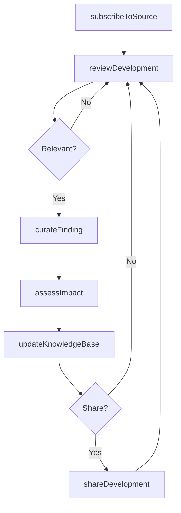
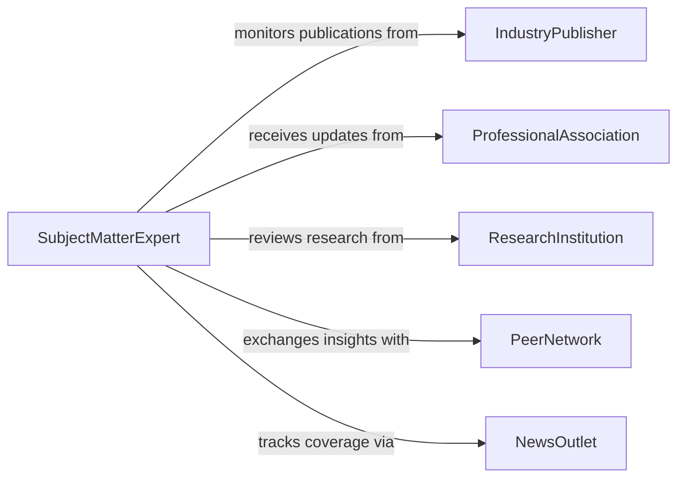

# Stay Informed About Current Developments

> Business-as-Code definition for staying informed about current developments in a field of specialization. Models the continuous monitoring and consumption of industry news, research, and emerging trends relevant to professional practice.

## Overview

Staying informed about current developments involves systematically tracking advancements, publications, and trends within a professional domain. This activity ensures practitioners remain aware of innovations, shifting best practices, and competitive dynamics that affect their work. It encompasses monitoring information sources, curating relevant content, and integrating new insights into professional knowledge.

## Actors

| Actor | Description |
|-------|-------------|
| IndustryPublisher | Produces trade journals, whitepapers, and research reports |
| ProfessionalAssociation | Issues standards updates, newsletters, and field guidelines |
| ResearchInstitution | Publishes academic findings and technical breakthroughs |
| PeerNetwork | Shares firsthand experiences and informal knowledge |
| NewsOutlet | Reports on market shifts, policy changes, and industry events |

## Roles

| Role | Description |
|------|-------------|
| SubjectMatterExpert | Maintains deep domain knowledge and curates updates |
| KnowledgeManager | Organizes and distributes relevant information across teams |
| TeamLead | Ensures team members stay current with field developments |
| Analyst | Evaluates the significance and applicability of new developments |

## Entities

| Entity | Description |
|--------|-------------|
| InformationSource | A publication, feed, or channel providing field-specific content |
| DevelopmentUpdate | A discrete piece of news or research about a field advancement |
| KnowledgeBase | Repository of curated and organized professional knowledge |
| AlertSubscription | A configured notification for specific topics or sources |
| TrendReport | A summary analysis of emerging patterns in the field |
| ReadingList | A prioritized queue of articles, papers, and reports to review |

## Actions

| Action | Description |
|--------|-------------|
| subscribeToSource | Register for updates from a publication, feed, or alert service |
| reviewDevelopment | Read and assess a new development for relevance and impact |
| curateFinding | Tag and categorize a development for future reference |
| shareDevelopment | Distribute a noteworthy update to colleagues or teams |
| assessImpact | Evaluate how a development affects current practices or strategies |
| updateKnowledgeBase | Incorporate validated findings into the knowledge repository |
| generateTrendReport | Compile and summarize emerging patterns from recent developments |

## Events

| Event | Description |
|-------|-------------|
| sourceSubscribed | A new information source has been added to monitoring |
| developmentReviewed | A development update has been read and assessed |
| findingCurated | A relevant finding has been tagged and categorized |
| developmentShared | An update has been distributed to stakeholders |
| impactAssessed | The significance of a development has been evaluated |
| knowledgeBaseUpdated | New information has been incorporated into the repository |
| trendReportGenerated | A summary of emerging trends has been compiled |

## Searches

| Search | Description |
|--------|-------------|
| findDevelopments | Retrieve developments by topic, date range, or source |
| getActiveSubscriptions | List all current information source subscriptions |
| getTrendReports | Retrieve trend analyses by period or subject area |
| searchKnowledgeBase | Query the knowledge repository for specific topics or keywords |

## Workflow



## Actor Relationships



## Usage

### Calling Actions

```typescript
import { stayInformedAboutCurrentDevelopments } from '@headlessly/stay-informed-about-current-developments'

const developments = stayInformedAboutCurrentDevelopments()

// Subscribe to a new industry source
const subscription = await developments.subscribeToSource({
  name: 'Journal of Applied Data Science',
  type: 'academic-journal',
  topics: ['machine-learning', 'data-engineering'],
  frequency: 'weekly'
})

// Review and curate a development
const finding = await developments.reviewDevelopment({
  sourceId: subscription.id,
  developmentId: 'dev-2026-0412',
  relevanceScore: 0.85
})

await developments.curateFinding({
  developmentId: finding.id,
  tags: ['neural-networks', 'optimization'],
  priority: 'high'
})

// Generate a trend report
const report = await developments.generateTrendReport({
  period: { start: '2026-01-01', end: '2026-03-31' },
  topics: ['machine-learning']
})
```

### Event-Driven Automation

```typescript
// Auto-share high-impact developments
developments.impactAssessed(async ({ developmentId, impactLevel }) => {
  if (impactLevel === 'high') {
    await developments.shareDevelopment({
      developmentId,
      channels: ['engineering-team', 'leadership']
    })
  }
})

// Update knowledge base when findings are curated
developments.findingCurated(async ({ developmentId, tags }) => {
  await developments.updateKnowledgeBase({
    developmentId,
    section: tags[0],
    autoClassify: true
  })
})
```
