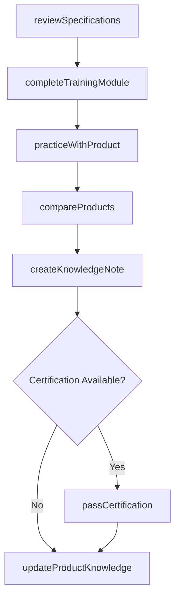
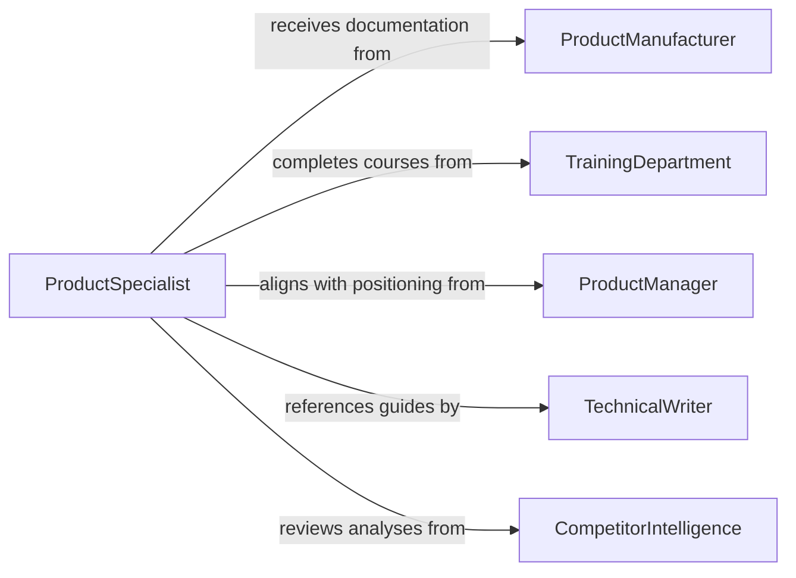

# Study Product Information Acquire Professional

> Business-as-Code definition for studying product information to acquire professional knowledge. Models the systematic review of product specifications, documentation, and technical details to build expertise for effective selling, servicing, or supporting products.

## Overview

Studying product information to acquire professional knowledge involves reviewing technical documentation, specifications, user manuals, training materials, and competitive analyses to develop a thorough understanding of products and their applications. This activity is essential for sales professionals, technical support staff, engineers, and anyone who needs deep product expertise to serve customers, resolve issues, or recommend solutions.

## Actors

| Actor | Description |
|-------|-------------|
| ProductManufacturer | Creates products and provides technical documentation and specifications |
| TrainingDepartment | Develops and delivers product training programs and materials |
| ProductManager | Defines product features, positioning, and competitive differentiation |
| TechnicalWriter | Produces manuals, guides, and knowledge base articles |
| CompetitorIntelligence | Provides comparison data on rival products and offerings |

## Roles

| Role | Description |
|------|-------------|
| ProductSpecialist | Develops deep expertise in product features and applications |
| SalesRepresentative | Studies products to effectively present and recommend to customers |
| TechnicalSupportAgent | Learns product details to troubleshoot and resolve customer issues |
| FieldEngineer | Masters product specifications for installation and maintenance |

## Entities

| Entity | Description |
|--------|-------------|
| ProductSpecification | Technical details and parameters of a product |
| TrainingModule | A structured learning unit covering specific product knowledge |
| ProductComparison | Side-by-side analysis of product features against competitors |
| KnowledgeBaseArticle | A documented solution or explanation for a product topic |
| ProductCatalog | Complete listing of products with descriptions and specifications |
| CertificationExam | An assessment validating product knowledge proficiency |

## Actions

| Action | Description |
|--------|-------------|
| reviewSpecifications | Study technical documentation and product specifications |
| completeTrainingModule | Finish a structured product knowledge training unit |
| compareProducts | Analyze product features against competitor offerings |
| practiceWithProduct | Gain hands-on experience using or demonstrating the product |
| createKnowledgeNote | Document personal insights and learnings from product study |
| passCertification | Complete a product knowledge assessment or certification exam |
| updateProductKnowledge | Refresh expertise when product updates or new versions are released |

## Events

| Event | Description |
|-------|-------------|
| specificationsReviewed | Product technical documentation has been studied |
| trainingModuleCompleted | A product training unit has been finished |
| productsCompared | Competitive product analysis has been completed |
| handOnPracticeCompleted | Direct product experience has been gained |
| knowledgeNoteCreated | Personal product insights have been documented |
| certificationPassed | Product knowledge assessment has been successfully completed |
| productKnowledgeUpdated | Expertise has been refreshed for a product update |

## Searches

| Search | Description |
|--------|-------------|
| findProductDocumentation | Search specifications and manuals by product name or category |
| getTrainingModules | Retrieve available training modules by product or skill level |
| findCompetitorComparisons | Look up competitive analyses by product category |
| getKnowledgeNotes | Search personal and team notes by product topic |

## Workflow



## Actor Relationships



## Usage

### Calling Actions

```typescript
import { studyProductInformationAcquireProfessional } from '@headlessly/study-product-information-acquire-professional'

const productStudy = studyProductInformationAcquireProfessional()

// Review specifications for a new product line
const review = await productStudy.reviewSpecifications({
  productId: 'XR-5000-Series',
  documentTypes: ['technical-specs', 'user-manual', 'installation-guide'],
  focusAreas: ['configuration-options', 'performance-specs', 'compatibility']
})

// Complete a training module
await productStudy.completeTrainingModule({
  moduleId: 'XR5000-Advanced-Config',
  professionalId: 'REP-2245',
  format: 'self-paced-online',
  completionDate: '2026-02-05'
})

// Compare against competitor products
const comparison = await productStudy.compareProducts({
  primaryProduct: 'XR-5000',
  competitors: ['CompA-Model-Z', 'CompB-ProLine'],
  criteria: ['performance', 'price', 'features', 'reliability', 'support']
})
```

### Event-Driven Automation

```typescript
// Notify team when new product documentation is available
productStudy.specificationsReviewed(async ({ productId, version, keyChanges }) => {
  await notify({
    to: 'sales-engineering',
    message: `Updated specs reviewed for ${productId} v${version}: ${keyChanges.join(', ')}`
  })
})

// Auto-assign training when product updates are released
productStudy.productKnowledgeUpdated(async ({ productId, updateType }) => {
  if (updateType === 'major-release') {
    await assignTraining({
      teams: ['sales', 'support', 'field-engineering'],
      moduleId: `${productId}-update-training`,
      deadline: inWeeks(2)
    })
  }
})
```
