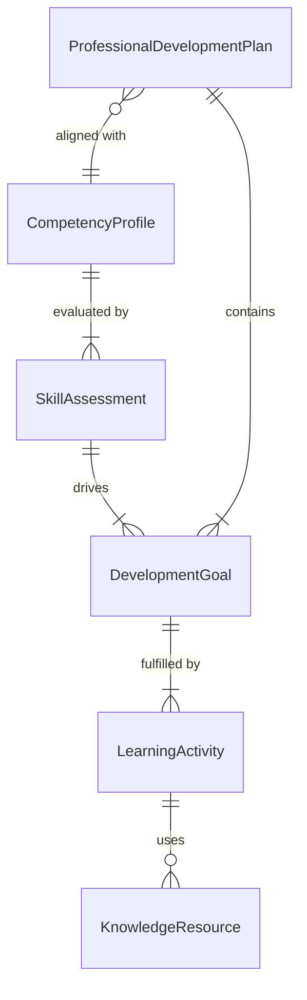
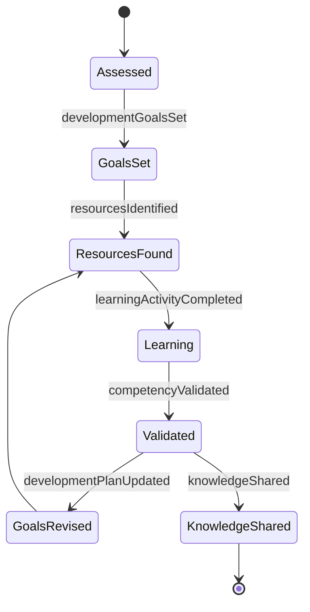
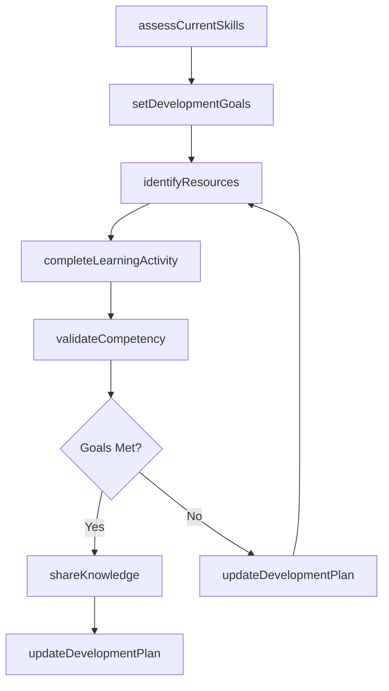
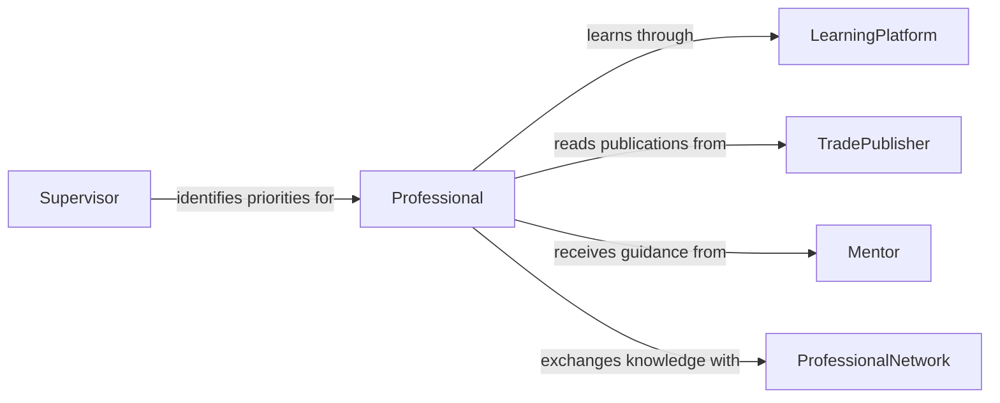

# Update Job Related Knowledge Skills

> Business-as-Code definition for updating job-related knowledge or skills. Models the continuous professional development cycle from needs assessment through learning activities and competency validation.

## Overview

Updating job-related knowledge or skills involves identifying areas where current competencies no longer meet evolving job requirements, then pursuing targeted learning activities to close those gaps. This activity encompasses reading trade publications, completing online courses, practicing with new tools, and engaging in peer learning or mentorship. It ensures that professionals maintain effectiveness as technologies, methodologies, and industry practices change over time.

## Actors

| Actor | Description |
|-------|-------------|
| LearningPlatform | Online system providing courses, tutorials, and skill assessments |
| TradePublisher | Organization producing industry-specific journals, magazines, and reports |
| Mentor | Experienced professional providing guidance and knowledge transfer |
| ProfessionalNetwork | Community of practitioners sharing knowledge and best practices |
| ToolVendor | Company offering new software, equipment, or methodology training |

## Roles

| Role | Description |
|------|-------------|
| Professional | Individual maintaining and updating their job-related competencies |
| Supervisor | Evaluates performance and identifies development priorities |
| LearningCoordinator | Manages learning resources and tracks employee development progress |
| HRDevelopmentSpecialist | Designs competency frameworks and career development programs |

## Entities

| Entity | Description |
|--------|-------------|
| CompetencyProfile | A mapping of required skills and knowledge for a specific role |
| LearningActivity | A specific course, reading, exercise, or practice session undertaken |
| SkillAssessment | An evaluation measuring current proficiency in a specific competency |
| DevelopmentGoal | A targeted objective to achieve a specific knowledge or skill level |
| ProfessionalDevelopmentPlan | A structured roadmap of learning activities and milestones |
| KnowledgeResource | A publication, course, tool, or reference material used for learning |

## Actions

| Action | Description |
|--------|-------------|
| assessCurrentSkills | Evaluate existing competencies against role requirements |
| setDevelopmentGoals | Define specific, measurable learning objectives for a time period |
| identifyResources | Find relevant courses, publications, or tools for skill development |
| completeLearningActivity | Finish a specific course, reading, or practice exercise |
| validateCompetency | Confirm skill acquisition through assessment, project work, or review |
| updateDevelopmentPlan | Revise the professional development plan based on progress or priorities |
| shareKnowledge | Contribute newly acquired knowledge back to the team or organization |

## Events

| Event | Description |
|-------|-------------|
| skillsAssessed | Current competency levels have been evaluated |
| developmentGoalsSet | Learning objectives have been defined for a time period |
| resourcesIdentified | Relevant learning materials and opportunities have been found |
| learningActivityCompleted | A specific course, reading, or exercise has been finished |
| competencyValidated | A skill acquisition has been confirmed through assessment |
| developmentPlanUpdated | The professional development plan has been revised |
| knowledgeShared | Newly acquired knowledge has been contributed to the team |

## Searches

| Search | Description |
|--------|-------------|
| findLearningResources | Search courses, publications, and tools by skill area or format |
| getCompetencyProfile | Retrieve the competency requirements for a specific role or position |
| getDevelopmentProgress | Track learning activity completion and goal achievement by employee |
| getSkillAssessments | Look up assessment results by employee, competency, or date range |

## Entity Relationships



## State Diagram



## Workflow



## Actor Relationships



## Usage

### Calling Actions

```typescript
import { updateJobRelatedKnowledgeSkills } from '@headlessly/update-job-related-knowledge-skills'

const skills = updateJobRelatedKnowledgeSkills()

// Assess current skills against role requirements
const assessment = await skills.assessCurrentSkills({
  employeeId: 'emp-3307',
  roleId: 'senior-data-engineer',
  competencies: ['apache-spark', 'dbt', 'data-modeling', 'cloud-architecture']
})

// Set development goals based on assessment
await skills.setDevelopmentGoals({
  employeeId: 'emp-3307',
  goals: [
    { skill: 'dbt', targetLevel: 'advanced', deadline: '2026-06-30' },
    { skill: 'cloud-architecture', targetLevel: 'intermediate', deadline: '2026-09-30' }
  ]
})

// Complete a learning activity
await skills.completeLearningActivity({
  employeeId: 'emp-3307',
  activityType: 'online-course',
  title: 'Advanced dbt for Analytics Engineering',
  hoursSpent: 16,
  completionDate: '2026-03-15'
})
```

### Event-Driven Automation

```typescript
// Notify supervisor when competency is validated
skills.competencyValidated(async ({ employeeId, skill, level }) => {
  await notify({
    to: 'supervisor',
    message: `${employeeId} has achieved ${level} proficiency in ${skill}`
  })
})

// Auto-recommend resources when new development goals are set
skills.developmentGoalsSet(async ({ employeeId, goals }) => {
  for (const goal of goals) {
    const resources = await skills.findLearningResources({
      skill: goal.skill,
      targetLevel: goal.targetLevel,
      format: 'online'
    })
    await notify({
      to: employeeId,
      message: `Recommended resources for ${goal.skill}: ${resources.map(r => r.title).join(', ')}`
    })
  }
})
```
