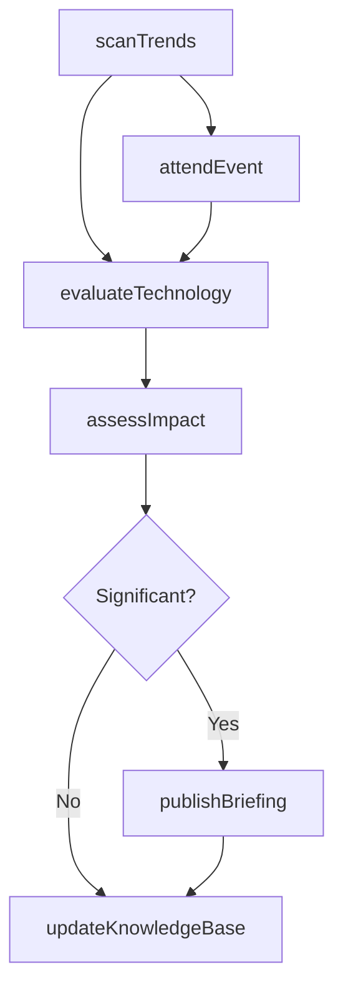
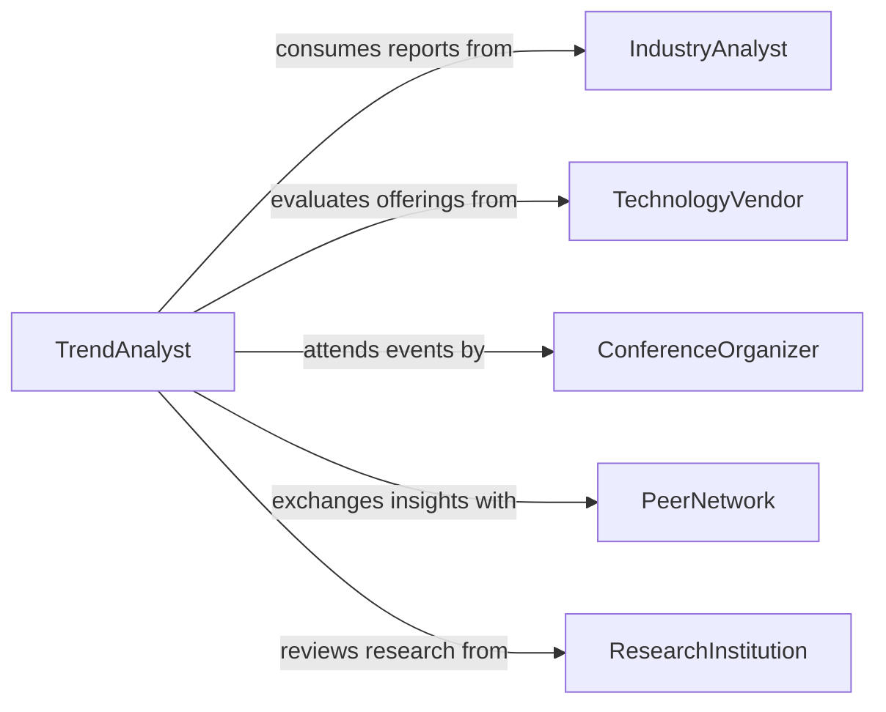

# Update Knowledge About Emerging Industry

> Business-as-Code definition for updating knowledge about emerging industry and technology trends. Models the systematic tracking, analysis, and dissemination of new developments that impact business strategy and operations.

## Overview

Updating knowledge about emerging industry or technology trends involves systematically scanning the business environment for new technologies, market shifts, competitive movements, and innovation patterns. This activity ensures that professionals and organizations stay ahead of disruptive changes by identifying, evaluating, and integrating emerging trends into strategic planning and decision-making.

## Actors

| Actor | Description |
|-------|-------------|
| IndustryAnalyst | Publishes reports on market trends and technology forecasts |
| TechnologyVendor | Introduces new tools, platforms, and solutions to the market |
| ConferenceOrganizer | Hosts events showcasing emerging technologies and thought leadership |
| PeerNetwork | Professional contacts who share insights and experiences |
| ResearchInstitution | Produces academic and applied research on emerging fields |
| TradeAssociation | Publishes industry standards, benchmarks, and trend reports |

## Roles

| Role | Description |
|------|-------------|
| TrendAnalyst | Monitors and evaluates emerging industry and technology signals |
| StrategyLeader | Incorporates trend insights into organizational strategy |
| InnovationManager | Assesses new technologies for potential adoption |
| KnowledgeCurator | Organizes and distributes trend intelligence across the organization |

## Entities

| Entity | Description |
|--------|-------------|
| TrendReport | A document summarizing an emerging industry or technology trend |
| TechnologyAssessment | Evaluation of a new technology's maturity and applicability |
| IndustryBriefing | A concise update on market shifts or competitive developments |
| KnowledgeBase | Repository of curated trend intelligence and research |
| LearningEvent | A conference, webinar, or workshop attended for trend updates |
| TrendAlert | A notification triggered when a significant development is identified |

## Actions

| Action | Description |
|--------|-------------|
| scanTrends | Systematically search for emerging industry and technology signals |
| evaluateTechnology | Assess a new technology for maturity, relevance, and adoption potential |
| attendEvent | Participate in conferences, webinars, or workshops on emerging trends |
| publishBriefing | Create and distribute a summary of key trend findings |
| updateKnowledgeBase | Add new trend intelligence to the organizational knowledge repository |
| assessImpact | Evaluate how an emerging trend may affect business operations or strategy |

## Events

| Event | Description |
|-------|-------------|
| trendIdentified | A new emerging trend has been detected and logged |
| technologyEvaluated | Assessment of a new technology has been completed |
| eventAttended | A learning event on emerging trends has been completed |
| briefingPublished | A trend briefing has been distributed to stakeholders |
| knowledgeBaseUpdated | New intelligence has been added to the knowledge repository |
| impactAssessed | The business impact of an emerging trend has been evaluated |
| disruptionAlertRaised | A potentially disruptive trend has been flagged for urgent review |

## Searches

| Search | Description |
|--------|-------------|
| findTrends | Retrieve trend reports by industry, technology domain, or date range |
| getAssessments | Look up technology evaluations by maturity level or relevance score |
| findUpcomingEvents | Query conferences and learning events by topic and date |
| searchKnowledgeBase | Full-text search across curated trend intelligence |

## Workflow



## Actor Relationships



## Usage

### Calling Actions

```typescript
import { updateKnowledgeAboutEmergingIndustry } from '@headlessly/update-knowledge-about-emerging-industry'

const trends = updateKnowledgeAboutEmergingIndustry()

// Scan for emerging trends in a specific domain
const signals = await trends.scanTrends({
  domains: ['artificial-intelligence', 'quantum-computing', 'green-energy'],
  sources: ['analyst-reports', 'patent-filings', 'conference-proceedings'],
  timeframe: 'last-quarter'
})

// Evaluate a specific technology
const assessment = await trends.evaluateTechnology({
  technology: 'edge-computing',
  criteria: ['maturity', 'relevance', 'adoptionCost', 'competitiveAdvantage'],
  industryContext: 'manufacturing'
})

// Publish a trend briefing
await trends.publishBriefing({
  title: 'Q1 2026 Technology Landscape Update',
  findings: signals.topTrends,
  audience: ['executive-team', 'product-management']
})
```

### Event-Driven Automation

```typescript
// Escalate disruptive trends to leadership
trends.disruptionAlertRaised(async ({ trend, impactLevel, domain }) => {
  await notify({
    to: 'strategy-team',
    message: `Disruption alert: ${trend} in ${domain} - impact level: ${impactLevel}`
  })
})

// Auto-update knowledge base when events are attended
trends.eventAttended(async ({ eventId, notes, keyTakeaways }) => {
  await trends.updateKnowledgeBase({
    source: eventId,
    insights: keyTakeaways,
    tags: notes.extractedTopics
  })
})
```
