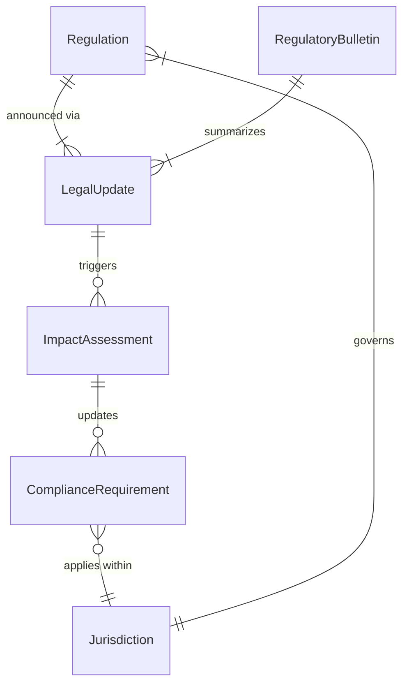
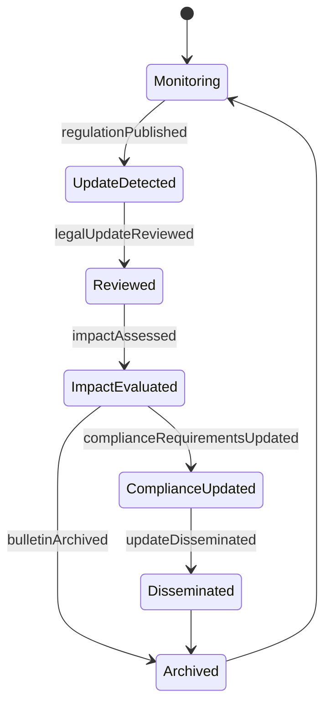
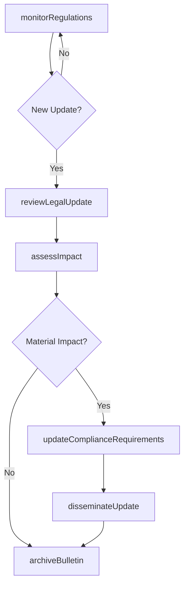
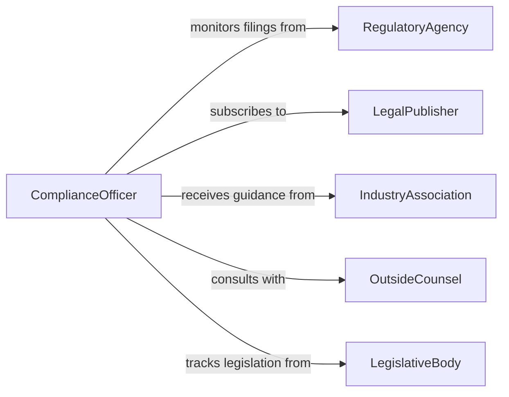

# Update Knowledge Legal Regulatory Environments

> Business-as-Code definition for updating knowledge of legal or regulatory environments. Models the monitoring, analysis, and dissemination of changes in laws, regulations, and compliance requirements.

## Overview

Updating knowledge of legal or regulatory environments involves continuously monitoring legislative changes, regulatory agency rulings, and compliance requirements that affect business operations. This activity includes reviewing new and amended laws, analyzing their impact on organizational policies, and communicating relevant changes to stakeholders. It ensures that organizations remain compliant with evolving legal frameworks across jurisdictions and industry sectors.

## Actors

| Actor | Description |
|-------|-------------|
| RegulatoryAgency | Government body that issues and enforces regulations |
| LegalPublisher | Organization that distributes legal updates, case law, and regulatory bulletins |
| IndustryAssociation | Trade group that provides regulatory guidance and advocacy for members |
| OutsideCounsel | External law firm providing specialized legal analysis and opinions |
| LegislativeBody | Government institution that enacts new laws and amendments |

## Roles

| Role | Description |
|------|-------------|
| ComplianceOfficer | Monitors regulatory changes and ensures organizational adherence |
| LegalAnalyst | Researches and interprets the impact of new laws and regulations |
| RegulatoryAffairsManager | Manages relationships with regulatory agencies and tracks filings |
| PolicyAdvisor | Recommends policy updates based on regulatory changes |

## Entities

| Entity | Description |
|--------|-------------|
| Regulation | A specific rule or requirement issued by a regulatory authority |
| LegalUpdate | A notification of a new or amended law, ruling, or regulation |
| ComplianceRequirement | A specific obligation the organization must meet under applicable law |
| ImpactAssessment | An analysis of how a regulatory change affects operations or policies |
| RegulatoryBulletin | A periodic summary of legal and regulatory developments |
| Jurisdiction | A geographic or legal boundary within which regulations apply |

## Actions

| Action | Description |
|--------|-------------|
| monitorRegulations | Track new and proposed regulatory changes across relevant jurisdictions |
| reviewLegalUpdate | Analyze a specific legal update for applicability and impact |
| assessImpact | Evaluate the operational and policy implications of a regulatory change |
| updateComplianceRequirements | Revise internal compliance obligations based on new regulations |
| disseminateUpdate | Distribute regulatory change summaries to affected stakeholders |
| archiveBulletin | Store regulatory bulletins and legal updates for future reference |

## Events

| Event | Description |
|-------|-------------|
| regulationPublished | A new or amended regulation has been officially published |
| legalUpdateReviewed | A legal update has been analyzed for organizational relevance |
| impactAssessed | The business impact of a regulatory change has been evaluated |
| complianceRequirementsUpdated | Internal compliance obligations have been revised |
| updateDisseminated | Regulatory change information has been shared with stakeholders |
| bulletinArchived | A regulatory bulletin has been stored in the knowledge repository |

## Searches

| Search | Description |
|--------|-------------|
| findRegulations | List regulations by jurisdiction, effective date, or subject area |
| getLegalUpdates | Retrieve recent legal updates by topic, agency, or date range |
| getComplianceRequirements | Find current compliance obligations by regulation or business unit |
| getImpactAssessments | Look up impact analyses by regulation or severity level |

## Entity Relationships



## State Diagram



## Workflow



## Actor Relationships



## Usage

### Calling Actions

```typescript
import { updateKnowledgeLegalRegulatoryEnvironments } from '@headlessly/update-knowledge-legal-regulatory-environments'

const regulatory = updateKnowledgeLegalRegulatoryEnvironments()

// Monitor regulations in relevant jurisdictions
const updates = await regulatory.monitorRegulations({
  jurisdictions: ['US-Federal', 'EU', 'US-CA'],
  topics: ['data-privacy', 'financial-reporting', 'environmental'],
  since: '2026-01-01'
})

// Assess impact of a specific regulation
const impact = await regulatory.assessImpact({
  regulationId: 'reg-eu-ai-act-2026',
  affectedUnits: ['engineering', 'product', 'legal'],
  currentPolicies: ['ai-governance-policy', 'data-handling-policy']
})

// Update compliance requirements
await regulatory.updateComplianceRequirements({
  regulationId: 'reg-eu-ai-act-2026',
  requirements: [
    { obligation: 'Risk classification for AI systems', deadline: '2026-08-01' },
    { obligation: 'Transparency documentation for high-risk AI', deadline: '2026-08-01' }
  ]
})
```

### Event-Driven Automation

```typescript
// Alert compliance team on new material regulations
regulatory.regulationPublished(async ({ regulationId, jurisdiction, topic }) => {
  await notify({
    to: 'compliance-team',
    message: `New regulation published: ${regulationId} in ${jurisdiction} covering ${topic}`
  })
})

// Auto-trigger policy review when compliance requirements change
regulatory.complianceRequirementsUpdated(async ({ regulationId, requirements }) => {
  for (const req of requirements) {
    await createTask({
      assignee: 'policy-advisor',
      title: `Review policy for: ${req.obligation}`,
      deadline: req.deadline
    })
  }
})
```
