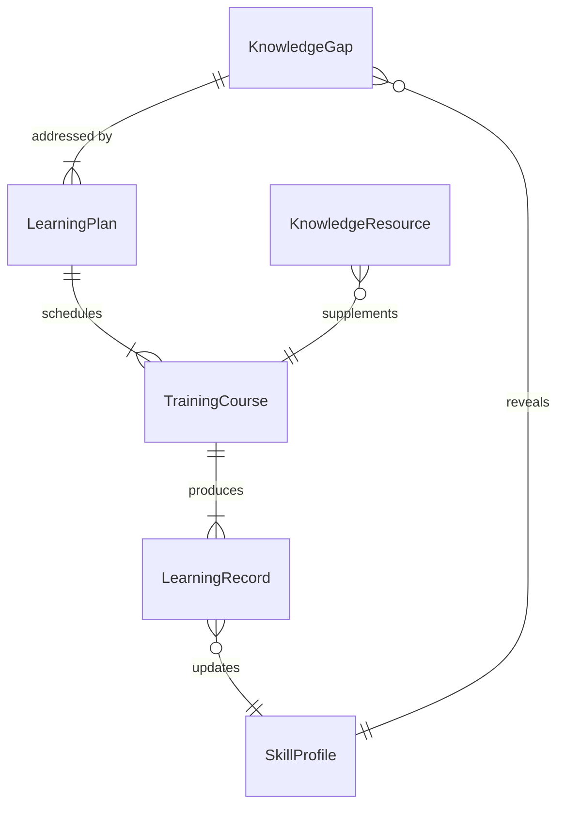
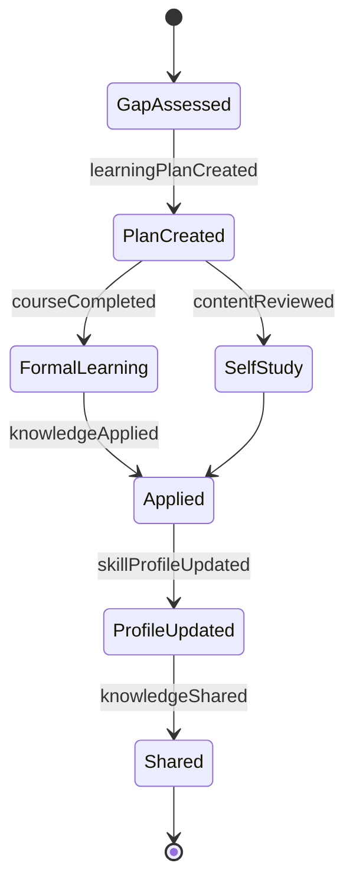
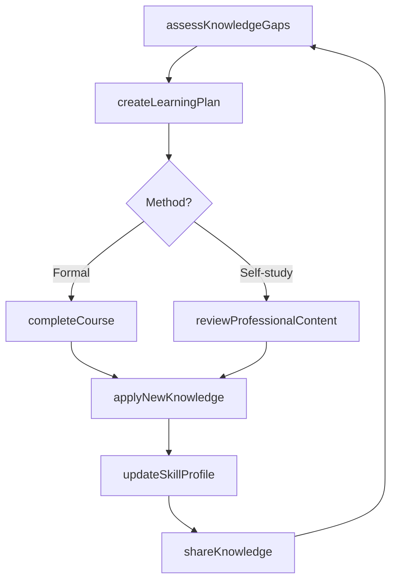
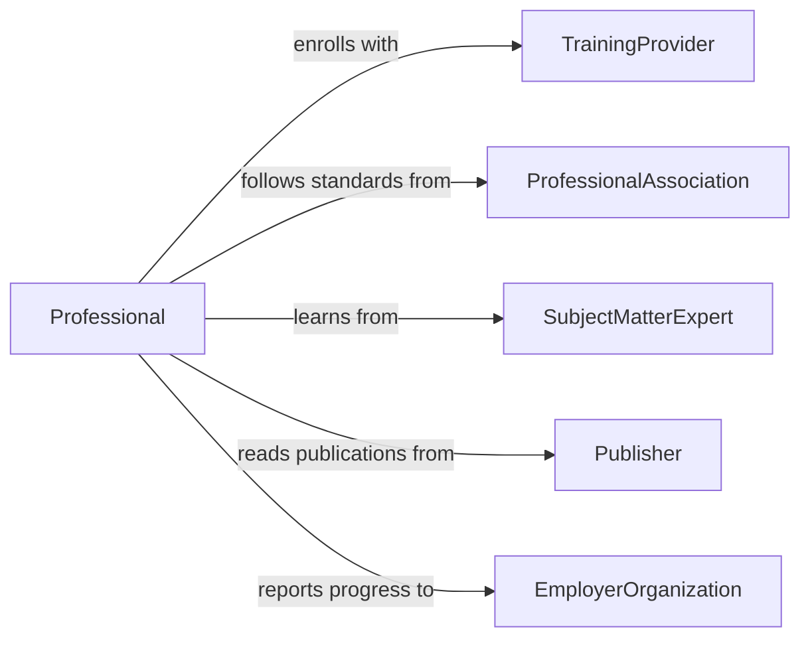

# Update Professional Knowledge

> Business-as-Code definition for updating professional knowledge. Models the continuous learning lifecycle from identifying knowledge gaps through acquiring, applying, and sharing new expertise.

## Overview

Updating professional knowledge involves the ongoing process of identifying areas where current expertise needs refreshing, acquiring new information through training, reading, mentorship, and practice, and integrating that knowledge into daily work. This activity is essential across all professions to maintain competence, adapt to evolving practices, and deliver high-quality work.

## Actors

| Actor | Description |
|-------|-------------|
| TrainingProvider | Offers courses, workshops, and certification programs |
| ProfessionalAssociation | Publishes standards, best practices, and continuing education requirements |
| SubjectMatterExpert | Provides mentorship and specialized knowledge transfer |
| Publisher | Distributes professional journals, books, and online content |
| EmployerOrganization | Sets expectations and provides resources for professional development |

## Roles

| Role | Description |
|------|-------------|
| Professional | The individual responsible for maintaining and updating their expertise |
| LearningCoordinator | Manages professional development programs and tracks completion |
| Mentor | Guides less experienced professionals in acquiring new knowledge |
| TeamLead | Identifies team knowledge gaps and recommends development activities |

## Entities

| Entity | Description |
|--------|-------------|
| LearningPlan | A structured plan for acquiring specific knowledge and skills |
| KnowledgeGap | An identified area where current expertise is insufficient |
| TrainingCourse | A formal learning program with defined objectives and outcomes |
| LearningRecord | Documentation of completed training, reading, or development activities |
| SkillProfile | A snapshot of current competencies and proficiency levels |
| KnowledgeResource | A book, article, course, or other source of professional information |

## Actions

| Action | Description |
|--------|-------------|
| assessKnowledgeGaps | Identify areas where professional knowledge needs updating |
| createLearningPlan | Develop a structured plan for knowledge acquisition |
| completeCourse | Finish a training program or educational module |
| reviewProfessionalContent | Read and analyze journals, articles, or technical publications |
| applyNewKnowledge | Put recently acquired knowledge into practice on real work |
| updateSkillProfile | Record new competencies and proficiency improvements |
| shareKnowledge | Disseminate newly acquired expertise with colleagues |

## Events

| Event | Description |
|-------|-------------|
| knowledgeGapIdentified | An area requiring professional development has been flagged |
| learningPlanCreated | A structured development plan has been established |
| courseCompleted | A training program has been successfully finished |
| contentReviewed | Professional literature or content has been read and analyzed |
| knowledgeApplied | New expertise has been used in a practical work context |
| skillProfileUpdated | Competency records have been refreshed with new capabilities |
| knowledgeShared | Insights have been disseminated to the team or organization |

## Searches

| Search | Description |
|--------|-------------|
| findKnowledgeGaps | Retrieve identified gaps by domain, severity, or professional |
| getAvailableCourses | Query training programs by topic, format, and provider |
| getLearningHistory | Look up completed development activities by professional or period |
| searchResources | Find knowledge resources by subject, format, or relevance |

## Entity Relationships



## State Diagram



## Workflow



## Actor Relationships



## Usage

### Calling Actions

```typescript
import { updateProfessionalKnowledge } from '@headlessly/update-professional-knowledge'

const knowledge = updateProfessionalKnowledge()

// Assess current knowledge gaps
const gaps = await knowledge.assessKnowledgeGaps({
  professionalId: 'EMP-4421',
  domains: ['data-analytics', 'machine-learning', 'cloud-architecture'],
  benchmarkAgainst: 'role-requirements'
})

// Create a learning plan to address gaps
const plan = await knowledge.createLearningPlan({
  professionalId: 'EMP-4421',
  gaps: gaps.prioritized,
  timeline: { start: '2026-02-01', end: '2026-06-30' },
  budget: 5000
})

// Record course completion
await knowledge.completeCourse({
  professionalId: 'EMP-4421',
  courseId: 'ML-201',
  provider: 'Coursera',
  completionDate: '2026-03-15',
  score: 94
})
```

### Event-Driven Automation

```typescript
// Prompt knowledge sharing after course completion
knowledge.courseCompleted(async ({ professionalId, courseId, topic }) => {
  await scheduleKnowledgeSession({
    presenter: professionalId,
    topic: `Key learnings from ${topic}`,
    audience: 'team',
    suggestedDate: nextFriday()
  })
})

// Auto-refresh learning plans when new gaps are identified
knowledge.knowledgeGapIdentified(async ({ professionalId, gap, severity }) => {
  if (severity === 'critical') {
    await knowledge.createLearningPlan({
      professionalId,
      gaps: [gap],
      timeline: { start: today(), end: inWeeks(4) },
      priority: 'urgent'
    })
  }
})
```
