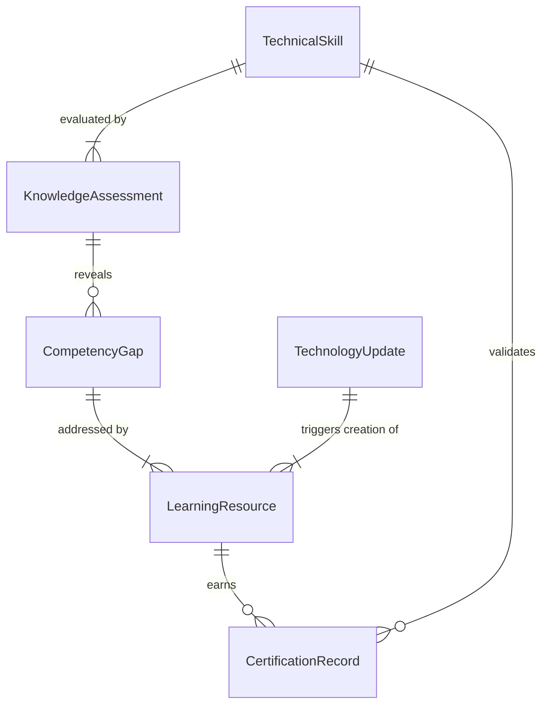
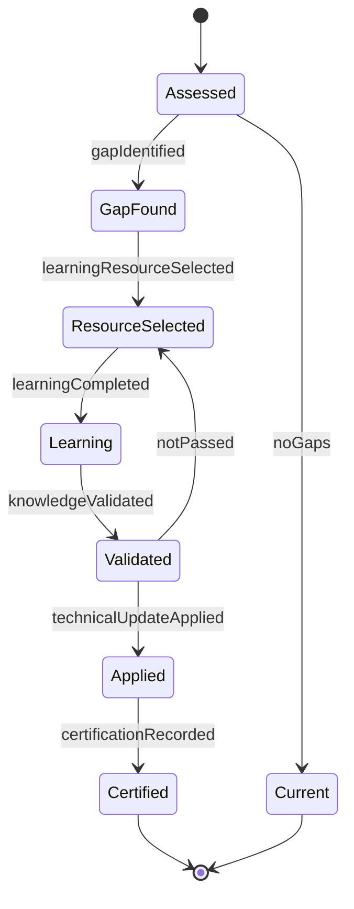
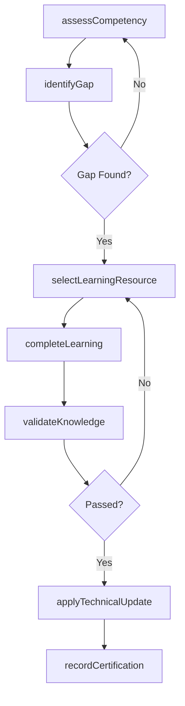
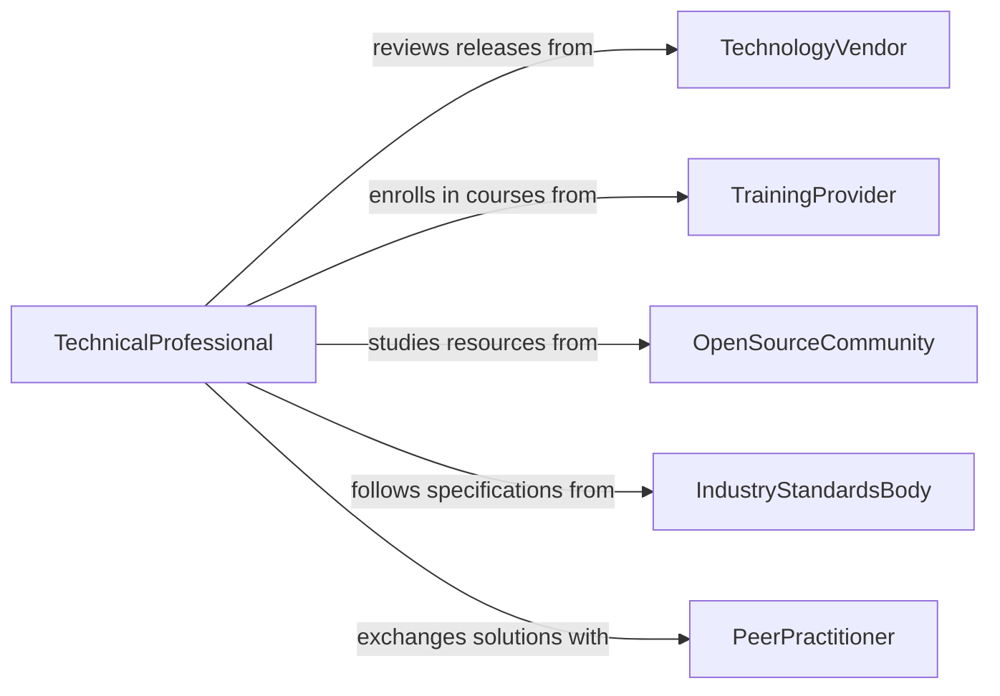

# Update Technical Knowledge

> Business-as-Code definition for updating technical knowledge. Models the systematic acquisition and integration of new technical skills, methods, and tools relevant to professional practice.

## Overview

Updating technical knowledge involves identifying gaps in current technical competencies, pursuing learning opportunities, and applying new methods and tools to professional work. This activity spans studying documentation, experimenting with new technologies, and validating that acquired knowledge meets operational requirements. It ensures technical staff remain effective as platforms, frameworks, and methodologies evolve.

## Actors

| Actor | Description |
|-------|-------------|
| TechnologyVendor | Releases new tools, platforms, and technical documentation |
| TrainingProvider | Offers courses, certifications, and hands-on technical workshops |
| OpenSourceCommunity | Publishes frameworks, libraries, and collaborative technical resources |
| IndustryStandardsBody | Issues technical specifications and protocol standards |
| PeerPractitioner | Shares practical experience and technical solutions |

## Roles

| Role | Description |
|------|-------------|
| TechnicalProfessional | Maintains and applies technical skills in daily work |
| TechLead | Guides the team on technology adoption and skill requirements |
| LearningCoordinator | Identifies training resources and tracks competency development |
| SystemArchitect | Evaluates new technologies for integration into existing systems |

## Entities

| Entity | Description |
|--------|-------------|
| TechnicalSkill | A specific competency or proficiency area |
| LearningResource | A course, manual, tutorial, or documentation set |
| CompetencyGap | An identified deficiency between required and current skill levels |
| CertificationRecord | Documentation of a completed certification or accreditation |
| TechnologyUpdate | A new release, patch, or version of a technical tool or platform |
| KnowledgeAssessment | An evaluation of current technical proficiency levels |

## Actions

| Action | Description |
|--------|-------------|
| assessCompetency | Evaluate current technical skill levels against requirements |
| identifyGap | Determine where technical knowledge falls short of needs |
| selectLearningResource | Choose appropriate training materials or courses |
| completeLearning | Finish a course, tutorial, or self-study module |
| validateKnowledge | Test understanding through assessment or practical application |
| applyTechnicalUpdate | Integrate newly learned techniques into work processes |
| recordCertification | Document completion of a formal certification program |

## Events

| Event | Description |
|-------|-------------|
| competencyAssessed | Technical skill levels have been evaluated |
| gapIdentified | A deficiency in technical knowledge has been found |
| learningResourceSelected | A training resource has been chosen for study |
| learningCompleted | A course or module has been finished |
| knowledgeValidated | Understanding has been confirmed through assessment |
| technicalUpdateApplied | New techniques have been integrated into practice |
| certificationRecorded | A certification completion has been documented |

## Searches

| Search | Description |
|--------|-------------|
| findCompetencyGaps | Retrieve skill gaps by role, domain, or severity |
| getLearningResources | Query available courses and materials by topic or format |
| getCertifications | List certifications by person, domain, or expiration date |
| getTechnologyUpdates | Find recent platform or tool updates by vendor or category |

## Entity Relationships



## State Diagram



## Workflow



## Actor Relationships



## Usage

### Calling Actions

```typescript
import { updateTechnicalKnowledge } from '@headlessly/update-technical-knowledge'

const knowledge = updateTechnicalKnowledge()

// Assess current competency
const assessment = await knowledge.assessCompetency({
  role: 'backend-engineer',
  domain: 'cloud-infrastructure',
  skills: ['kubernetes', 'terraform', 'observability']
})

// Identify and address a gap
const gap = await knowledge.identifyGap({
  assessmentId: assessment.id,
  threshold: 0.7
})

const resource = await knowledge.selectLearningResource({
  gapId: gap.id,
  format: 'hands-on-lab',
  maxDuration: '8h'
})

// Complete and validate learning
await knowledge.completeLearning({ resourceId: resource.id })
await knowledge.validateKnowledge({
  resourceId: resource.id,
  method: 'practical-exercise'
})
```

### Event-Driven Automation

```typescript
// Auto-assign training when gaps are identified
knowledge.gapIdentified(async ({ skillName, severity, roleId }) => {
  if (severity === 'critical') {
    const resource = await knowledge.selectLearningResource({
      topic: skillName,
      format: 'instructor-led',
      priority: 'urgent'
    })
    await assignTraining({ roleId, resourceId: resource.id })
  }
})

// Record certification when knowledge is validated
knowledge.knowledgeValidated(async ({ resourceId, score }) => {
  if (score >= 0.85) {
    await knowledge.recordCertification({
      resourceId,
      validUntil: '2028-01-01'
    })
  }
})
```
