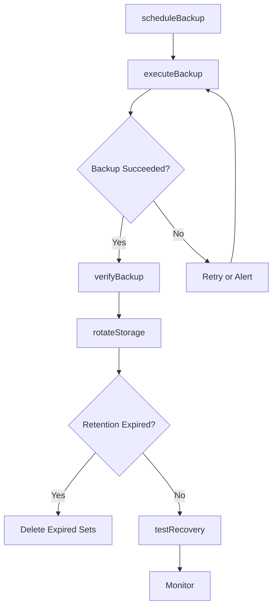
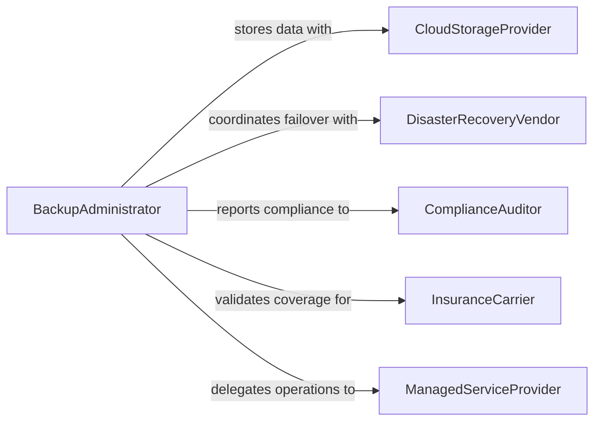

# Create Electronic Data Backups to Prevent Loss

> Business-as-Code definition for data backup and disaster recovery operations. Models the complete backup lifecycle from scheduling through verification and restoration.

## Overview

Creating electronic data backups involves planning, executing, and verifying copies of critical data to protect against loss from hardware failures, cyberattacks, or human error. This definition exposes actions for backup scheduling, execution, and restoration, events for automated monitoring, and searches for backup inventory and health tracking.

## Actors

| Actor | Description |
|-------|-------------|
| CloudStorageProvider | Hosts offsite backup repositories and archives |
| DisasterRecoveryVendor | Provides recovery infrastructure and failover services |
| ComplianceAuditor | Verifies backup practices meet retention and regulatory requirements |
| InsuranceCarrier | Assesses data protection measures for policy underwriting |
| ManagedServiceProvider | Delivers outsourced backup management and monitoring |

## Roles

| Role | Description |
|------|-------------|
| BackupAdministrator | Configures and monitors backup schedules and policies |
| SystemAdministrator | Manages the servers and storage systems being backed up |
| DataOwner | Defines retention requirements and recovery priorities |
| RecoverySpecialist | Executes restore operations during outage or data loss events |

## Entities

| Entity | Description |
|--------|-------------|
| BackupJob | A scheduled task that copies data to a backup destination |
| BackupSet | A collection of files or database snapshots from a single run |
| RetentionPolicy | Rules governing how long backup copies are preserved |
| RecoveryPoint | A specific point in time from which data can be restored |
| StorageTarget | The destination volume or cloud bucket for backup data |
| RestoreRequest | A formal request to recover data from a backup set |
| BackupReport | A summary of backup job status, size, and duration |

## Actions

| Action | Description |
|--------|-------------|
| scheduleBackup | Define timing and frequency for automated backup jobs |
| executeBackup | Run a backup job to copy data to the storage target |
| verifyBackup | Validate backup integrity through checksum or test restore |
| restoreData | Recover files or databases from a specific recovery point |
| setRetentionPolicy | Configure rules for backup lifecycle and expiration |
| rotateStorage | Move aging backups to archival or cold storage tiers |
| testRecovery | Perform a drill to validate end-to-end restore procedures |

## Events

| Event | Description |
|-------|-------------|
| backupScheduled | A new backup job has been configured and scheduled |
| backupCompleted | A backup job has finished successfully |
| backupFailed | A backup job has terminated with errors |
| backupVerified | Backup integrity has been confirmed through validation |
| dataRestored | Data has been successfully recovered from backup |
| retentionExpired | A backup set has reached its retention limit |
| storageThresholdReached | Backup storage utilization has exceeded a defined limit |

## Searches

| Search | Description |
|--------|-------------|
| findBackupJobs | List backup jobs by schedule, status, or target system |
| getRecoveryPoints | Retrieve available restore points by date and source |
| getBackupHealth | Check completion rates and failure trends over time |
| findExpiredBackups | List backup sets past their retention period |
| getStorageUsage | Query backup storage consumption by target or tier |

## Workflow



## Actor Relationships



## Usage

### Calling Actions

```typescript
import { createElectronicDataBackupPrevent } from '@headlessly/create-electronic-data-backup-prevent'

const backups = createElectronicDataBackupPrevent()

// Schedule nightly database backups
const job = await backups.scheduleBackup({
  source: 'production-database',
  target: 's3://backups/prod-db/',
  frequency: 'daily',
  time: '02:00',
  retentionDays: 90
})

// Execute an on-demand backup
const backupSet = await backups.executeBackup({
  jobId: job.id,
  type: 'incremental'
})

// Verify backup integrity
await backups.verifyBackup({
  backupSetId: backupSet.id,
  method: 'checksum'
})
```

### Event-Driven Automation

```typescript
// Alert on backup failure
backups.backupFailed(async ({ jobId, source, error }) => {
  await notify({
    to: 'infrastructure-team',
    message: `Backup failed for ${source}: ${error.message}`
  })
})

// Auto-archive when storage threshold is reached
backups.storageThresholdReached(async ({ targetId, utilization }) => {
  if (utilization > 85) {
    await backups.rotateStorage({ targetId, tier: 'glacier' })
  }
})
```
