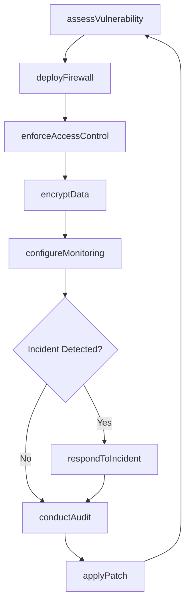
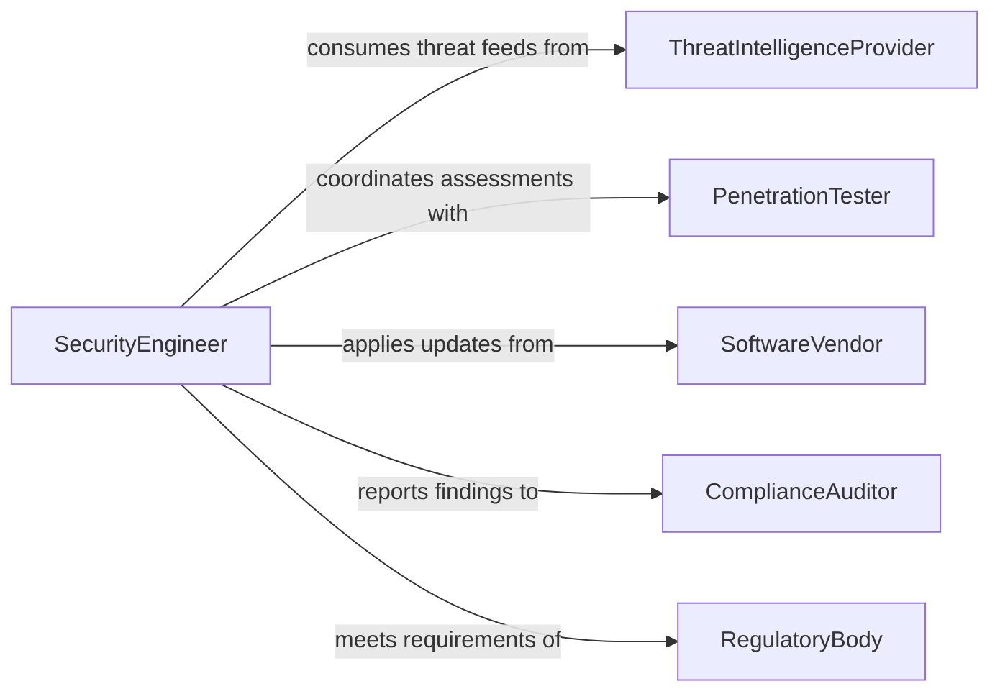

# Implement Security Measures for Computer and Information Systems

> Business-as-Code definition for cybersecurity implementation and information system protection. Models the lifecycle of threat assessment, control deployment, and continuous monitoring.

## Overview

Implementing security measures for computer and information systems involves assessing vulnerabilities, deploying protective controls, and monitoring for threats across networks, applications, and data stores. This definition exposes actions for each phase of the security lifecycle, events for incident response automation, and searches for audit and compliance reporting.

## Actors

| Actor | Description |
|-------|-------------|
| ThreatIntelligenceProvider | Supplies vulnerability data and threat indicators |
| ComplianceAuditor | Evaluates security posture against regulatory standards |
| ManagedSecurityProvider | Delivers outsourced monitoring and incident response |
| SoftwareVendor | Supplies patches, updates, and security advisories |
| RegulatoryBody | Mandates security standards such as SOC 2 or GDPR |
| PenetrationTester | Conducts authorized attacks to identify weaknesses |

## Roles

| Role | Description |
|------|-------------|
| SecurityEngineer | Designs and deploys security controls and infrastructure |
| SecurityAnalyst | Monitors alerts and investigates potential incidents |
| CISO | Oversees organizational security strategy and policy |
| ComplianceOfficer | Ensures adherence to regulatory and industry standards |

## Entities

| Entity | Description |
|--------|-------------|
| SecurityPolicy | A documented set of rules governing system access and behavior |
| Vulnerability | A known weakness in a system component |
| Firewall | A network boundary control filtering inbound and outbound traffic |
| AccessControl | A rule defining who can access which resources |
| EncryptionKey | A cryptographic key used to protect data at rest or in transit |
| AuditLog | A chronological record of security-relevant system events |
| Incident | A detected security event requiring investigation or response |
| Patch | A software update that addresses a known vulnerability |

## Actions

| Action | Description |
|--------|-------------|
| assessVulnerability | Scan systems to identify security weaknesses |
| deployFirewall | Configure and activate network boundary controls |
| enforceAccessControl | Apply role-based permissions to system resources |
| encryptData | Enable encryption for data at rest or in transit |
| applyPatch | Install security updates to remediate vulnerabilities |
| configureMonitoring | Set up intrusion detection and log analysis |
| conductAudit | Perform a structured review of security controls |
| respondToIncident | Execute containment and remediation for security events |

## Events

| Event | Description |
|-------|-------------|
| vulnerabilityDetected | A new security weakness has been identified |
| firewallDeployed | Network boundary controls have been activated |
| accessControlEnforced | Permission policies have been applied to resources |
| dataEncrypted | Encryption has been enabled on target data stores |
| patchApplied | A security update has been successfully installed |
| incidentDetected | A potential security breach has been flagged |
| incidentResolved | A security incident has been contained and remediated |
| auditCompleted | A security audit has finished with findings report |

## Searches

| Search | Description |
|--------|-------------|
| findVulnerabilities | List open vulnerabilities by severity, system, or age |
| getAuditLogs | Retrieve security event logs by date range or source |
| getIncidents | Query security incidents by status, severity, or type |
| getComplianceStatus | Check adherence to specific regulatory frameworks |
| findExpiredCertificates | List SSL or encryption certificates nearing expiration |

## Workflow



## Actor Relationships



## Usage

### Calling Actions

```typescript
import { implementSecurityMeasuresComputerInformation } from '@headlessly/implement-security-measures-computer-information'

const security = implementSecurityMeasuresComputerInformation()

// Scan for vulnerabilities
const scan = await security.assessVulnerability({
  target: 'production-cluster',
  scanType: 'full',
  includeContainers: true
})

// Deploy firewall rules
await security.deployFirewall({
  network: 'vpc-prod-01',
  rules: [
    { direction: 'inbound', port: 443, protocol: 'tcp', action: 'allow' },
    { direction: 'inbound', port: 22, protocol: 'tcp', action: 'deny' }
  ]
})

// Enforce role-based access
await security.enforceAccessControl({
  resource: 'customer-database',
  policy: {
    roles: ['db-admin', 'read-only'],
    mfaRequired: true
  }
})
```

### Event-Driven Automation

```typescript
// Auto-respond to critical vulnerabilities
security.vulnerabilityDetected(async ({ systemId, severity, cveId }) => {
  if (severity === 'critical') {
    await security.applyPatch({ systemId, cveId, autoRestart: true })
  }
})

// Escalate unresolved incidents
security.incidentDetected(async ({ incidentId, severity }) => {
  if (severity === 'high') {
    await notify({
      to: 'security-team',
      message: `High-severity incident ${incidentId} requires immediate response`
    })
  }
})
```
