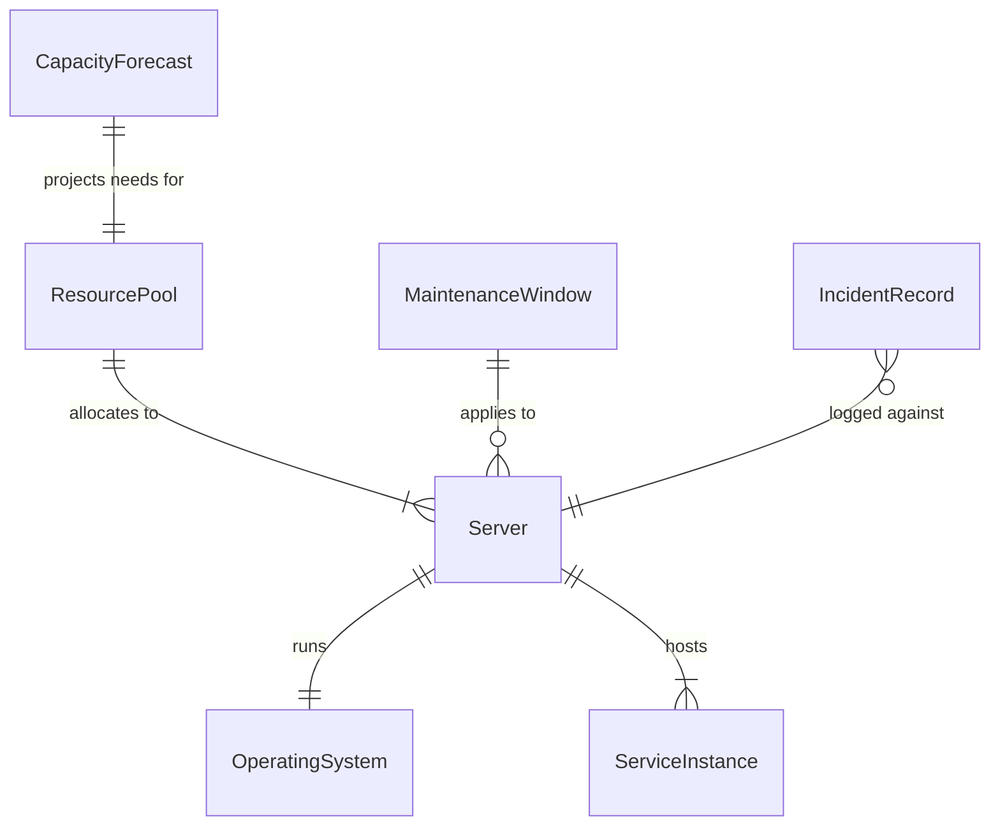
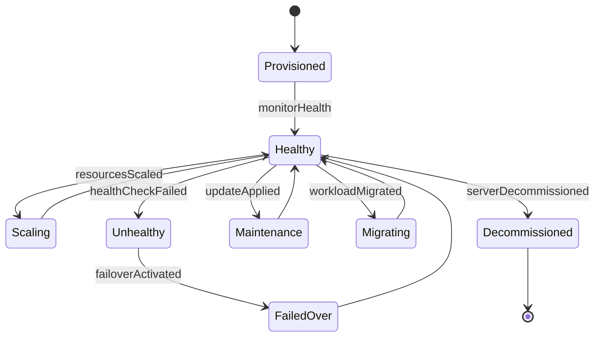
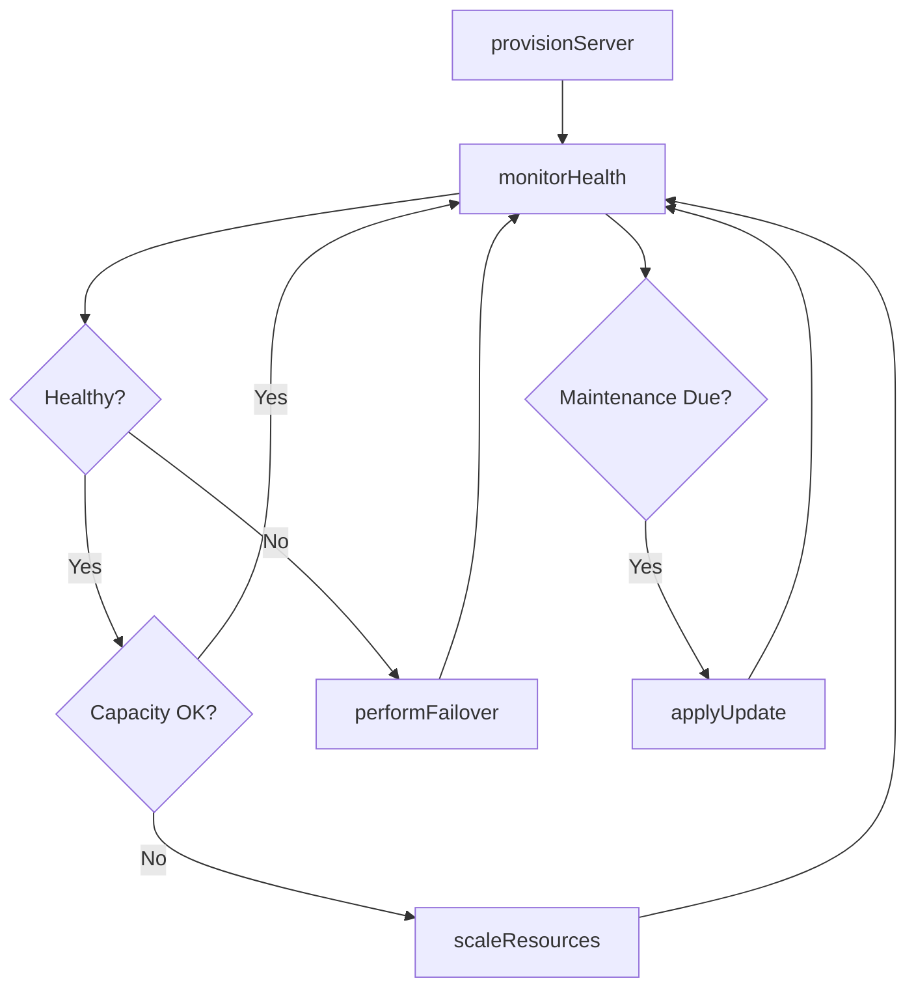
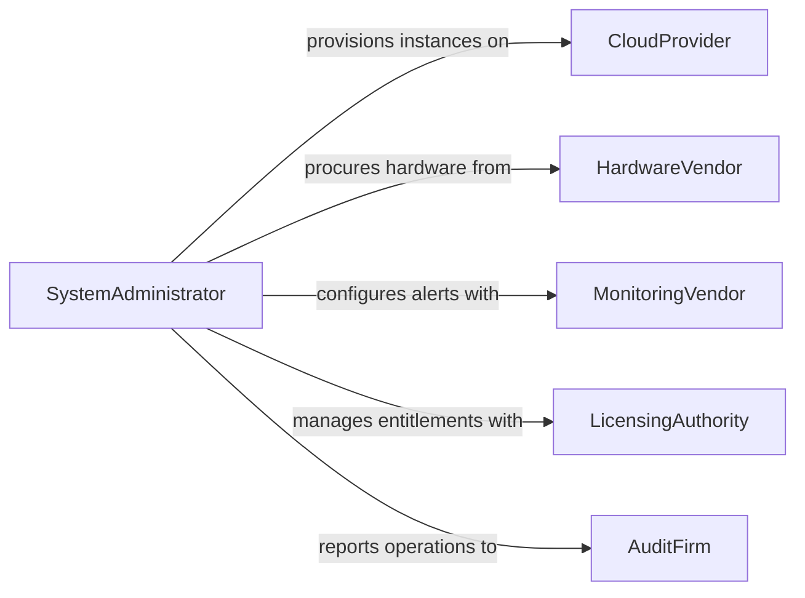

# Operate Computer Systems

> Business-as-Code definition for enterprise computer system operations. Models the lifecycle from provisioning through daily operations, capacity management, and system lifecycle governance.

## Overview

Operating computer systems involves managing servers, cloud instances, and enterprise infrastructure to ensure availability, performance, and reliability for business applications. This definition exposes actions for system provisioning and management, events for infrastructure monitoring, and searches for capacity planning and operational reporting.

## Actors

| Actor | Description |
|-------|-------------|
| CloudProvider | Hosts virtual machines, containers, and managed services |
| HardwareVendor | Supplies physical servers and storage equipment |
| MonitoringVendor | Provides infrastructure observability and alerting platforms |
| LicensingAuthority | Manages operating system and platform licenses |
| AuditFirm | Reviews system operations for compliance and governance |

## Roles

| Role | Description |
|------|-------------|
| SystemAdministrator | Provisions and manages computer systems day to day |
| SiteReliabilityEngineer | Ensures system availability and performance targets |
| CapacityPlanner | Forecasts resource needs and right-sizes infrastructure |
| OperationsManager | Oversees system operations schedules and policies |

## Entities

| Entity | Description |
|--------|-------------|
| Server | A physical or virtual machine running workloads |
| OperatingSystem | The platform software managing hardware resources |
| ServiceInstance | A running application or microservice on the system |
| ResourcePool | A shared allocation of CPU, memory, and storage |
| MaintenanceWindow | A scheduled period for system updates and patches |
| CapacityForecast | A projection of future resource requirements |
| IncidentRecord | A log entry for a system outage or degradation event |

## Actions

| Action | Description |
|--------|-------------|
| provisionServer | Create and configure a new physical or virtual server |
| scaleResources | Adjust CPU, memory, or storage allocations for workloads |
| applyUpdate | Install operating system patches during maintenance windows |
| monitorHealth | Track system uptime, load, and error rates |
| migrateWorkload | Move a service or application to a different host or region |
| decommissionServer | Remove a server from production and release resources |
| performFailover | Switch operations to a standby system during an outage |

## Events

| Event | Description |
|-------|-------------|
| serverProvisioned | A new server has been created and is ready for workloads |
| resourcesScaled | System allocations have been adjusted up or down |
| updateApplied | Operating system patches have been installed |
| healthCheckFailed | A system health monitor has detected an anomaly |
| workloadMigrated | A service has been moved to a different host |
| serverDecommissioned | A server has been retired from production |
| failoverActivated | Operations have switched to a standby system |

## Searches

| Search | Description |
|--------|-------------|
| findServers | List servers by type, region, or workload |
| getResourceUtilization | Query CPU, memory, and storage usage by server or pool |
| getMaintenanceSchedule | Retrieve upcoming maintenance windows by system |
| findUnhealthySystems | List servers with active health check failures |
| getCapacityForecasts | Retrieve projected resource needs for planning |

## Entity Relationships



## State Diagram



## Workflow



## Actor Relationships



## Usage

### Calling Actions

```typescript
import { operateComputerSystems } from '@headlessly/operate-computer-systems'

const systems = operateComputerSystems()

// Provision a new application server
const server = await systems.provisionServer({
  type: 'virtual',
  provider: 'aws',
  instanceType: 'c6i.2xlarge',
  region: 'us-east-1',
  operatingSystem: 'ubuntu-22.04'
})

// Scale resources based on demand
await systems.scaleResources({
  serverId: server.id,
  adjustments: { vcpus: 8, memoryGb: 32, storageGb: 500 }
})

// Monitor system health
const health = await systems.monitorHealth({
  serverId: server.id,
  checks: ['cpu-load', 'disk-space', 'network-latency']
})
```

### Event-Driven Automation

```typescript
// Auto-failover on health check failure
systems.healthCheckFailed(async ({ serverId, check, details }) => {
  if (check === 'heartbeat') {
    await systems.performFailover({ serverId, target: 'standby-pool' })
  }
})

// Notify capacity planning on scaling events
systems.resourcesScaled(async ({ serverId, adjustments }) => {
  await notify({
    to: 'capacity-planning',
    message: `Resources scaled on ${serverId}: ${JSON.stringify(adjustments)}`
  })
})
```
