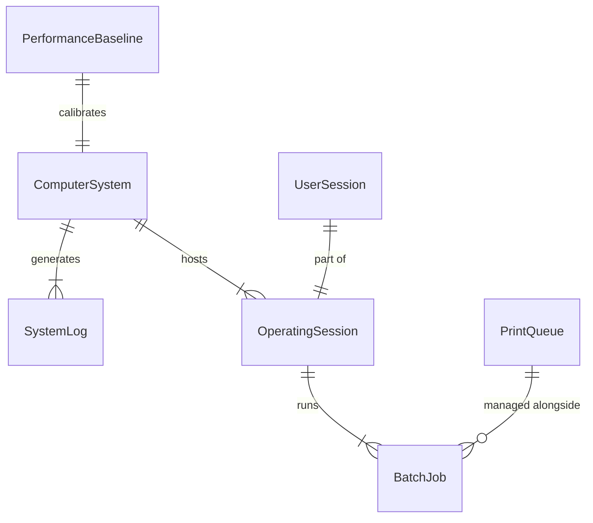
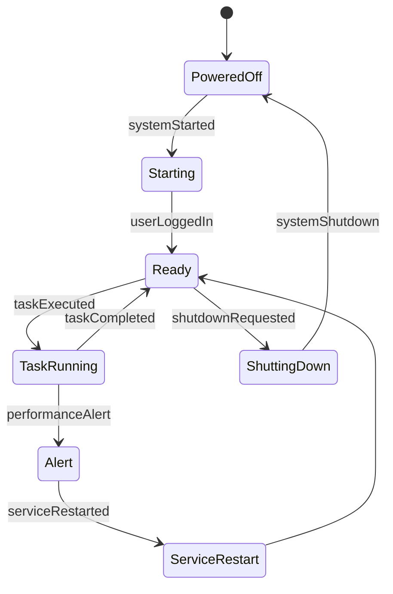
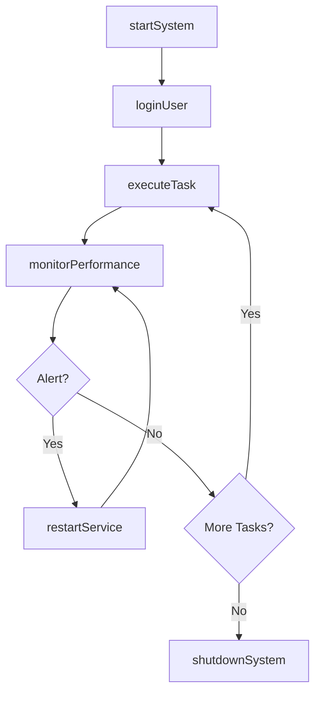
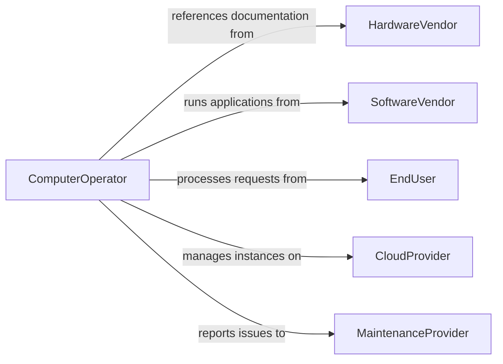

# Operate Computers or Computerized Equipment

> Business-as-Code definition for daily computer and computerized equipment operations. Models the lifecycle from system startup through task execution, monitoring, and orderly shutdown.

## Overview

Operating computers or computerized equipment involves starting systems, running applications, executing batch processes, monitoring system health, and performing routine operational tasks across workstations, servers, and specialized equipment. This definition exposes actions for system operation and task execution, events for operational monitoring, and searches for performance and usage tracking.

## Actors

| Actor | Description |
|-------|-------------|
| HardwareVendor | Provides operational documentation and firmware updates |
| SoftwareVendor | Supplies applications executed on the equipment |
| EndUser | Requests tasks and consumes output from computer operations |
| CloudProvider | Hosts virtual machines and cloud-based systems |
| MaintenanceProvider | Services equipment when operational issues arise |

## Roles

| Role | Description |
|------|-------------|
| ComputerOperator | Starts, monitors, and manages daily system operations |
| SystemAdministrator | Configures and maintains the operating environment |
| DataEntryOperator | Inputs data and runs batch processes on the system |
| ShiftSupervisor | Oversees operations schedules and escalates anomalies |

## Entities

| Entity | Description |
|--------|-------------|
| ComputerSystem | A workstation, server, or embedded system being operated |
| OperatingSession | A period during which the system is actively in use |
| BatchJob | A scheduled or queued process running on the system |
| SystemLog | A record of operational events and status messages |
| PerformanceBaseline | Normal operating metrics for comparison |
| PrintQueue | A list of documents waiting to be printed |
| UserSession | An authenticated login to the computer system |

## Actions

| Action | Description |
|--------|-------------|
| startSystem | Power on and initialize the computer or equipment |
| loginUser | Authenticate and establish a user session |
| executeTask | Run an application, script, or batch process |
| monitorPerformance | Track CPU, memory, disk, and network utilization |
| managePrintQueue | Submit, prioritize, or cancel print jobs |
| shutdownSystem | Perform an orderly system shutdown |
| restartService | Stop and start a specific service or application |

## Events

| Event | Description |
|-------|-------------|
| systemStarted | The computer has been powered on and is operational |
| userLoggedIn | A user has authenticated and started a session |
| taskExecuted | An application or batch process has completed |
| performanceAlert | A system metric has exceeded a defined threshold |
| printJobCompleted | A document has been successfully printed |
| systemShutdown | The computer has been powered down in an orderly manner |
| serviceRestarted | A service or application has been stopped and restarted |

## Searches

| Search | Description |
|--------|-------------|
| findActiveSessions | List current user sessions by system or user |
| getSystemLogs | Retrieve operational logs by date, severity, or source |
| getPerformanceMetrics | Query CPU, memory, and disk usage over time |
| findBatchJobs | List scheduled or completed batch processes by status |
| getPrintHistory | Retrieve print job records by user, printer, or date |

## Entity Relationships



## State Diagram



## Workflow



## Actor Relationships



## Usage

### Calling Actions

```typescript
import { operateComputersComputerizedEquipment } from '@headlessly/operate-computers-computerized-equipment'

const ops = operateComputersComputerizedEquipment()

// Start the system and execute a batch job
await ops.startSystem({ systemId: 'batch-server-01', mode: 'normal' })

const job = await ops.executeTask({
  systemId: 'batch-server-01',
  task: 'nightly-etl-pipeline',
  parameters: { sourceDate: '2026-02-04', targetSchema: 'analytics' }
})

// Monitor performance during execution
const metrics = await ops.monitorPerformance({
  systemId: 'batch-server-01',
  metrics: ['cpu', 'memory', 'disk-io'],
  interval: 30
})
```

### Event-Driven Automation

```typescript
// Auto-restart services on performance alerts
ops.performanceAlert(async ({ systemId, metric, value, threshold }) => {
  if (metric === 'memory' && value > threshold) {
    await ops.restartService({ systemId, service: 'etl-worker' })
  }
})

// Log task completion for audit
ops.taskExecuted(async ({ systemId, taskName, duration, status }) => {
  await auditLog.record({
    event: 'task-executed',
    systemId,
    taskName,
    duration,
    status
  })
})
```
