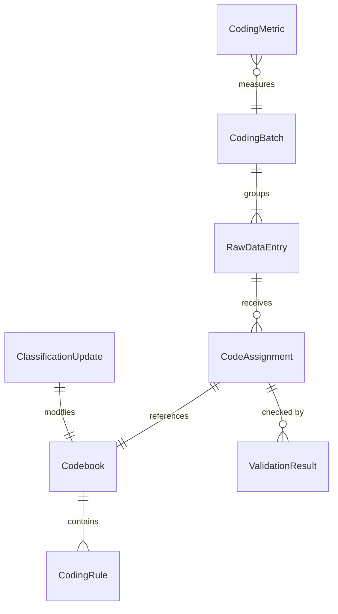
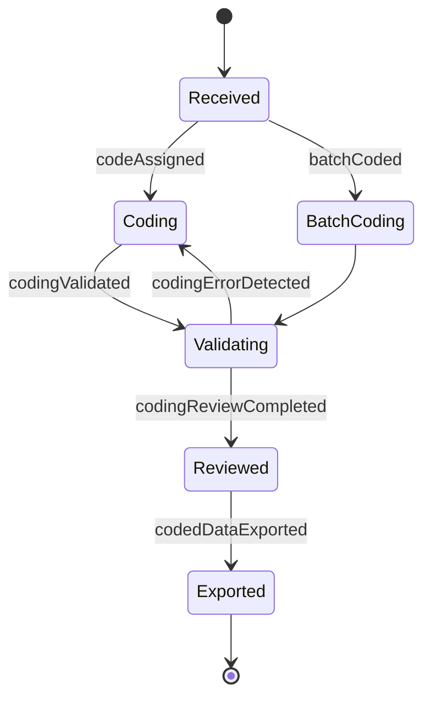
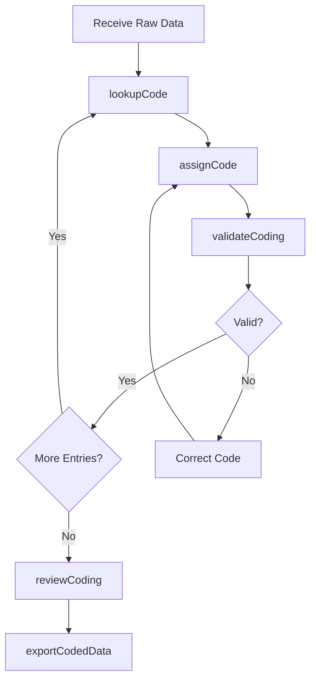
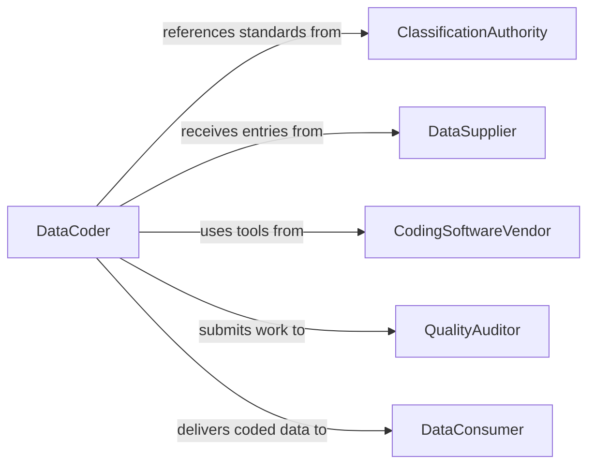

# Code Data or Other Information

> Business-as-Code definition for data classification and coding operations. Models the lifecycle from raw data receipt through code assignment, validation, standardization, and quality assurance across classification systems.

## Overview

Coding data or other information involves assigning standardized codes, categories, and classifications to raw data according to established taxonomies such as ICD, NAICS, SOC, or custom organizational coding schemes. This definition exposes actions for code assignment and validation, events for coding workflow tracking, and searches for codebook management and quality metrics.

## Actors

| Actor | Description |
|-------|-------------|
| ClassificationAuthority | Publishes and maintains standard code sets and taxonomies |
| DataSupplier | Provides raw data requiring classification and coding |
| CodingSoftwareVendor | Offers tools for assisted and automated code assignment |
| QualityAuditor | Reviews coded data for accuracy and consistency |
| DataConsumer | Uses coded data for analysis, reporting, or compliance |

## Roles

| Role | Description |
|------|-------------|
| DataCoder | Assigns classification codes to raw data entries |
| CodingSupervisor | Manages coding team workflows and quality standards |
| TaxonomySpecialist | Maintains codebooks and adapts to classification updates |
| QualityReviewer | Audits coded data for accuracy against source records |

## Entities

| Entity | Description |
|--------|-------------|
| RawDataEntry | An unclassified record requiring code assignment |
| CodeAssignment | A specific code applied to a data entry from a classification system |
| Codebook | A reference document defining all valid codes within a classification scheme |
| CodingRule | A guideline specifying how to select the correct code for given data |
| CodingBatch | A grouped set of entries processed together in a coding session |
| ValidationResult | The outcome of checking a code assignment against coding rules |
| ClassificationUpdate | A revision to a codebook adding, retiring, or modifying codes |
| CodingMetric | A measure of coding speed, accuracy, and consistency |

## Actions

| Action | Description |
|--------|-------------|
| assignCode | Apply a classification code to a raw data entry |
| batchCode | Process multiple data entries for code assignment in a single session |
| validateCoding | Check assigned codes against codebook rules and source data |
| lookupCode | Search the codebook for the appropriate classification |
| updateCodebook | Incorporate revisions to the classification system |
| reviewCoding | Audit a sample of coded entries for quality assurance |
| exportCodedData | Deliver classified data to downstream systems |

## Events

| Event | Description |
|-------|-------------|
| codeAssigned | A classification code has been applied to a data entry |
| batchCoded | A group of entries has been processed and coded |
| codingValidated | Assigned codes have been verified against rules |
| codingErrorDetected | An incorrect or inconsistent code assignment has been found |
| codebookUpdated | The classification system has been revised with new or changed codes |
| codingReviewCompleted | A quality audit of coded data has been finished |
| codedDataExported | Classified data has been delivered to a consuming system |

## Searches

| Search | Description |
|--------|-------------|
| findUncodedEntries | List data entries awaiting code assignment |
| lookupCodes | Search the codebook by keyword, hierarchy, or code value |
| getCodingMetrics | Retrieve accuracy rates and throughput by coder or batch |
| findCodingErrors | List entries flagged during validation or review |
| getCodebookVersions | Retrieve the history of classification system updates |

## Entity Relationships



## State Diagram



## Workflow



## Actor Relationships



## Usage

### Calling Actions

```typescript
import { codeDataInformation } from '@headlessly/code-data-information'

const coding = codeDataInformation()

// Assign NAICS codes to business records
await coding.assignCode({
  entryId: 'biz-record-4521',
  codebook: 'naics-2022',
  code: '541512',
  description: 'Computer Systems Design Services'
})

// Batch code survey responses
const batch = await coding.batchCode({
  source: 'survey-responses-q1-2026',
  codebook: 'custom-response-taxonomy',
  entries: 500,
  autoAssist: true
})

// Validate the batch
const validation = await coding.validateCoding({
  batchId: batch.id,
  rules: ['no-deprecated-codes', 'hierarchy-consistency', 'mutual-exclusivity']
})
```

### Event-Driven Automation

```typescript
// Alert on codebook updates
coding.codebookUpdated(async ({ codebook, version, changesCount }) => {
  await notify({
    to: 'coding-team',
    message: `${codebook} updated to v${version}: ${changesCount} codes changed`
  })
})

// Flag coding errors for review
coding.codingErrorDetected(async ({ entryId, assignedCode, expectedCode, rule }) => {
  await notify({
    to: 'coding-supervisor',
    message: `Coding error on entry ${entryId}: assigned ${assignedCode}, expected ${expectedCode} (rule: ${rule})`
  })
})
```
