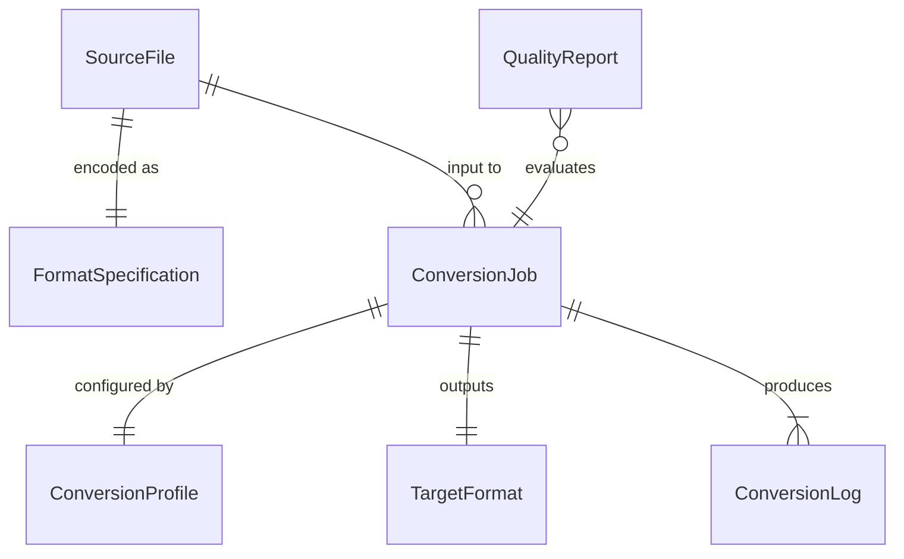
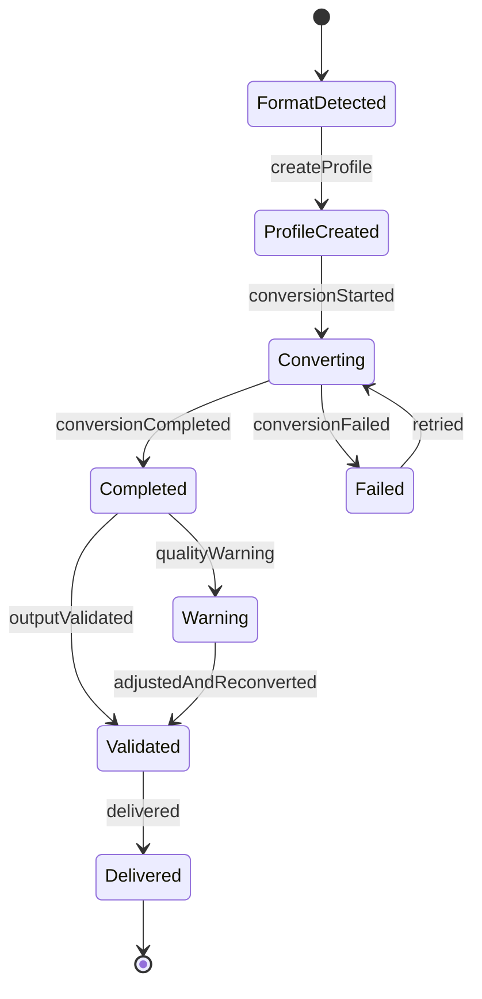
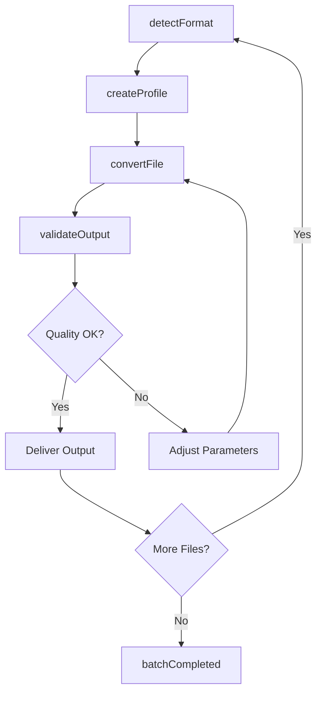
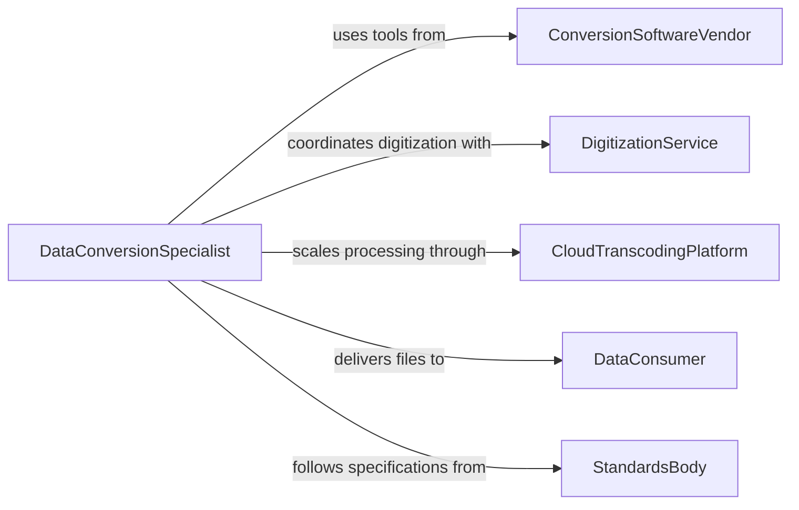

# Convert Data Among Multiple Digital or Analog Formats

> Business-as-Code definition for data format conversion and transformation. Models the lifecycle from source format identification through conversion execution, validation, and delivery across digital and analog media.

## Overview

Converting data among multiple digital or analog formats involves transforming files, media, and datasets from one encoding, structure, or medium to another while preserving content integrity and quality. This definition exposes actions for format detection and conversion, events for job tracking and quality verification, and searches for conversion history and format compatibility.

## Actors

| Actor | Description |
|-------|-------------|
| ConversionSoftwareVendor | Provides format transformation tools and codec libraries |
| DigitizationService | Converts physical analog media to digital formats |
| CloudTranscodingPlatform | Offers scalable media transcoding as a service |
| DataConsumer | Receives converted files in the required target format |
| StandardsBody | Publishes format specifications and interoperability guidelines |

## Roles

| Role | Description |
|------|-------------|
| DataConversionSpecialist | Executes format transformations and validates output quality |
| MediaTechnician | Operates digitization equipment for analog-to-digital conversion |
| IntegrationEngineer | Automates conversion pipelines between systems |
| QualityAssuranceAnalyst | Verifies converted data integrity and format compliance |

## Entities

| Entity | Description |
|--------|-------------|
| SourceFile | The original data in its current format before conversion |
| TargetFormat | The desired output encoding, structure, or media type |
| ConversionJob | A scheduled or in-progress format transformation task |
| ConversionProfile | A reusable set of parameters defining input/output format mappings |
| QualityReport | An assessment of output fidelity compared to the source |
| FormatSpecification | The technical definition of a data encoding or file format |
| ConversionLog | A record of transformation steps, parameters, and outcomes |

## Actions

| Action | Description |
|--------|-------------|
| detectFormat | Identify the encoding and structure of a source file |
| convertFile | Transform a file from one format to another |
| batchConvert | Process multiple files through a conversion pipeline |
| validateOutput | Verify converted data matches expected quality and structure |
| digitizeMedia | Convert analog materials to digital format using capture equipment |
| createProfile | Define a reusable conversion configuration for recurring jobs |
| scheduleConversion | Set up automated format transformation for incoming data |

## Events

| Event | Description |
|-------|-------------|
| formatDetected | The source file encoding has been identified |
| conversionStarted | A format transformation job has begun processing |
| conversionCompleted | A file has been successfully converted to the target format |
| conversionFailed | A transformation job encountered an error |
| outputValidated | Converted data has passed quality verification |
| qualityWarning | Converted output has minor fidelity issues |
| batchCompleted | All files in a batch conversion have been processed |

## Searches

| Search | Description |
|--------|-------------|
| findConversionJobs | List conversion tasks by status, format, or date |
| getSupportedFormats | Query available input and output format combinations |
| getConversionHistory | Retrieve past conversions for a specific file or batch |
| findFailedJobs | List conversions that did not complete successfully |
| getQualityMetrics | Retrieve fidelity scores and error rates by format pair |

## Entity Relationships



## State Diagram



## Workflow



## Actor Relationships



## Usage

### Calling Actions

```typescript
import { convertDataAmongMultipleDigital } from '@headlessly/convert-data-among-multiple-digital'

const converter = convertDataAmongMultipleDigital()

// Convert a legacy database export to modern format
const job = await converter.convertFile({
  source: 'exports/legacy-db-dump.dbf',
  targetFormat: 'parquet',
  options: { encoding: 'utf-8', compression: 'snappy' }
})

// Batch convert video files for web delivery
await converter.batchConvert({
  sourceFolder: 'raw-video/training-series/',
  targetFormat: 'mp4',
  profile: 'web-720p',
  options: { codec: 'h264', bitrate: '2500k', audioCodec: 'aac' }
})

// Digitize analog audio recordings
await converter.digitizeMedia({
  source: 'tape-deck-input',
  outputFormat: 'flac',
  sampleRate: 96000,
  bitDepth: 24,
  destination: 'archive/audio/oral-histories/'
})
```

### Event-Driven Automation

```typescript
// Notify on conversion failures
converter.conversionFailed(async ({ jobId, sourceFile, targetFormat, error }) => {
  await notify({
    to: 'data-ops',
    message: `Conversion failed: ${sourceFile} to ${targetFormat} - ${error}`
  })
})

// Auto-validate on completion
converter.conversionCompleted(async ({ jobId, outputFile }) => {
  await converter.validateOutput({
    jobId,
    checks: ['file-integrity', 'format-compliance', 'content-parity']
  })
})
```
