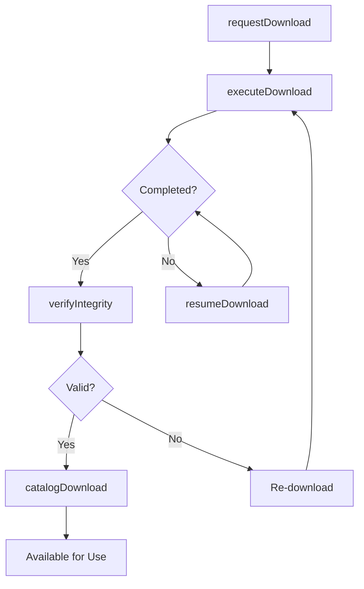
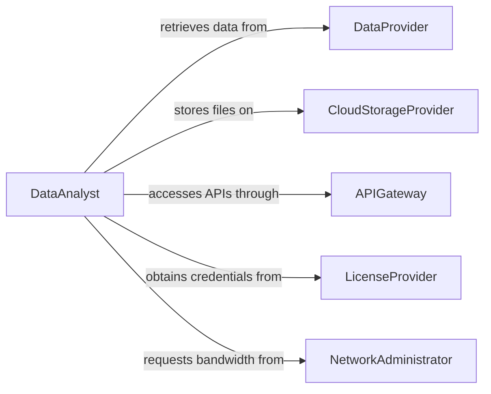

# Download Data

> Business-as-Code definition for data acquisition and file retrieval operations. Models the lifecycle from source identification through download execution, verification, and storage management.

## Overview

Downloading data involves identifying, retrieving, and storing digital files and datasets from remote servers, cloud platforms, APIs, and external data providers. This definition exposes actions for download management and verification, events for transfer monitoring, and searches for download history and storage tracking.

## Actors

| Actor | Description |
|-------|-------------|
| DataProvider | Hosts datasets and files available for download |
| CloudStorageProvider | Provides object storage for downloaded files |
| APIGateway | Serves data through programmatic interfaces |
| LicenseProvider | Grants access to licensed or subscription-based datasets |
| NetworkAdministrator | Manages bandwidth and access policies for downloads |

## Roles

| Role | Description |
|------|-------------|
| DataAnalyst | Identifies and requests data needed for analysis |
| SystemAdministrator | Manages download infrastructure and storage allocation |
| ResearchAssistant | Retrieves datasets from academic and public repositories |
| IntegrationEngineer | Automates recurring data downloads from external systems |

## Entities

| Entity | Description |
|--------|-------------|
| DownloadRequest | A specification of data to be retrieved from a source |
| DataFile | A downloaded file stored locally or in cloud storage |
| TransferJob | An active or completed download operation |
| Checksum | A hash value used to verify download integrity |
| DownloadSchedule | A recurring schedule for automated data retrieval |
| StorageQuota | The allocated space available for downloaded files |
| AccessCredential | Authentication tokens or keys for protected data sources |

## Actions

| Action | Description |
|--------|-------------|
| requestDownload | Specify data to be retrieved from a remote source |
| executeDownload | Initiate the file transfer from the source to local storage |
| verifyIntegrity | Validate the downloaded file against a checksum or size |
| scheduleDownload | Set up recurring automated data retrieval |
| resumeDownload | Continue an interrupted transfer from the last checkpoint |
| catalogDownload | Register the downloaded file in the data inventory |
| purgeExpiredFiles | Remove downloaded files that have exceeded retention |

## Events

| Event | Description |
|-------|-------------|
| downloadRequested | A new data download has been specified |
| downloadStarted | The file transfer has begun |
| downloadCompleted | The file has been successfully retrieved |
| downloadFailed | The transfer encountered an error and could not complete |
| integrityVerified | The downloaded file has passed checksum validation |
| integrityFailed | The downloaded file did not match the expected checksum |
| storageQuotaReached | Available storage for downloads has been exhausted |

## Searches

| Search | Description |
|--------|-------------|
| findDownloads | List completed downloads by source, date, or file type |
| getTransferHistory | Retrieve download job details by date range or status |
| getStorageUsage | Query consumed storage by download category or source |
| findScheduledDownloads | List recurring download schedules and their next run |
| findFailedTransfers | List downloads that did not complete successfully |

## Workflow



## Actor Relationships



## Usage

### Calling Actions

```typescript
import { downloadData } from '@headlessly/download-data'

const downloads = downloadData()

// Download a public dataset
const transfer = await downloads.executeDownload({
  source: 'https://data.census.gov/exports/acs-2025.csv',
  destination: 'data-lake/census/acs-2025.csv',
  checksum: 'sha256:abc123...'
})

// Schedule recurring market data downloads
await downloads.scheduleDownload({
  source: 'sftp://marketdata.provider.com/daily-prices/',
  destination: 'data-lake/market/daily/',
  frequency: 'daily',
  time: '06:00',
  credentials: 'vault://market-data-sftp'
})

// Verify a completed download
const check = await downloads.verifyIntegrity({
  fileId: transfer.id,
  method: 'sha256'
})
```

### Event-Driven Automation

```typescript
// Auto-catalog completed downloads
downloads.downloadCompleted(async ({ fileId, source, size }) => {
  await downloads.catalogDownload({
    fileId,
    source,
    size,
    tags: ['auto-downloaded']
  })
})

// Alert on storage limits
downloads.storageQuotaReached(async ({ usedBytes, quotaBytes }) => {
  await notify({
    to: 'data-ops',
    message: `Download storage at capacity: ${usedBytes}/${quotaBytes} bytes`
  })
  await downloads.purgeExpiredFiles({ retentionDays: 30 })
})
```
