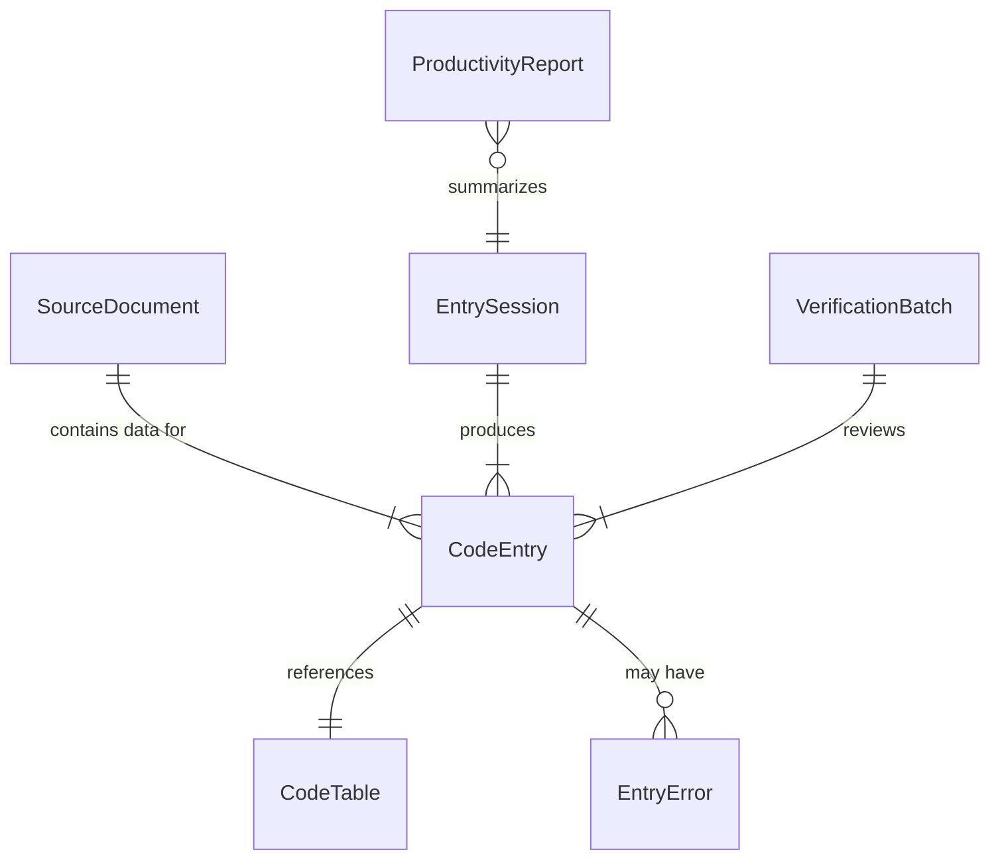
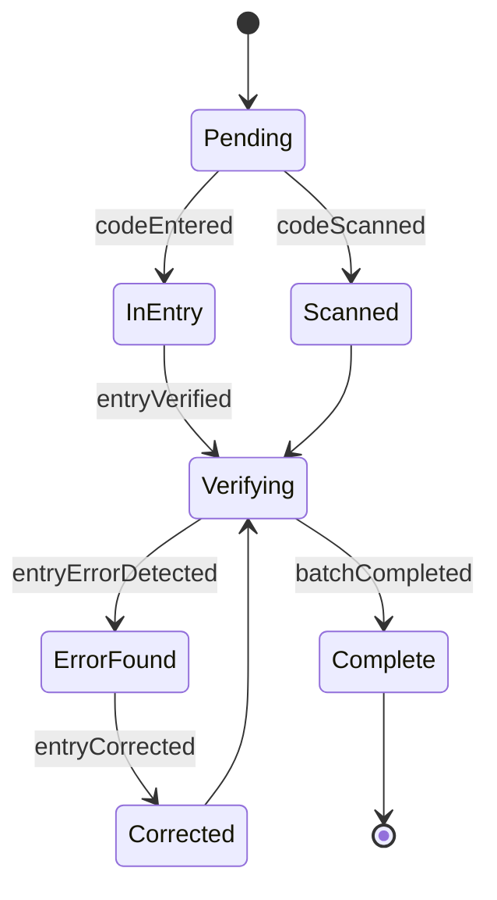
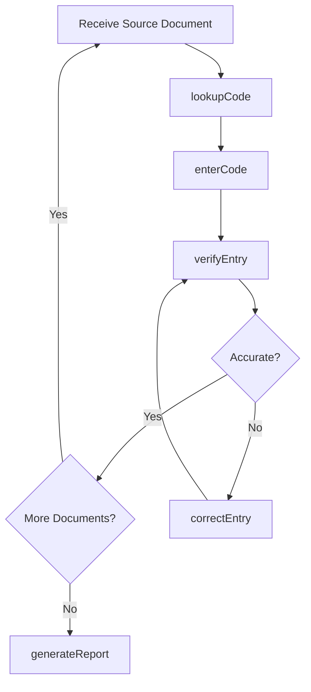
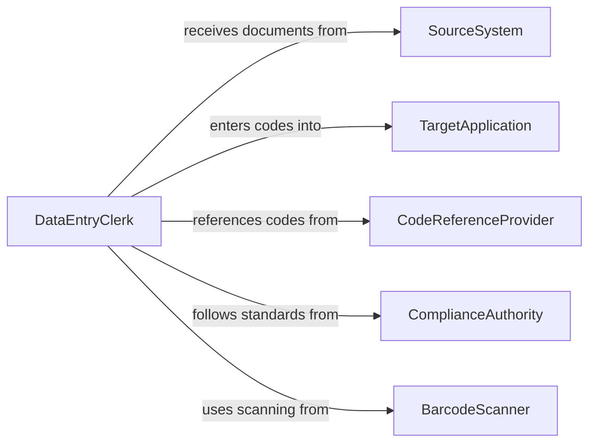

# Enter Codes or Other Information into Computers

> Business-as-Code definition for structured code entry and system input operations. Models the workflow from source document interpretation through code selection, data entry, verification, and system submission.

## Overview

Entering codes or other information into computers involves interpreting source documents, selecting appropriate classification or identification codes, and inputting them into business systems for processing, billing, inventory, or compliance purposes. This definition exposes actions for code entry and validation, events for entry tracking and error detection, and searches for productivity metrics and entry backlog management.

## Actors

| Actor | Description |
|-------|-------------|
| SourceSystem | Provides documents, forms, or records requiring coded data entry |
| TargetApplication | Receives coded input for processing, billing, or tracking |
| CodeReferenceProvider | Publishes code tables, lookup databases, and classification guides |
| ComplianceAuthority | Sets standards for data accuracy and entry completeness |
| BarcodeScanner | Provides automated code capture from physical labels and documents |

## Roles

| Role | Description |
|------|-------------|
| DataEntryClerk | Inputs codes and information from source documents into systems |
| CodeVerifier | Reviews entered codes for accuracy against source records |
| EntryTeamLead | Manages workload distribution and monitors team productivity |
| SystemAdministrator | Maintains code tables and entry forms in the target application |

## Entities

| Entity | Description |
|--------|-------------|
| SourceDocument | A form, label, or record containing information to be entered |
| CodeEntry | A single code or data value submitted to the target system |
| EntrySession | A work period during which an operator processes code entries |
| CodeTable | A reference list of valid codes for a specific field or category |
| EntryError | A detected mistake in an entered code or data value |
| VerificationBatch | A set of entries queued for accuracy review |
| ProductivityReport | A summary of entry speed, volume, and error rates |

## Actions

| Action | Description |
|--------|-------------|
| enterCode | Input a specific code or value from a source document into the system |
| scanCode | Capture a code automatically using a barcode or QR scanner |
| batchEnter | Process multiple source documents in a continuous entry session |
| verifyEntry | Check entered codes against source documents for accuracy |
| correctEntry | Fix an identified data entry error |
| lookupCode | Search code reference tables to find the correct value |
| generateReport | Produce productivity and accuracy statistics for the entry team |

## Events

| Event | Description |
|-------|-------------|
| codeEntered | A code or value has been submitted to the target system |
| codeScanned | A barcode or QR code has been automatically captured |
| batchCompleted | A group of source documents has been fully processed |
| entryVerified | An entered code has been confirmed accurate |
| entryErrorDetected | An incorrect code or value has been identified |
| entryCorrected | A previously flagged error has been fixed |
| backlogThresholdReached | Pending entry work has exceeded the target limit |

## Searches

| Search | Description |
|--------|-------------|
| findPendingEntries | List source documents awaiting code entry |
| getEntryMetrics | Retrieve speed, volume, and accuracy statistics by operator |
| findErrors | List detected entry errors by type, date, or operator |
| lookupCodes | Search code reference tables by keyword or category |
| getBacklogStatus | Check the volume of unprocessed entry work |

## Entity Relationships



## State Diagram



## Workflow



## Actor Relationships



## Usage

### Calling Actions

```typescript
import { enterCodesInformationIntoComputers } from '@headlessly/enter-codes-information-into-computers'

const entry = enterCodesInformationIntoComputers()

// Enter a product code from a receiving document
await entry.enterCode({
  sourceDocument: 'receiving-slip-8842',
  targetSystem: 'inventory',
  field: 'sku',
  value: 'WH-PLT-4420-BLK',
  quantity: 48
})

// Scan a batch of barcodes
const scanned = await entry.scanCode({
  device: 'scanner-dock-3',
  format: 'ean-13',
  targetSystem: 'point-of-sale'
})

// Generate daily productivity report
const report = await entry.generateReport({
  period: 'daily',
  date: '2026-02-05',
  metrics: ['entries-per-hour', 'error-rate', 'backlog-count']
})
```

### Event-Driven Automation

```typescript
// Alert on growing backlog
entry.backlogThresholdReached(async ({ pendingCount, threshold }) => {
  await notify({
    to: 'entry-team-lead',
    message: `Entry backlog at ${pendingCount} documents (threshold: ${threshold})`
  })
})

// Flag high error rates
entry.entryErrorDetected(async ({ operatorId, errorType }) => {
  const metrics = await entry.getEntryMetrics({ operatorId, period: 'today' })
  if (metrics.errorRate > 3) {
    await notify({
      to: 'entry-team-lead',
      message: `High error rate for operator ${operatorId}: ${metrics.errorRate}%`
    })
  }
})
```
