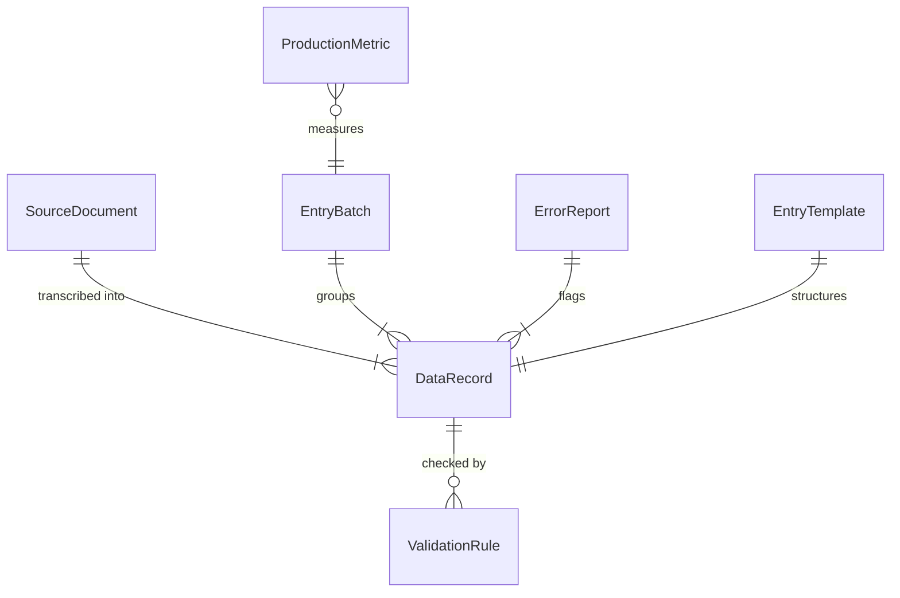
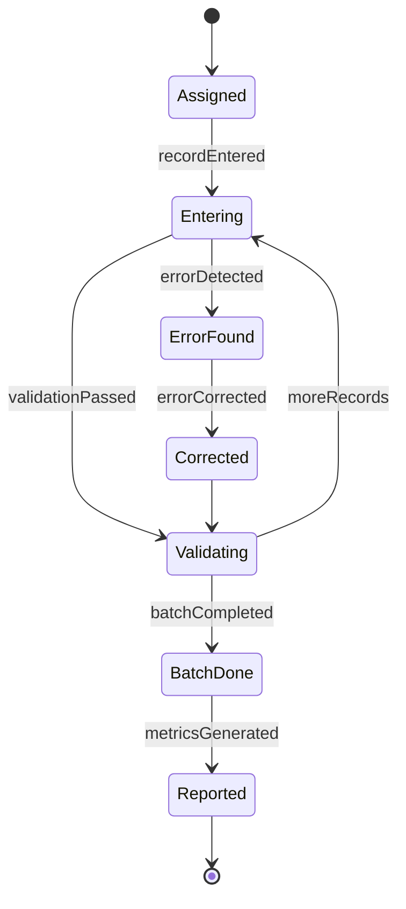
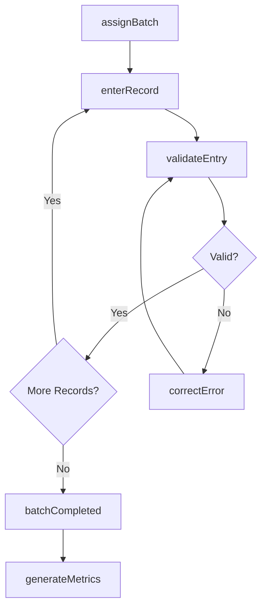
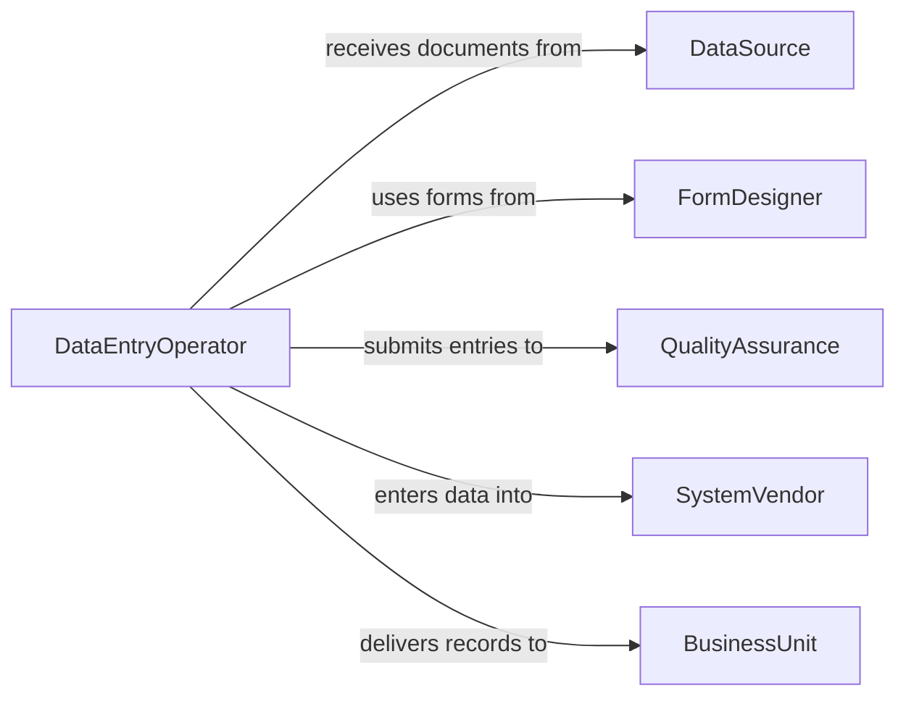

# Enter Information into Databases or Software Programs

> Business-as-Code definition for data entry and record creation across enterprise systems. Models the workflow from source document intake through data entry, validation, and quality assurance.

## Overview

Entering information into databases or software programs involves transcribing data from source documents, forms, and external systems into structured digital records. This definition exposes actions for data input and quality control, events for entry tracking and error detection, and searches for production metrics and backlog management.

## Actors

| Actor | Description |
|-------|-------------|
| DataSource | Provides paper or digital documents requiring transcription |
| FormDesigner | Creates input forms and templates for data collection |
| QualityAssurance | Audits entered data for accuracy and completeness |
| SystemVendor | Provides the database or software platform for data storage |
| BusinessUnit | Consumes the entered data for operational processes |

## Roles

| Role | Description |
|------|-------------|
| DataEntryOperator | Transcribes information from source documents into systems |
| DataEntrySupervisor | Manages workload distribution and quality standards |
| DataValidator | Reviews entries for accuracy against source documents |
| ProcessCoordinator | Prioritizes entry tasks and manages backlogs |

## Entities

| Entity | Description |
|--------|-------------|
| SourceDocument | A paper or digital form containing data to be entered |
| DataRecord | A structured entry created in the target database |
| EntryBatch | A grouped set of records entered during a single session |
| ValidationRule | A constraint ensuring entered data meets format and range requirements |
| ErrorReport | A list of data entry mistakes identified during quality checks |
| EntryTemplate | A predefined form layout guiding consistent data input |
| ProductionMetric | A measure of data entry speed, accuracy, and throughput |

## Actions

| Action | Description |
|--------|-------------|
| enterRecord | Input a new data record from a source document |
| batchEnter | Process multiple source documents in a single entry session |
| validateEntry | Check entered data against source documents and rules |
| correctError | Fix an identified data entry mistake |
| assignBatch | Distribute a set of source documents to entry operators |
| generateMetrics | Calculate production speed, error rates, and backlog |
| importData | Load structured data from external files into the system |

## Events

| Event | Description |
|-------|-------------|
| recordEntered | A new data record has been created in the system |
| batchCompleted | All records in an entry batch have been processed |
| validationPassed | Entered data has been confirmed accurate |
| errorDetected | A data entry mistake has been identified |
| errorCorrected | A previously flagged entry error has been fixed |
| batchAssigned | A set of source documents has been assigned to an operator |
| backlogThresholdReached | Pending entry work has exceeded the target limit |

## Searches

| Search | Description |
|--------|-------------|
| findPendingBatches | List unprocessed entry batches by priority or age |
| getEntryMetrics | Retrieve productivity and accuracy statistics by operator |
| findErrors | List detected entry errors by type, batch, or operator |
| getRecordsBySource | Query entered records by source document or date |
| getBacklogStatus | Check the volume of pending entry work |

## Entity Relationships



## State Diagram



## Workflow



## Actor Relationships



## Usage

### Calling Actions

```typescript
import { enterInformationIntoDatabasesSoftware } from '@headlessly/enter-information-into-databases-software'

const dataEntry = enterInformationIntoDatabasesSoftware()

// Enter a single record
await dataEntry.enterRecord({
  targetSystem: 'crm',
  table: 'leads',
  data: {
    name: 'Acme Corporation',
    contactEmail: 'info@acme.com',
    source: 'trade-show-2026',
    status: 'new'
  }
})

// Import a batch from a spreadsheet
await dataEntry.importData({
  source: 'uploads/leads-february-2026.csv',
  targetSystem: 'crm',
  table: 'leads',
  mapping: { 'Company': 'name', 'Email': 'contactEmail' },
  validateBeforeInsert: true
})

// Generate daily metrics
const metrics = await dataEntry.generateMetrics({
  period: 'daily',
  date: '2026-02-05'
})
```

### Event-Driven Automation

```typescript
// Alert supervisor on high error rates
dataEntry.errorDetected(async ({ operatorId, batchId, errorType }) => {
  const metrics = await dataEntry.getEntryMetrics({ operatorId, period: 'today' })
  if (metrics.errorRate > 5) {
    await notify({
      to: 'data-entry-supervisor',
      message: `High error rate (${metrics.errorRate}%) for operator ${operatorId}`
    })
  }
})

// Notify when backlog grows
dataEntry.backlogThresholdReached(async ({ pendingCount, threshold }) => {
  await notify({
    to: 'process-coordinator',
    message: `Data entry backlog at ${pendingCount} documents (threshold: ${threshold})`
  })
})
```
