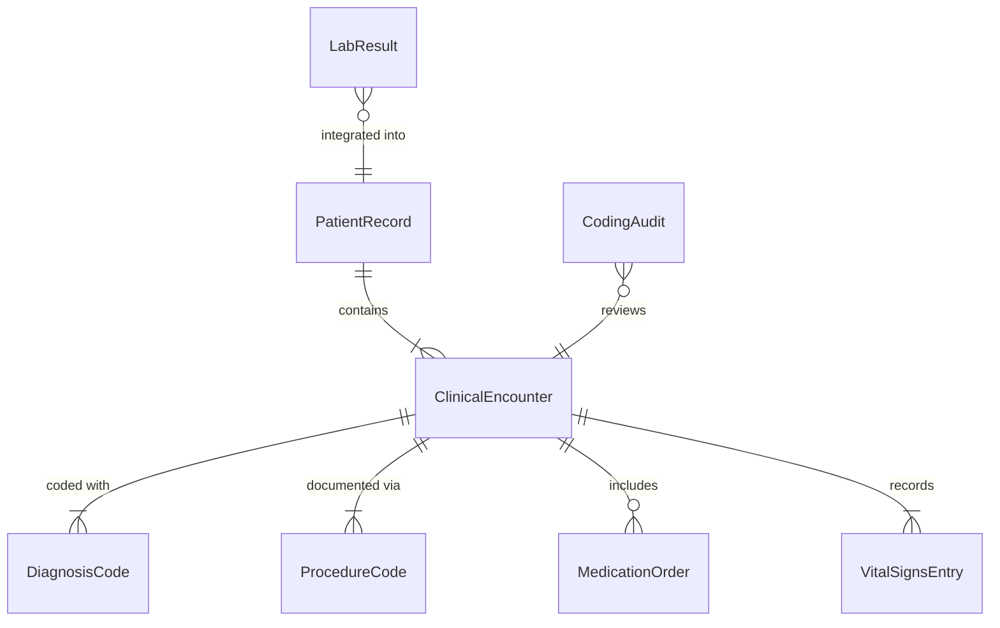
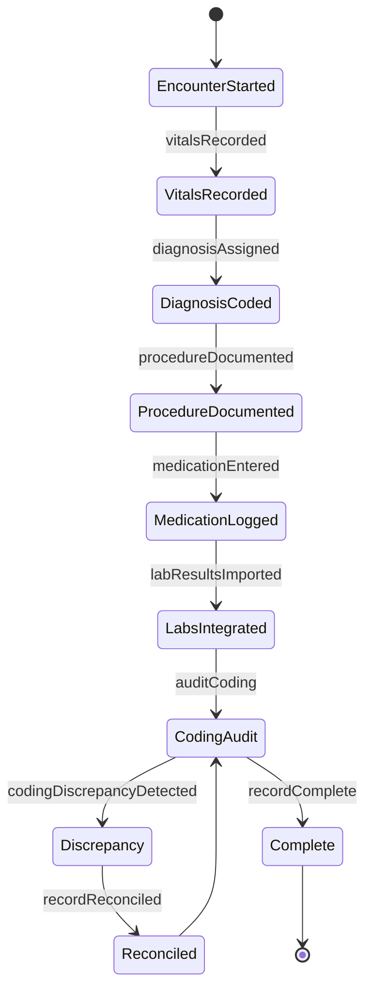
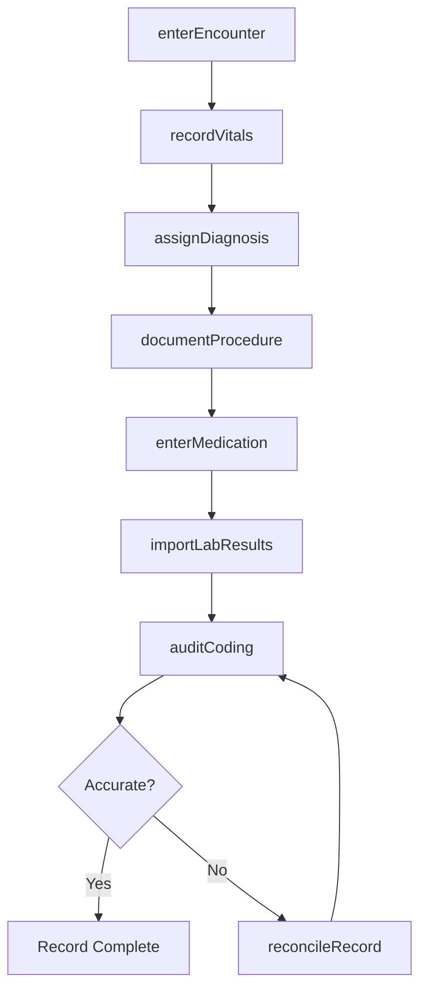
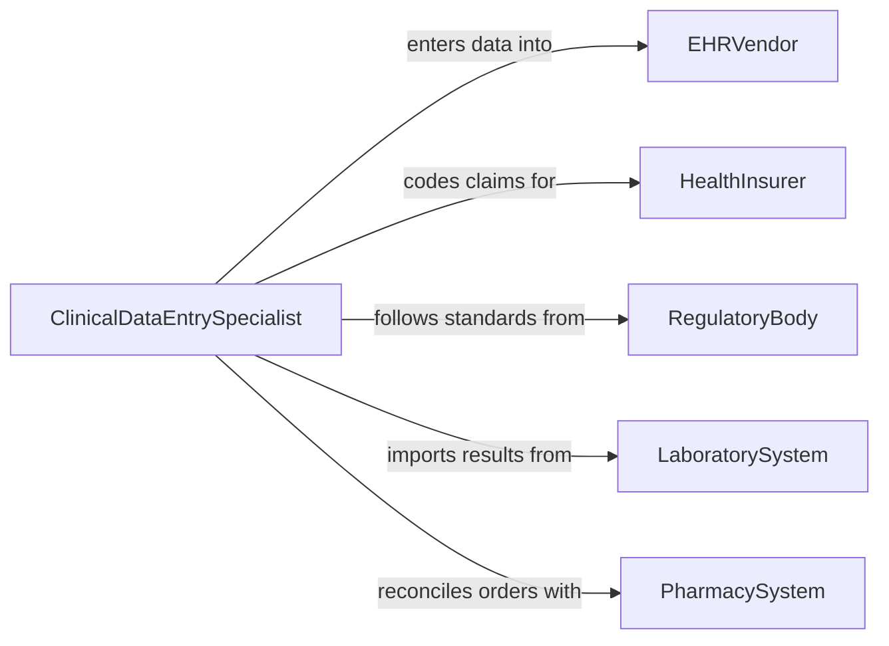

# Enter Patient or Treatment Data into Computers

> Business-as-Code definition for clinical data entry and electronic health record management. Models the workflow from patient encounter through data capture, validation, coding, and integration into electronic health record systems.

## Overview

Entering patient or treatment data into computers involves transcribing clinical observations, diagnoses, procedures, medications, and outcomes into electronic health record (EHR) systems. This definition exposes actions for structured clinical data entry, events for quality and compliance monitoring, and searches for patient record retrieval and data completeness auditing.

## Actors

| Actor | Description |
|-------|-------------|
| EHRVendor | Provides the electronic health record platform and templates |
| HealthInsurer | Requires coded clinical data for claims processing and authorization |
| RegulatoryBody | Mandates data standards such as HIPAA, HL7, and ICD coding requirements |
| LaboratorySystem | Delivers test results for integration into patient records |
| PharmacySystem | Exchanges medication orders and dispensing information |

## Roles

| Role | Description |
|------|-------------|
| ClinicalDataEntrySpecialist | Transcribes clinical documentation into the EHR system |
| MedicalCoder | Assigns ICD, CPT, and HCPCS codes to diagnoses and procedures |
| RegisteredNurse | Documents patient assessments, vitals, and care activities |
| HealthInformationTechnician | Maintains data quality and resolves coding discrepancies |

## Entities

| Entity | Description |
|--------|-------------|
| PatientRecord | The comprehensive electronic record for an individual patient |
| ClinicalEncounter | A documented visit, admission, or telehealth session |
| DiagnosisCode | An ICD-10 or SNOMED code classifying a patient condition |
| ProcedureCode | A CPT or HCPCS code documenting a clinical procedure performed |
| MedicationOrder | A prescription or medication administration record |
| VitalSignsEntry | A recorded set of patient measurements such as blood pressure and temperature |
| LabResult | A diagnostic test result received from a laboratory system |
| CodingAudit | A review of assigned codes for accuracy and completeness |

## Actions

| Action | Description |
|--------|-------------|
| enterEncounter | Document a patient visit including chief complaint and history |
| recordVitals | Input patient vital signs and measurements |
| assignDiagnosis | Apply ICD-10 diagnosis codes to the encounter |
| documentProcedure | Record procedures performed with CPT codes and notes |
| enterMedication | Log medication orders, dosages, and administration routes |
| importLabResults | Integrate laboratory test results into the patient record |
| auditCoding | Review assigned codes for accuracy against clinical documentation |
| reconcileRecord | Resolve discrepancies between entered data and source documents |

## Events

| Event | Description |
|-------|-------------|
| encounterEntered | A patient visit has been documented in the EHR |
| vitalsRecorded | Patient vital signs have been entered |
| diagnosisAssigned | Diagnosis codes have been applied to the encounter |
| procedureDocumented | A clinical procedure has been recorded with coding |
| medicationEntered | A medication order has been logged in the system |
| labResultsImported | Laboratory results have been integrated into the patient record |
| codingDiscrepancyDetected | A mismatch between clinical documentation and assigned codes has been found |
| recordReconciled | Data discrepancies have been resolved |

## Searches

| Search | Description |
|--------|-------------|
| findPatientRecords | Search patient records by name, MRN, or date of birth |
| getEncounterHistory | Retrieve encounter records by patient, provider, or date range |
| findUncodedEncounters | List encounters missing required diagnosis or procedure codes |
| getCodingMetrics | Retrieve coding accuracy rates and turnaround times |
| findIncompleteRecords | Identify patient records with missing required data fields |

## Entity Relationships



## State Diagram



## Workflow



## Actor Relationships



## Usage

### Calling Actions

```typescript
import { enterPatientTreatmentDataInto } from '@headlessly/enter-patient-treatment-data-into'

const clinical = enterPatientTreatmentDataInto()

// Document a patient encounter
const encounter = await clinical.enterEncounter({
  patientMRN: 'MRN-00482916',
  provider: 'dr-patel',
  date: '2026-02-05',
  chiefComplaint: 'Persistent cough for 2 weeks',
  type: 'office-visit'
})

// Record vitals and assign diagnosis
await clinical.recordVitals({
  encounterId: encounter.id,
  vitals: { temperature: 99.2, bloodPressure: '128/82', pulse: 78, respiration: 18 }
})

await clinical.assignDiagnosis({
  encounterId: encounter.id,
  codes: [
    { system: 'icd-10', code: 'R05.9', description: 'Cough, unspecified' },
    { system: 'icd-10', code: 'J06.9', description: 'Acute upper respiratory infection' }
  ]
})
```

### Event-Driven Automation

```typescript
// Flag encounters missing required codes
clinical.encounterEntered(async ({ encounterId, patientMRN }) => {
  const uncoded = await clinical.findUncodedEncounters({ encounterId })
  if (uncoded.length > 0) {
    await notify({
      to: 'medical-coding',
      message: `Encounter ${encounterId} for patient ${patientMRN} requires coding`
    })
  }
})

// Alert on coding discrepancies
clinical.codingDiscrepancyDetected(async ({ encounterId, field, expected, actual }) => {
  await notify({
    to: 'health-information',
    message: `Coding discrepancy on encounter ${encounterId}: ${field} expected ${expected}, found ${actual}`
  })
})
```
