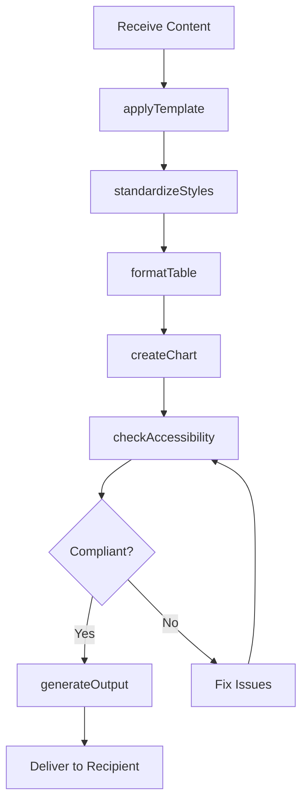
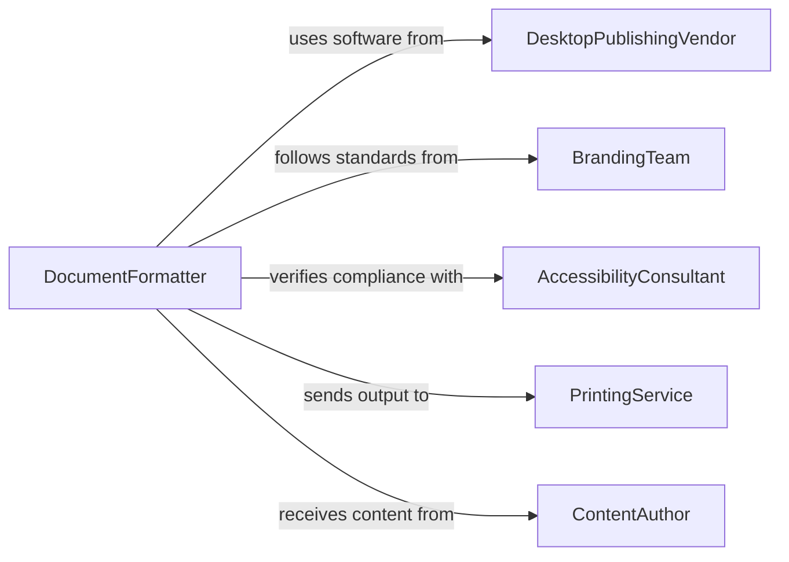

# Format Digital Documents, Data, or Images

> Business-as-Code definition for digital document and data formatting operations. Models the lifecycle from content receipt through layout application, style standardization, accessibility compliance, and final output production.

## Overview

Formatting digital documents, data, and images involves applying consistent layouts, styles, templates, and structural standards to electronic files for presentation, publication, or regulatory submission. This definition exposes actions for template application and format standardization, events for quality verification and output tracking, and searches for template management and formatting history.

## Actors

| Actor | Description |
|-------|-------------|
| DesktopPublishingVendor | Provides document layout and typesetting software |
| BrandingTeam | Defines visual identity standards and approved templates |
| AccessibilityConsultant | Provides guidance on WCAG and Section 508 compliance |
| PrintingService | Produces physical copies from formatted digital files |
| ContentAuthor | Provides raw content requiring professional formatting |

## Roles

| Role | Description |
|------|-------------|
| DocumentFormatter | Applies layouts, styles, and templates to digital content |
| DesktopPublisher | Produces publication-ready documents with advanced typesetting |
| DataVisualizationSpecialist | Formats data into charts, tables, and infographics |
| QualityReviewer | Verifies formatting accuracy against brand and accessibility standards |

## Entities

| Entity | Description |
|--------|-------------|
| DocumentTemplate | A predefined layout with styles, headers, and placeholders |
| StyleGuide | A reference document defining typography, colors, and spacing rules |
| FormattedDocument | A digital file with applied layouts and visual styling |
| DataTable | A structured arrangement of data in rows and columns |
| ChartGraphic | A visual representation of data formatted for presentation |
| OutputProfile | A set of specifications for the target output such as print, web, or PDF |
| AccessibilityReport | An assessment of document compliance with accessibility standards |

## Actions

| Action | Description |
|--------|-------------|
| applyTemplate | Apply a predefined layout and style to a document |
| formatTable | Structure data into a consistently styled table |
| createChart | Generate a visual data representation from source data |
| standardizeStyles | Apply brand typography, colors, and spacing consistently |
| checkAccessibility | Verify the document meets accessibility compliance standards |
| generateOutput | Produce the final formatted file in the target format |
| batchFormat | Apply formatting rules to multiple documents in a single operation |

## Events

| Event | Description |
|-------|-------------|
| templateApplied | A document template has been applied to content |
| tableFormatted | Data has been structured into a styled table |
| chartCreated | A data visualization has been generated |
| stylesStandardized | Brand and typographic standards have been applied |
| accessibilityChecked | An accessibility compliance review has been completed |
| outputGenerated | The final formatted file has been produced |
| formattingErrorDetected | A deviation from formatting standards has been identified |

## Searches

| Search | Description |
|--------|-------------|
| findTemplates | List available document templates by type or category |
| getFormattedDocuments | Retrieve formatted documents by author, type, or date |
| getAccessibilityStatus | Check formatting compliance status for a set of documents |
| findFormattingErrors | List documents with detected formatting deviations |
| getOutputHistory | Retrieve the production history for a specific document |

## Workflow



## Actor Relationships



## Usage

### Calling Actions

```typescript
import { formatDigitalDocumentsDataImages } from '@headlessly/format-digital-documents-data-images'

const formatter = formatDigitalDocumentsDataImages()

// Apply a corporate template to a report
const formatted = await formatter.applyTemplate({
  sourceDocument: 'drafts/quarterly-report-q4.docx',
  template: 'corporate-report-2026',
  sections: ['cover', 'executive-summary', 'financials', 'appendix']
})

// Format data tables and charts
await formatter.formatTable({
  documentId: formatted.id,
  section: 'financials',
  dataSource: 'reports/q4-data.csv',
  style: 'striped-corporate'
})

await formatter.createChart({
  documentId: formatted.id,
  type: 'bar',
  dataSource: 'reports/q4-revenue.csv',
  title: 'Q4 Revenue by Region',
  style: 'brand-colors'
})

// Generate final PDF
await formatter.generateOutput({
  documentId: formatted.id,
  format: 'pdf',
  profile: 'print-ready',
  accessibility: true
})
```

### Event-Driven Automation

```typescript
// Auto-check accessibility after formatting
formatter.stylesStandardized(async ({ documentId }) => {
  await formatter.checkAccessibility({
    documentId,
    standards: ['wcag-2.1-aa', 'section-508']
  })
})

// Alert on formatting errors
formatter.formattingErrorDetected(async ({ documentId, errorType, location }) => {
  await notify({
    to: 'publishing-team',
    message: `Formatting error in document ${documentId}: ${errorType} at ${location}`
  })
})
```
