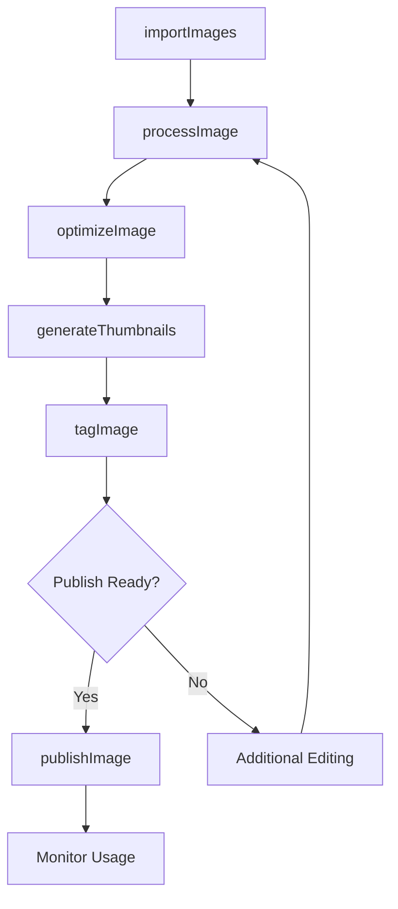
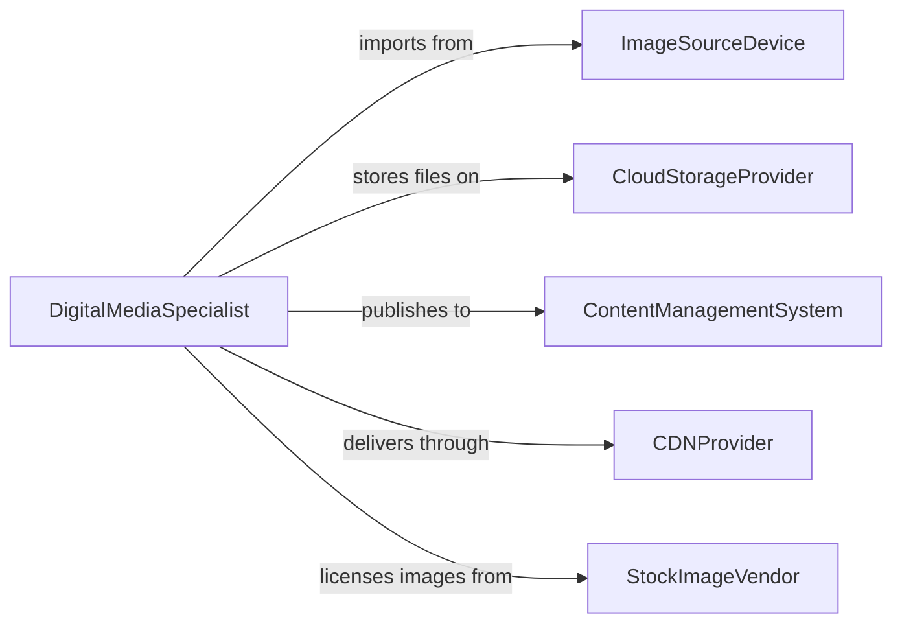

# Load Digital Images onto Computers or Websites

> Business-as-Code definition for digital image ingestion and publishing. Models the lifecycle from image capture or receipt through processing, optimization, storage, and publication to websites and content management systems.

## Overview

Loading digital images onto computers or websites involves transferring image files from cameras, scanners, and external sources into local storage or web platforms, then processing and optimizing them for their intended use. This definition exposes actions for image ingestion and publishing, events for upload tracking and quality validation, and searches for image library management and usage analytics.

## Actors

| Actor | Description |
|-------|-------------|
| ImageSourceDevice | Camera, scanner, or mobile device that captures digital images |
| CloudStorageProvider | Hosts image files in object storage for retrieval and distribution |
| ContentManagementSystem | Web platform where images are published alongside content |
| CDNProvider | Delivers optimized images to end users through edge caching |
| StockImageVendor | Supplies licensed imagery for commercial use |

## Roles

| Role | Description |
|------|-------------|
| DigitalMediaSpecialist | Manages image ingestion, processing, and library organization |
| WebContentEditor | Selects and publishes images to website pages and blog posts |
| Photographer | Captures and delivers original digital images |
| GraphicDesigner | Edits, crops, and optimizes images for specific formats and placements |

## Entities

| Entity | Description |
|--------|-------------|
| DigitalImage | A raster or vector image file in formats such as JPEG, PNG, WebP, or SVG |
| ImageBatch | A grouped set of images imported from a single source in one session |
| ImageMetadata | EXIF data, alt text, captions, and tags associated with an image |
| ImageProfile | A set of optimization rules defining size, format, and quality targets |
| MediaLibrary | The organized repository of all uploaded and processed images |
| PublishTarget | A website page, CMS entry, or social media channel receiving an image |
| ThumbnailSet | A collection of resized versions of an image for different display contexts |

## Actions

| Action | Description |
|--------|-------------|
| importImages | Transfer images from a device or source folder into the media library |
| processImage | Apply cropping, color correction, and format conversion |
| optimizeImage | Compress and resize images for web delivery performance |
| tagImage | Add metadata, alt text, and categorical tags to an image |
| publishImage | Upload an image to a website, CMS, or social media platform |
| generateThumbnails | Create multiple size variants for responsive display |
| archiveImage | Move images to long-term storage while retaining metadata |

## Events

| Event | Description |
|-------|-------------|
| imagesImported | A batch of images has been transferred into the media library |
| imageProcessed | An image has been cropped, adjusted, or converted |
| imageOptimized | An image has been compressed and sized for target delivery |
| imageTagged | Metadata and tags have been applied to an image |
| imagePublished | An image has been uploaded to a target platform |
| thumbnailsGenerated | Size variants have been created for an image |
| uploadFailed | An image upload encountered an error |

## Searches

| Search | Description |
|--------|-------------|
| findImages | Search the media library by tag, date, format, or dimensions |
| getUntaggedImages | List images missing alt text or categorical metadata |
| getPublishHistory | Retrieve where and when a specific image was published |
| getStorageUsage | Query media library size by format, source, or date range |
| findLargeImages | Identify images exceeding size thresholds for optimization |

## Workflow



## Actor Relationships



## Usage

### Calling Actions

```typescript
import { loadDigitalImagesOntoComputers } from '@headlessly/load-digital-images-onto-computers'

const images = loadDigitalImagesOntoComputers()

// Import a batch of product photos
const batch = await images.importImages({
  source: 'camera-card://DCIM/2026-02-05/',
  destination: 'media-library/products/spring-2026/',
  formats: ['raw', 'jpeg']
})

// Process and optimize for web
for (const image of batch.files) {
  await images.processImage({
    imageId: image.id,
    operations: ['auto-level', 'crop-to-4x3', 'convert-to-webp']
  })
  await images.optimizeImage({
    imageId: image.id,
    maxWidth: 2400,
    quality: 85,
    format: 'webp'
  })
}

// Publish to the product catalog
await images.publishImage({
  imageId: batch.files[0].id,
  target: 'cms://products/spring-collection',
  altText: 'Spring 2026 collection preview',
  placement: 'hero'
})
```

### Event-Driven Automation

```typescript
// Auto-generate thumbnails on import
images.imagesImported(async ({ batchId, fileCount }) => {
  for (const image of await images.findImages({ batchId })) {
    await images.generateThumbnails({
      imageId: image.id,
      sizes: [150, 300, 600, 1200]
    })
  }
})

// Alert on failed uploads
images.uploadFailed(async ({ imageId, target, error }) => {
  await notify({
    to: 'web-team',
    message: `Image upload failed to ${target}: ${error}`
  })
})
```
