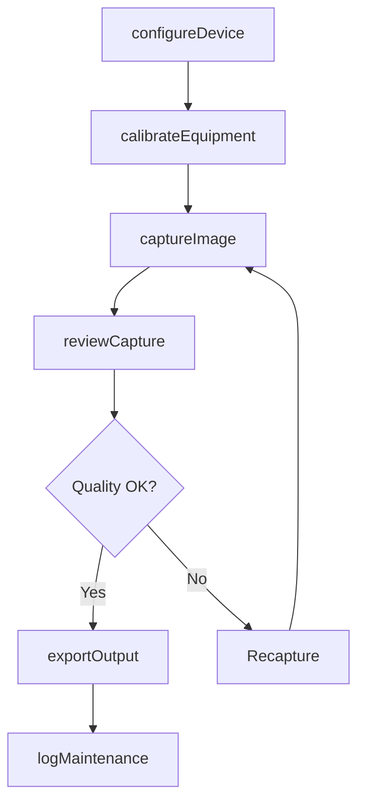
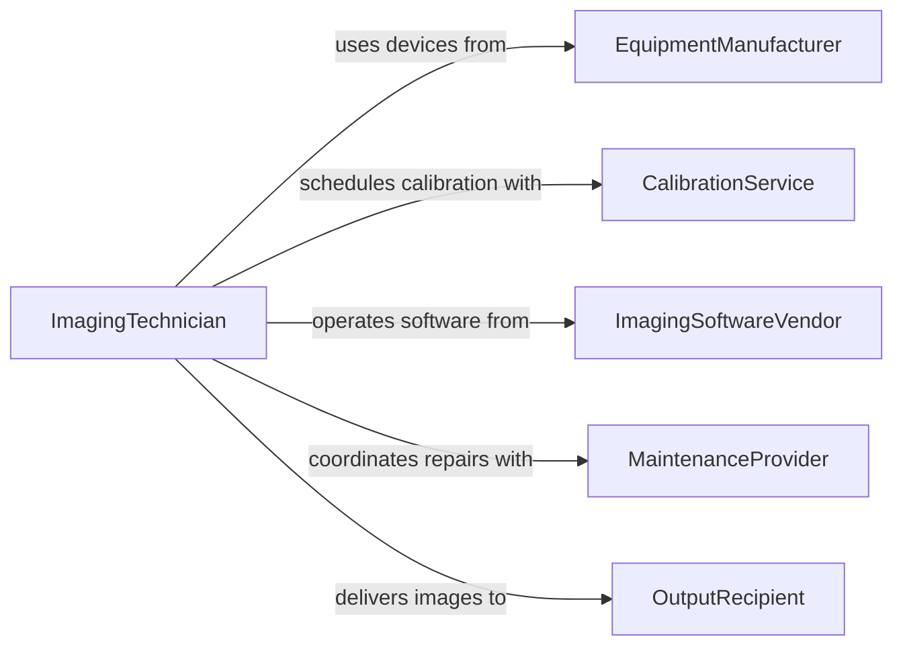

# Operate Digital Imaging Equipment

> Business-as-Code definition for digital imaging equipment operation and management. Models the lifecycle from equipment configuration through image capture, quality verification, and output delivery across scanners, cameras, and diagnostic imaging devices.

## Overview

Operating digital imaging equipment involves configuring, calibrating, and using scanners, digital cameras, medical imaging devices, and other capture hardware to produce high-quality digital images for documentation, analysis, or publication. This definition exposes actions for equipment operation and calibration, events for capture tracking and quality monitoring, and searches for equipment utilization and output history.

## Actors

| Actor | Description |
|-------|-------------|
| EquipmentManufacturer | Produces imaging hardware and provides firmware updates |
| CalibrationService | Performs periodic color and resolution calibration |
| ImagingSoftwareVendor | Provides capture, processing, and workflow management software |
| MaintenanceProvider | Delivers repair and preventive maintenance for imaging devices |
| OutputRecipient | Receives the captured images for use in downstream workflows |

## Roles

| Role | Description |
|------|-------------|
| ImagingTechnician | Operates imaging equipment and manages capture sessions |
| QualityControlSpecialist | Verifies captured images meet resolution and color standards |
| EquipmentCoordinator | Schedules equipment use and coordinates maintenance |
| ImageProcessingOperator | Post-processes captured images using editing software |

## Entities

| Entity | Description |
|--------|-------------|
| ImagingDevice | A scanner, camera, or specialized capture device |
| CaptureSession | A scheduled period of equipment operation for image production |
| CalibrationProfile | A set of color, resolution, and exposure parameters for the device |
| CapturedImage | A raw or processed image file produced by the equipment |
| DeviceLog | A record of equipment usage, errors, and maintenance events |
| OutputSpecification | The required format, resolution, and color space for deliverables |
| MaintenanceSchedule | A recurring plan for equipment cleaning, calibration, and service |

## Actions

| Action | Description |
|--------|-------------|
| configureDevice | Set capture parameters such as resolution, color space, and exposure |
| calibrateEquipment | Perform color accuracy and resolution calibration |
| captureImage | Operate the device to produce a digital image |
| reviewCapture | Inspect captured images for quality against specifications |
| batchCapture | Run an automated sequence of captures for high-volume production |
| exportOutput | Deliver captured images in the required format to recipients |
| logMaintenance | Record equipment service, calibration, or repair activity |

## Events

| Event | Description |
|-------|-------------|
| deviceConfigured | Imaging equipment has been set up with capture parameters |
| equipmentCalibrated | Calibration has been completed and verified |
| imageCaptured | A digital image has been produced by the equipment |
| captureReviewed | A captured image has been inspected for quality |
| batchCompleted | An automated capture sequence has finished |
| outputExported | Captured images have been delivered in the target format |
| maintenanceDue | A scheduled maintenance window is approaching |

## Searches

| Search | Description |
|--------|-------------|
| findDevices | List imaging equipment by type, location, or availability |
| getSessionHistory | Retrieve capture session records by device, date, or operator |
| getCalibrationStatus | Check when devices were last calibrated and next due date |
| findCapturedImages | Search captured images by device, session, or quality rating |
| getMaintenanceLog | Retrieve service and repair history for a specific device |

## Workflow



## Actor Relationships



## Usage

### Calling Actions

```typescript
import { operateDigitalImagingEquipment } from '@headlessly/operate-digital-imaging-equipment'

const imaging = operateDigitalImagingEquipment()

// Configure a high-resolution scanner
await imaging.configureDevice({
  deviceId: 'scanner-epson-v850',
  settings: {
    resolution: 4800,
    colorSpace: 'adobe-rgb',
    bitDepth: 48,
    format: 'tiff'
  }
})

// Capture a batch of archival scans
const batch = await imaging.batchCapture({
  deviceId: 'scanner-epson-v850',
  items: 25,
  autoFeed: true,
  namingPattern: 'archive-{date}-{seq}'
})

// Export in the required format
await imaging.exportOutput({
  sessionId: batch.sessionId,
  format: 'jpeg',
  resolution: 300,
  colorSpace: 'srgb',
  destination: 'archive/scans/2026-02/'
})
```

### Event-Driven Automation

```typescript
// Alert on upcoming maintenance
imaging.maintenanceDue(async ({ deviceId, deviceName, maintenanceType, dueDate }) => {
  await notify({
    to: 'equipment-coordinator',
    message: `${maintenanceType} due for ${deviceName} on ${dueDate}`
  })
})

// Auto-log completed calibrations
imaging.equipmentCalibrated(async ({ deviceId, calibrationType, operator }) => {
  await imaging.logMaintenance({
    deviceId,
    type: calibrationType,
    performedBy: operator,
    date: new Date().toISOString()
  })
})
```
