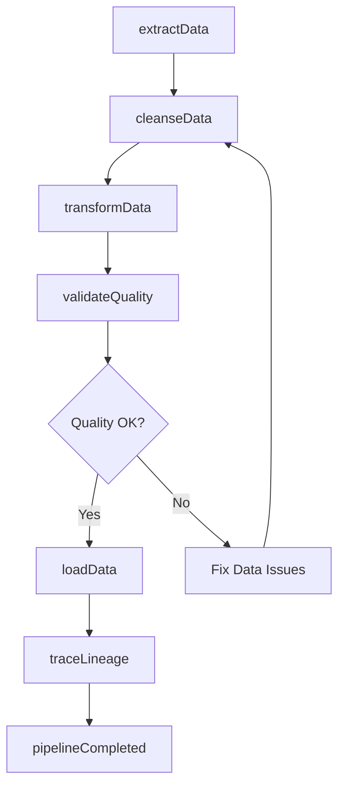
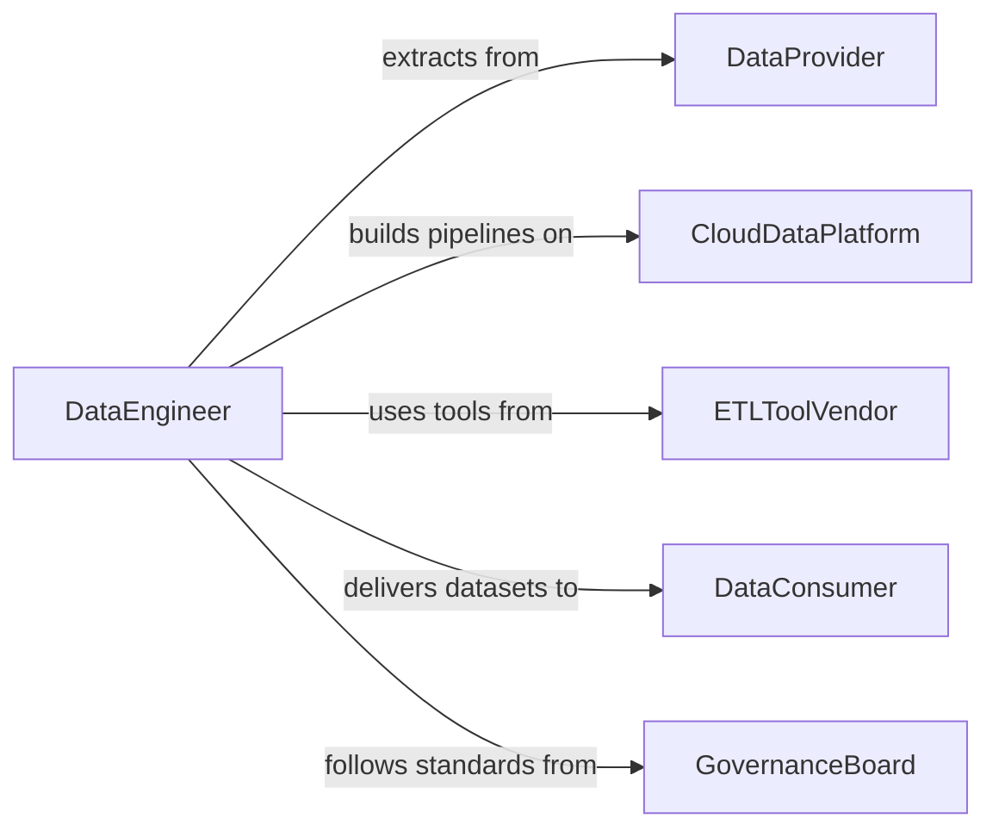

# Prepare Data for Analysis

> Business-as-Code definition for data preparation and ETL operations. Models the pipeline from raw data ingestion through cleansing, transformation, and loading into analytics-ready formats.

## Overview

Preparing data for analysis involves extracting raw data from source systems, cleansing and transforming it to meet quality standards, and loading it into data warehouses or analytics platforms. This definition exposes actions for each stage of the data preparation pipeline, events for pipeline monitoring, and searches for data lineage and quality tracking.

## Actors

| Actor | Description |
|-------|-------------|
| DataProvider | Supplies raw data from transactional or external systems |
| CloudDataPlatform | Hosts data lakes, warehouses, and processing infrastructure |
| ETLToolVendor | Provides data integration and transformation software |
| DataConsumer | Analysts and scientists who use the prepared data |
| GovernanceBoard | Sets standards for data quality, security, and access |

## Roles

| Role | Description |
|------|-------------|
| DataEngineer | Builds and maintains data pipelines and transformations |
| DataAnalyst | Defines analysis requirements and validates output quality |
| DataSteward | Ensures data meets governance and quality standards |
| PipelineOperator | Monitors and troubleshoots data processing jobs |

## Entities

| Entity | Description |
|--------|-------------|
| RawDataset | An unprocessed collection of data from a source system |
| TransformationRule | A defined operation that modifies data structure or values |
| DataPipeline | An automated sequence of extraction, transformation, and load steps |
| DataQualityCheck | A validation rule applied to data during processing |
| StagingTable | A temporary storage area for data being processed |
| AnalyticsDataset | A cleansed and transformed dataset ready for analysis |
| DataLineageRecord | A map of data origin, transformations, and destinations |

## Actions

| Action | Description |
|--------|-------------|
| extractData | Pull raw data from source systems into staging |
| cleanseData | Remove duplicates, fix formatting, and handle missing values |
| transformData | Apply business rules to reshape data for analysis |
| validateQuality | Run quality checks on processed data |
| loadData | Write prepared data to the target warehouse or data lake |
| scheduleP pipeline | Set up automated execution of the data preparation workflow |
| traceLineage | Document the origin and transformation path of a dataset |

## Events

| Event | Description |
|-------|-------------|
| dataExtracted | Raw data has been pulled from the source system |
| dataCleansed | Data quality issues have been addressed |
| dataTransformed | Business logic transformations have been applied |
| qualityCheckPassed | Data has met all validation criteria |
| qualityCheckFailed | Data did not meet one or more quality thresholds |
| dataLoaded | Prepared data has been written to the target system |
| pipelineCompleted | The full data preparation pipeline has finished |

## Searches

| Search | Description |
|--------|-------------|
| findPipelines | List data pipelines by source, target, or schedule |
| getQualityMetrics | Retrieve data quality scores by dataset or check type |
| getLineage | Trace the origin and transformation path of a dataset |
| findFailedJobs | List pipeline runs that encountered errors |
| getDataCatalog | Browse available datasets by domain, format, or freshness |

## Workflow



## Actor Relationships



## Usage

### Calling Actions

```typescript
import { prepareDataAnalysis } from '@headlessly/prepare-data-analysis'

const dataPrep = prepareDataAnalysis()

// Extract sales data from the source system
const raw = await dataPrep.extractData({
  source: 'salesforce',
  query: 'SELECT * FROM Opportunity WHERE CloseDate >= 2026-01-01',
  destination: 'staging.raw_opportunities'
})

// Cleanse and transform
await dataPrep.cleanseData({
  dataset: 'staging.raw_opportunities',
  rules: ['remove-duplicates', 'normalize-currency', 'fill-missing-regions']
})

await dataPrep.transformData({
  source: 'staging.raw_opportunities',
  target: 'analytics.opportunities_fact',
  transformations: [
    { type: 'aggregate', groupBy: 'region', metrics: ['total_value', 'deal_count'] },
    { type: 'join', with: 'dim_accounts', on: 'account_id' }
  ]
})

// Load to the analytics warehouse
await dataPrep.loadData({
  source: 'analytics.opportunities_fact',
  target: 'warehouse.sales_analytics',
  mode: 'upsert'
})
```

### Event-Driven Automation

```typescript
// Alert on quality failures
dataPrep.qualityCheckFailed(async ({ dataset, check, score, threshold }) => {
  await notify({
    to: 'data-engineering',
    message: `Quality check "${check}" failed on ${dataset}: ${score} < ${threshold}`
  })
})

// Notify analysts when fresh data is available
dataPrep.pipelineCompleted(async ({ pipelineName, recordCount, duration }) => {
  await notify({
    to: 'analytics-team',
    message: `Pipeline "${pipelineName}" completed: ${recordCount} records in ${duration}s`
  })
})
```
